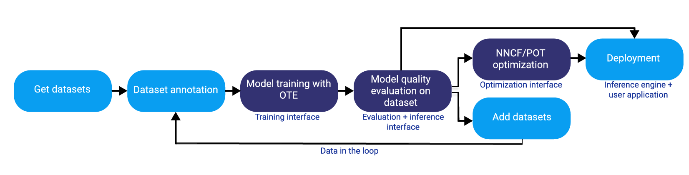

# OpenVINO™ Training Extensions {#ote_documentation}


OpenVINO™ Training Extensions (OTE) provide a suite of advanced algorithms to train
Deep Learning models and convert them using the [OpenVINO™
toolkit](https://software.intel.com/en-us/openvino-toolkit) for optimized
inference. It allows you to export and convert the models to the needed format. OTE independently create and train the model. It is open-sourced and available on [GitHub](https://github.com/openvinotoolkit/training_extensions).

## Detailed Workflow



1. To start working with OTE, prepare and annotate your dataset. For example, on CVAT.

2. OTE train the model, using training interface, and evaluate the model quality on your dataset, using evaluation and inference interfaces.

Note: prepare a separate dataset or split the dataset you have for more accurate quality evaluation.

3. Having successful evaluation results received, you have an opportunity to deploy your model or continue optimizing it, using NNCF and POT. For more information about these frameworks, go to [Optimization Guide](https://docs.openvino.ai/nightly/openvino_docs_model_optimization_guide.html).

If the results are unsatisfactory, add datasets and perform the same steps, starting with dataset annotation.

## OTE Components

- [OTE SDK](https://github.com/openvinotoolkit/training_extensions/tree/master/ote_sdk)
- [OTE CLI](https://github.com/openvinotoolkit/training_extensions/tree/master/ote_cli)
- [OTE Algorithms](https://github.com/openvinotoolkit/training_extensions/tree/master/external)

## Get Started

## Prerequisites

- Ubuntu 18.04 / 20.04
- Python 3.8+
- [CUDA Toolkit 11.1](https://developer.nvidia.com/cuda-11.1.1-download-archive) - for training on GPU
  In order to get started with OpenVINO™ Training Extensions click [here](https://github.com/openvinotoolkit/training_extensions/tree/master/QUICK_START_GUIDE.md).

## Installation

1. Clone repository in the working directory by running the following:

   ```
   git clone https://github.com/openvinotoolkit/training_extensions.git
   cd training_extensions
   git checkout -b develop origin/develop
   git submodule update --init --recursive
   ```

2. Install prerequisites by running the following:

   ```
   sudo apt-get install python3-pip python3-venv
   ```

3. Search for available scripts that create python virtual environments for different task types:

   ```bash
   find external/ -name init_venv.sh
   ```

   Sample output:

   ```
   external/mmdetection/init_venv.sh
   external/mmsegmentation/init_venv.sh
   external/deep-object-reid/init_venv.sh
   ```

4. Create, activate Object Detection virtual environment, and install `ote_cli`:
   ```
   ./external/mmdetection/init_venv.sh det_venv
   source det_venv/bin/activate
   pip3 install -e ote_cli/
   ```
   To learn more about OTE CLI commands go to [GitHub](https://github.com/openvinotoolkit/training_extensions/blob/master/QUICK_START_GUIDE.md).

## Tutorials

[Object Detection](https://github.com/openvinotoolkit/training_extensions/blob/master/ote_cli/notebooks/train.ipynb)

## Contribution

If you want to contribute, refer to [Contributing guide](https://github.com/openvinotoolkit/training_extensions/blob/master/CONTRIBUTING.md) before starting work on a pull request.

Deep Learning Deployment Toolkit is licensed under [Apache License Version 2.0](https://github.com/openvinotoolkit/training_extensions/blob/master/LICENSE).
By contributing to the project, you agree to the license and copyright terms therein
and release your contribution under these terms.
