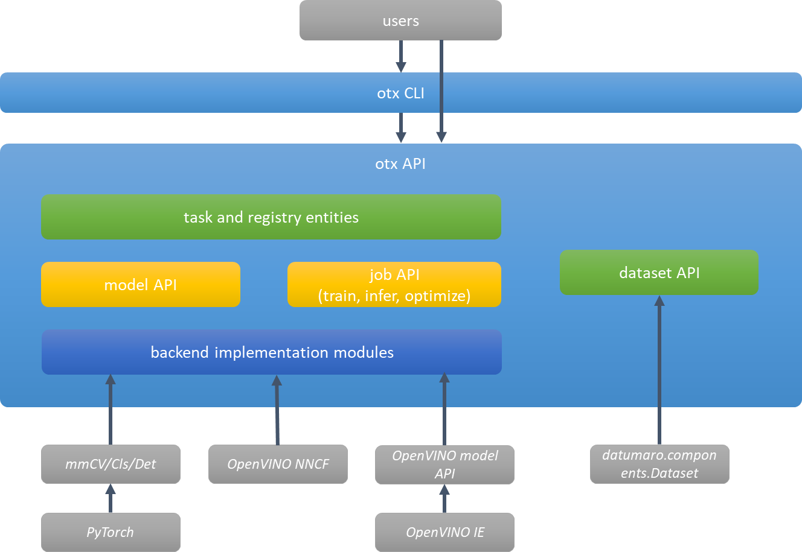
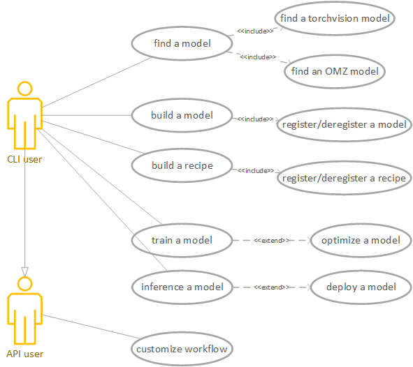
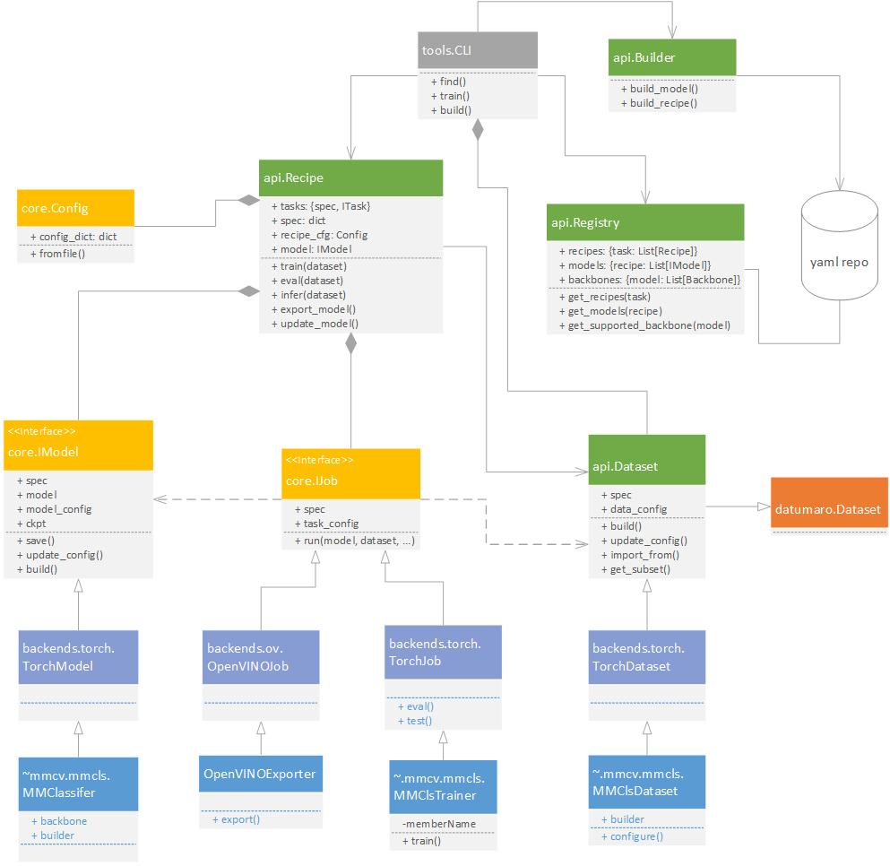
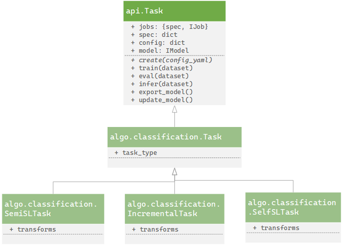
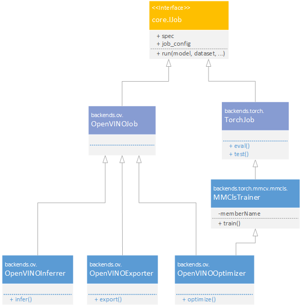
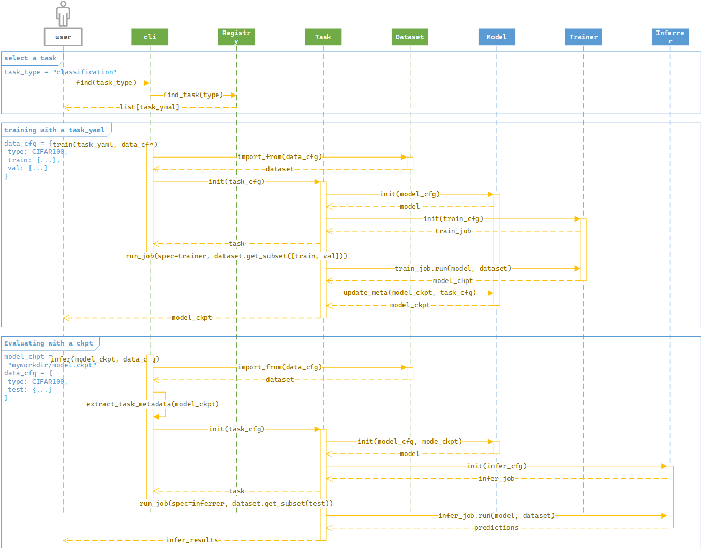
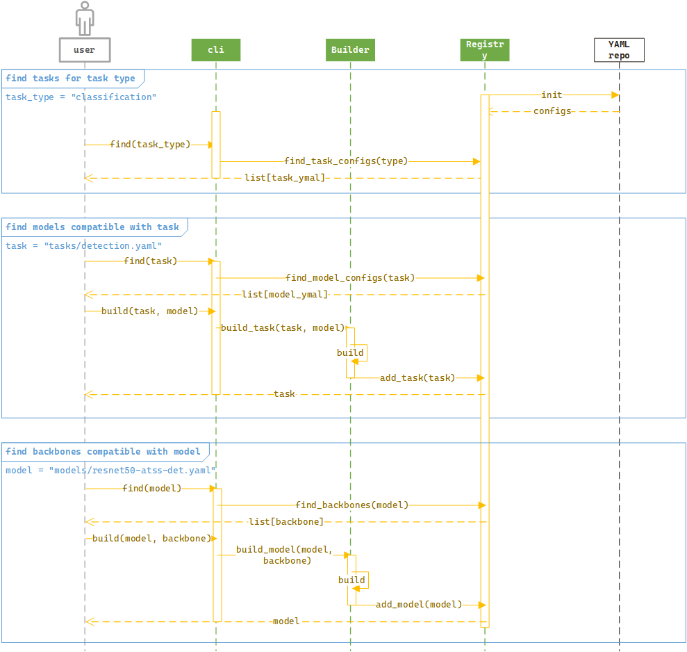

# OpenVINO Training eXtensions (OTX)

# Overview
OpenVINO Training eXtensions (OTX) is command-line interface (CLI) framework designed for low-code deep learning model training. OTX lets developers train/inference/optimize models with a diverse combination of model architectures and learning methods. For example, users can train a ResNet18-based SSD ([Single Shot Detection](https://arxiv.org/abs/1512.02325)) model in a semi-supervised manner without worrying about setting a configuration manually. `otx build` and `otx train` commands will automatically analyze users' dataset and do necessary tasks for training the model with best configuration. OTX provides the following features:

- Provide a set of pre-configured models for quick start
    - `otx find` helps you quickly finds the best pre-configured models for common task types like classification, detection, segmentation, and anomaly analysis.
- Configure and train a model from torchvision, [OpenVINO Model Zoo (OMZ)](https://github.com/openvinotoolkit/open_model_zoo)
    - `otx build` can help you configure your own model based on torchvision and OpenVINO Model Zoo models. You can replace backbones, necks and heads for your own preference (Currently only backbones are supported).
- Provide several learning methods including supervised, semi-supervised, imbalanced-learn, class-incremental, self-supervised representation learning
    - `otx build` helps you automatically identify the best learning methods for your data and model. All you need to do is to set your data in the supported format. If you don't specify a model, the framework will automatically sets the best model for you. For example, if your dataset has long-tailed and partially-annotated bounding box annotations, OTX auto-configurator will choose a semi-supervised imbalanced-learning method and an appropriate model with the best parameters. 
- Integrated efficient hyper-parameter optimization
    - OTX has an integrated, efficient hyper-parameter optimization module. So, you don't need to worry about searching right hyper-parameters. Through dataset proxy and built-in hyper-parameter optimizer, you can get much faster hyper-parameter optimization compared to other off-the-shelf tools. The hyperparameter optimization is dynamically scheduled based on your resource budget.
- Support widely-used annotation formats
    - OTX uses [datumaro](https://github.com/openvinotoolkit/datumaro), which is designed for dataset building and transformation, as a default interface for dataset management. All supported formats by datumaro are also consumable by OTX without the need of explicit data conversion. If you want to build your own custom dataset format, you can do this via datumaro CLI and API.


# High-level component view
The diagram below illustrates key components in a high-level design (the colors correspond to [API class diagram](#otx-api)). OTX has two implementation layers: CLI and API. CLI is implemented as a combination of APIs which provides components for model management, dataset processing, and job interfaces for inference/train/optimize. A task is a concrete combination of model and job interfaces, and takes dataset for training a model. OTX provides both pre-built tasks and models in registry, and mechanisms to build your own ones in a low-code manner. OTX dataset API uses datumaro as a base class, and thus supports diverse annotation formats.

<figure>

<figcaption></figcaption>
</figure>

# Architecturally-significant use cases
The diagram below shows architecturally-significant use cases. OTX use cases cover from model building to final deployment. Users can use OTX CLI for finding and building models and tasks, training with dataset, and optimizing model performance for final deployment. Users also can generate a self-contained package for exportable codes with a single command. API users can customize the built-in workflow for their purpose. For example, new learning methods can be registered or users can extend core APIs for supporting other backends like TensorFlow or ONNX.

<figure>

<figcaption></figcaption>
</figure>

# Terminology
- **Model** is a collection of backbone, neck, and (task-specific) head which is ready to be consumed by *Task* if *Dataset* is provided.
- **Task type** is a type of vision prediction like classification, regression, detection, instance segmentation, anomaly detection, and so on. *Task type* and *Model* are usually highly-related, and *Task type* determines how the *Model* looks like, especially for neck and head architecture.
- **Job** is a type of computational workload like inference, optimization, training, and other openvino related ones. Job is an elementary operation which can be called by a specific *Task*. Job implementation depends on ML framework such as PyTorch or TensorFlow. In OTX, most of default jobs are implemented based on PyTorch, mmCV, and OpenVINO.
- **Task** is the collection of *Job*, *Model*, and ML frameworka-gnostic implementation like data augmentation strategy, batch composition policy, job cascading and switching, which are not bound for specific *Dataset*. For example, semi-supervised learning can be a task-level implementation since this requires multiple jobs as well as on-the-fly data scheduling with pseudo-labels.
- **Config** is a descriptor of a specific *Task* or *Model* based on Python dictionary. It can be instantiated from YAML or XML formatted files.
- **Registry** is a collection of **Config**s.
- **Dataset** corresponds to something like torch.utils.data.Dataset which can be consumed in torch.utils.data.DataLoader. Each dataset can be created for specific purposes like training or evaluation. *Dataset* should provide an iterator for constructing a batch or a subset for training and evaluation.


# OTX CLI
The table below shows OTX CLIs and their API mappings. In most cases, users simply put their dataset and run train CLI for training a model.

The following command will analyze a dataset and auto-generate a training configuration (task.yaml).
```
otx build <data.yaml>
```
Users can train a model with the generated tranining configuration.
```
otx train <data.yaml> <task.yaml>
```

|command|argument|API mapping|result(return)|
|---|---|---|---|
|`otx find`|`--task_types`|`Registry.find_task_types()`|list of supported task types (classification, detection, etc.)|
|   |`--task <task_type>`|`Registry.find_tasks(task_type)`|list of tasks for the given task type(class-incremental, semi-supervised etc.)|
|   |`--model <task.yaml>`|`Registry.find_models(task)`|list of models for the given task (e.g. resnet18-atss-det)|
|   |`--backbone <model.yaml>`|`Registry.find_backbones(model)`|list of backbones for the given model (e.g. resnet18)|
|   |`--all`|`Registry.find_*()`|recursive call of all above|
|`otx build`|`--model <model.yaml> --backbone <backbone.yaml>`|`Builder.build_model_config(model, backbone)`|<*(backbone)*_model.yaml> will be saved to user’s workspace after replacing model.backbone attribute to the given *backbone*|
|   |`--task <task.yaml> --data <data.yaml>`|`Builder.build_task_config(data)`|analyze data and generate <task.yaml> automatically and dump it to user’s workspace|
|   |`--task <task.yaml> --model <model.yaml>`|`Builder.build_task_config(task(old), model)`|<*(model)*_task.yaml> will be added to user’s workspace after updating task.model attribute to the given *model*|
|`otx train`|`<data.yaml> <task.yaml>`|`Task.train(data)`|path to model ckpt trained on *data*|
|`otx eval`|`<path-to-ckpt> <data.yaml>`<sup>[1](#note1)</sup>|`Task.eval(data)`|evaluation (if there is ground-truth) and/or prediction result on *data*|
|   |`<path-to-ckpt> <path-to-input>`|`Task.eval(input)`|prediction result on a single image or video *input*|
|   |~~`<path-to-ckpt> <device>`~~|~~`Task.eval(device)`~~|~~prediction result on *device* (typically camera)~~|
|`otx optimize`|`<path-to-ckpt> <type-str> <data.yaml>`|`Task.optimize(type, data)`|run *type* of optimization to the given *ckpt*<sup>[2](#note2)</sup>|
|`otx export`|`<path-to-ckpt>`|`Task.export()`|export *ckpt* model to OpenVINO IR (xml and bin files)|
|~~`otx demo`(deprecated)~~|   |  |  |
|`otx deploy`|`<path-to-ckpt>`|`Task.deploy()`|create a zip file containing all exportable codes in a self-contained manner. This includes both PyTorch and OpenVINO inferences|

<a name="#note1"><sup>1</sup></a>ckpt file has a metadata for task information. For more information, refer to sequence diagram in OTX API.

<a name="#note2"><sup>2</sup></a>For more information on optimization types, refer to [OpenVINO Model Optimization Guide](https://docs.openvino.ai/latest/openvino_docs_model_optimization_guide.html).

## `otx build` is all you need (task auto-configurator)
One of unique features of OTX is task auto-configurator. Unlike other AI training toolkits, OTX provides an automated way of setting training-related stuffs by analyzing users' dataset. This includes task type, model architecture, learning method and hyper-parameters. Among them, hyper-parameters could be tuned further by automatic hyper-parameter optimization module in later stages of training. Users can directly edit task.yaml file for customization. This auto-configurator also provides estimated times for training and inference so that users can review the configuration before triggering actual jobs.

**_NOTE:_** Not all task types can be autoconfigured correctly since the same data can be mapped to different tasks. For example, a dataset having no annotation can be mapped into either unsupervised representational learning or anomaly detection. In such cases, we will recommend one of them based on the task type popularity.

**_NOTE2:_** OTX will use label and data statistics computed in Datumaro.

<figure>

<figcaption></figcaption>
</figure>

# OTX API

OTX API consists of three component groups. The first group defines entities for constructing CLIs, registration of models and tasks, and interfaces for dataset, which could be used or modified by users. The second group is for core components like defining jobs and model architecture, which are intended for internal execution. And the third group specifies backend implementations that depend on platforms like PyTorch, MMCV, and OpenVINO. The figure below illustrates class diagram, which partially shows backend implementations.
<figure>

<figcaption></figcaption>
</figure>

- `api.Dataset` class inherits datumaro.components.Dataset and works as a base class for other dataset classes from PyTorch and MMCV. For example, MMClsDataset is an adapter for dataset in MMClassification framework. Dataset class provides rich interfaces for many task types like classification, detection, segmentation, and so on with widely-used formats like MS-COCO, LabelMe, Open Images, and ImageNet.
- `api.Registry` class is designed for managing tasks and models either from built-in or user workspace. When initialization, it retrieves all tasks and models from YAML repo and user workspace and loads them into memory. In Registry, there are two resident types, models and tasks. Models are grouped by task specification, and tasks are grouped by task type specification. New models and tasks can be automatically (de)registered if there are untracked changes in user workspace.
- `api.Task` class is the main interface for algorithm implementation of specific task type. Actual algorithm implementation should inherit this class and provide a combination of model and job for the task type. Implemented task configuration can be stored as a config file in the registry, and later instantiated from it. The following figure shows examples on algorithm implementation with this api.
<figure>

<figcaption></figcaption>
</figure>

- `core.IModel` provides a basic interface for creating a model from model configuration, which defines backbone, neck, (task-specific) head. Their names, connections, and parameters are used to concretize a specific model. To support jobs with specific checkpoints, this class has checkpoint as a member variable.
- `core.IJob` provides a set of interfaces for computational workloads like training and inference. It defines a minimal executable unit in AI workflow. The purpose of job is specified within the class. Every job must implement `run()` method for execution. When model instance is required for specific job, the caller (*Task*) will pass the information as an argument. core.IJob depends on core.IModel and api.Dataset.
- `backends` is a set of components that depend on specific ML frameworks. OTX API uses Pytorch, MMCV, and OpenVINO as main backends for implementing actual models and jobs. For example, OpenVINO jobs can be implemented in their corresponding backend as below.
    - OpenVINO backends: OpenVINOJob provides a base class for all OpenVINO-related jobs, and OpenVINOInference and OpenVINOExporter classes provides actual implementations. Since OpenVINOOptimizer requires not only OpenVINO but also AI training framework like PyTorch, it inherits both OpenVINOJob and TorchJob simultaneously.
<figure>

<figcaption></figcaption>
</figure>

## API sequence for training and evaluation
<figure>

<figcaption></figcaption>
</figure>

## API sequence for model and task building
<figure>

<figcaption></figcaption>
</figure>