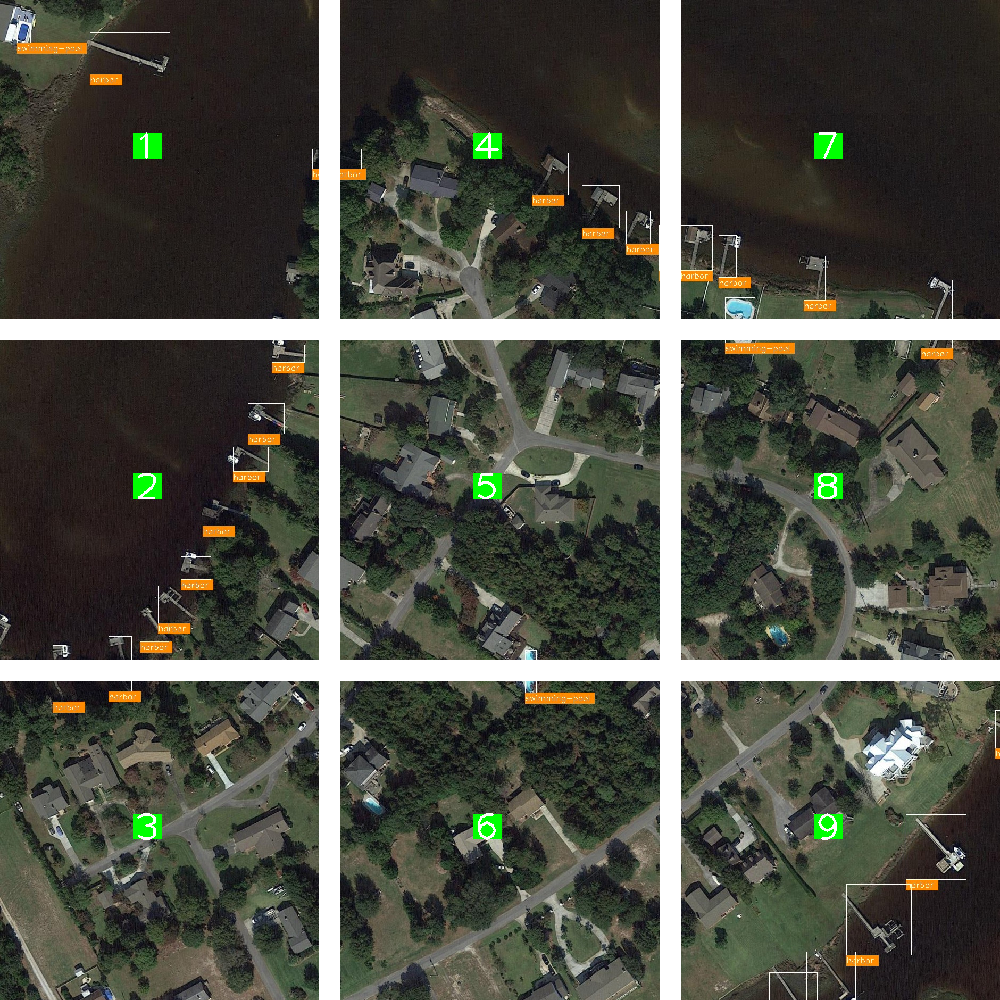

Improve Small Object Detection with Image Tiling
*************************************************

The OpenVINO Training Extensions introduces the concept of image tiling to enhance the accuracy of detection algorithms and instance segmentation algorithms, particularly for small and densely packed objects in high-resolution images.

Image tiling involves dividing the original full-resolution image into multiple smaller tiles or patches. This division allows objects within the tiles to appear larger in relation to the tile size, effectively addressing the challenge of objects becoming nearly invisible in deeper layers of feature maps due to downsampling operations. Image tiling proves especially beneficial for datasets where objects can be as small as 20 by 20 pixels in a 4K image.

However, it's important to consider the trade-off associated with image tiling. Dividing a single image sample into several tiles increases the number of samples for training, evaluation, and testing. This trade-off impacts the execution speed, as processing more images requires additional computational resources. To strike a balance between patch size and computational efficiency, the OpenVINO Training  incorporates tile dataset samples and adaptive tiling parameter optimization. These features enable the proper tuning of tile size and other tiling-related parameters to ensure efficient execution without compromising accuracy.

By leveraging image tiling, the OpenVINO Training Extensions empowers detection and instance segmentation algorithms to effectively detect and localize small and crowded objects in large-resolution images, ultimately leading to improved overall performance and accuracy.

Tiling Strategies 
=================
Below we provided an example of tiling used on one of the image from `DOTA <https://captain-whu.github.io/DOTA/dataset.html>`_.

In this example, the full image is cropped into 9 tiles. During training, only the tiles with annotations (bounding boxes or masks) are used for training.

During evaluation in training, only the tiles with annotations are used for evaluation, and evaluation is performed at the tile level.

During testing, each tile is processed and predicted separately. The tiles are then stitched back together to form the full image, and the tile predictions are merged to form the full image prediction.

The tiling strategy is implemented in the OpenVINO Training Extensions through the following steps:

.. code-block:: 

    * Training: Create an ImageTilingDataset with annotated tiles -> Train with annotated tile images -> Evaluate on annotated tiles
    * Testing: Create an ImageTilingDataset including all tiles -> Test with all tile images -> Stitching -> Merge tile-level predictions -> Full Image Prediction

.. note::

    While running `ote eval` on models trained with tiling enabled, the evaluation will be performed on all tiles, this process includes merging all the tile-level prediction. 
    The below context will be provided during evaluation:

    .. code-block:: 

        [>>>>>>>>>>>>>>>>>>>>>>>>>>>>>>>>>>>>>>>>>>>>>>>>>>] 650/650, 17.2 task/s, elapsed: 38s, ETA:     0s
        ==== merge: 7.326097726821899 sec ====

Enable Tiling via OTX Training CLI 
==================================

Currently, tiling is supported for both detection and instance segmentation models. Please refer to :doc:`../algorithms/object_detection/object_detection` and :doc:`../algorithms/segmentation/instance_segmentation` for more details.

To enable tiling in OTX training, set ``tiling_parameters.enable_tiling`` parameter to 1. Here's an example of enabling tiling for the SSD model template:

.. code-block::

    otx train Custom_Object_Detection_Gen3_SSD --train-data-roots tests/assets/small_objects --val-data-roots tests/assets/small_objects params --tiling_parameters.enable_tiling 1

.. note::

    To learn how to deploy the trained model and run the exported demo, refer to :doc:`../../tutorials/base/deploy`.

    To learn how to run the demo in CLI and visualize results, refer to :doc:`../../tutorials/base/demo`.

Enable Tiling via OTX Build
===========================
Here's another way of enabling tiling for the SSD model template using the workspace:

.. code-block::

    otx build Custom_Object_Detection_Gen3_SSD --train-data-roots tests/assets/small_objects --val-data-roots tests/assets/small_objects

The above command will create a workspace folder with the necessary files for training under ``otx-workspace-DETECTION``.

You can then train the model with tiling enabled using the following command without specifying any data-related paths:

.. code-block::

    cd otx-workspace-DETECTION
    otx train params --tiling_parameters.enable_tiling 1

Alternatively, you can update the ``tiling_parameters`` in ``configuration.yaml`` file under the workspace folder to configure tiling parameters:

.. code-block::

    hyper_parameters:
      parameter_overrides:
        tiling_parameters:
          enable_tiling:
            default_value: true

And then train the model with tiling enabled using the following command:

.. code-block::

    otx train

Tile Size and Tile Overlap Optimization
-----------------------------------------
By default, the OpenVINO Training Extensions automatically optimize tile size and tile overlap to ensure efficient execution without compromising accuracy.

To strike a balance between patch size and computational efficiency, the OpenVINO Training Extensions incorporate adaptive tiling parameter optimization. These features enable the proper tuning of tile size and other tiling-related parameters to ensure efficient execution without compromising accuracy.

Adaptive tiling parameter optimization works by finding the average object size in the training dataset and using that to determine the tile size. Currently, the average object size to tile size ratio is set to 3%. For example, if the average object size is 100x100 pixels, the tile size will be around 577x577 pixels.

This computation is performed by dividing the average object size by the desired object size ratio (default: 3%) and then taking the square root. This ensures that the objects are large enough to be detected by the model. The object size to tile size ratio can also be configured with ``tiling_parameters.object_tile_ratio`` parameter. 

Here's an example of setting the object size ratio to 5%:

.. code-block:: 
    
    otx train Custom_Object_Detection_Gen3_SSD
        --train-data-roots tests/assets/small_objects \
        --val-data-roots tests/assets/small_objects \
        params --tiling_parameters.enable_tiling 1          \  # enable tiling
               --tiling_parameters.enable_adaptive_params 1 \  # enable automatic tiling parameter optimization
               --tiling_parameters.object_tile_ratio 0.05   \  # set the object size ratio to 5%

After determining the tile size, the tile overlap is computed by dividing the largest object size in the training dataset by the adaptive tile size. 
This calculation ensures that the largest object on the border of a tile is not split into two tiles and is covered by adjacent tiles.

You can also manually configure the tile overlap using ``tiling_parameters.tile_overlap parameter`` parameter. For more details, please refer to the section on `Manual Tiling Parameter Configuration`_ .

Tiling Sampling Strategy
------------------------
To accelerate the training process, the OpenVINO Training Extensions introduces a tile sampling strategy. This strategy involves randomly sampling a percentage of tile images from the dataset to be used for training. 

Since training and validation on all tiles from a high-resolution image dataset can be time-consuming, sampling the tile dataset can significantly reduce the training and validation time.

It's important to note that sampling is applied to the training and validation datasets, not the test dataset.

This can be configured with ``tiling_parameters.tile_sampling_ratio`` parameter. Here's an example of setting the tile sampling ratio to 50%:

.. code-block:: 
    
    otx train Custom_Object_Detection_Gen3_SSD
        --train-data-roots tests/assets/small_objects \
        --val-data-roots tests/assets/small_objects \
        params --tiling_parameters.enable_tiling 1           \  # enable tiling
               --tiling_parameters.enable_adaptive_params 1  \  # enable automatic tiling parameter optimization
               --tiling_parameters.tile_sampling_ratio 0.5   \  # set the tile sampling ratio to 50%

Manual Tiling Parameter Configuration
-------------------------------------

Users can disable adaptive tiling and customize the tiling process by setting the following parameters:

.. code-block:: 
    
    otx train Custom_Object_Detection_Gen3_SSD
        --train-data-roots tests/assets/small_objects \
        --val-data-roots tests/assets/small_objects \
        params --tiling_parameters.enable_tiling 1          \  # enable tiling
               --tiling_parameters.enable_adaptive_params 0 \  # disable automatic tiling parameter optimization
               --tiling_parameters.tile_size 512            \  # tile size configured to 512x512
               --tiling_parameters.tile_overlap 0.1         \  # 10% overlap between tiles

By specifying these parameters, automatic tiling parameter optimization is disabled, and the tile size is configured to 512x512 pixels with a 10% overlap between tiles.

The following parameters can be configured to customize the tiling process:

- ``tiling_parameters.enable_tiling``: Enable or disable tiling (0 or 1)
- ``tiling_parameters.enable_adaptive_params``: Enable or disable adaptive tiling parameter optimization (0 or 1)
- ``tiling_parameters.object_tile_ratio``: Ratio of average object size to tile size (float between 0.0 and 1.0)
- ``tiling_parameters.tile_size``: Tile edge length in pixels (integer between 100 and 4096)
- ``tiling_parameters.tile_overlap``: The overlap between adjacent tiles as a percentage (float between 0.0 and 1.0)
- ``tiling_parameters.tile_sampling_ratio``: The percentage of tiles to sample from the dataset (float between 0.0 and 1.0)

Run Tiling on OpenVINO Exported Model
======================================

After training a model with tiling enabled, you can export the model to OpenVINO IR format using the following command:

.. code-block:: 

    otx export Custom_Object_Detection_Gen3_SSD --load-weights <path_to_trained_model>/weights.pth --output <path_to_exported_model>

After exporting the model, you can run inference on the exported model using the following command:

.. code-block:: 

    ote eval Custom_Object_Detection_Gen3_SSD --test-data-roots tests/assets/small_objects --load-weights <path_to_exported_model>/openvino.xml

.. warning::
    When tiling is enabled, there is a trade-off between speed and accuracy as it increases the number of images to be processed. 
    As a result, longer training and inference times are expected. If you encounter GPU out of memory errors, 
    you can mitigate the issue by reducing the number of batches through the command-line interface (CLI) or 
    by adjusting the batch size value in ``template.yaml`` file located in the workspace.