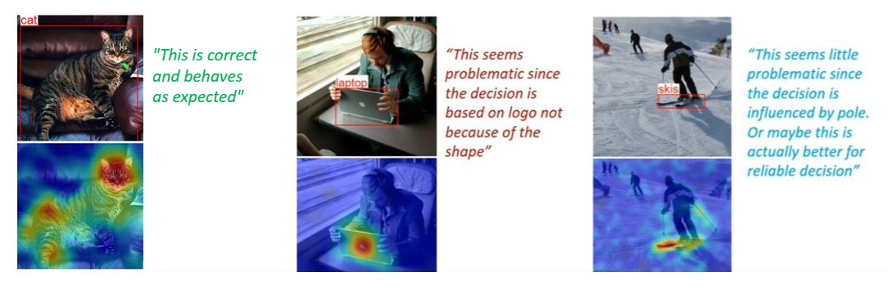
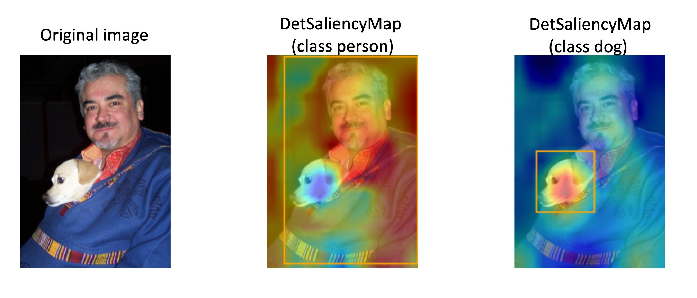

Explainable AI (XAI)
====================

**Explainable AI (XAI)** is a field of research that aims to make machine learning models more transparent and interpretable to humans.
The goal is to help users understand how and why AI systems make decisions and provide insight into their inner workings. It allows us to detect, analyze, and prevent common mistakes, for example, when the model uses irrelevant features to make a prediction.
XAI can help to build trust in AI, make sure that the model is safe for development and increase its adoption in various domains.

Most XAI methods generate **saliency maps** as a result. Saliency map is a visual representation, suitable for human comprehension, that highlights the most important parts of the image from the model point of view.
It looks like a heatmap, where warm-colored areas represent the areas with main focus.

  These images are taken from `D-RISE paper <https://arxiv.org/abs/2006.03204>`_.

We can generate saliency maps for a certain model that was trained in OpenVINO™ Training Extensions, using ``otx explain`` command line. Learn more about its usage in  :doc:`../../tutorials/base/explain` tutorial.

*********************************
XAI algorithms for classification
*********************************

.. image:: ../../../../utils/images/xai_cls.jpg
  :width: 600
  :align: center
  :alt: this image shows the comparison of XAI classification algorithms

For classification networks these algorithms are used to generate saliency maps:

- **Activation Map​** - this is the most basic and naive approach. It takes the outputs of the model's feature extractor (backbone) and averages it in channel dimension. The results highly rely on the backbone and ignore neck and head computations. Basically, it gives a relatively good and fast result.

- `Eigen-Cam <https://arxiv.org/abs/2008.00299​>`_ uses Principal Component Analysis (PCA).  It returns the first principal component of the feature extractor output, which most of the time corresponds to the dominant object. The results highly rely on the backbone as well and ignore neck and head computations.

- `Recipro-CAM​ <https://arxiv.org/pdf/2209.14074>`_ uses Class Activation Mapping (CAM) to weigh the activation map for each class, so it can generate different saliency per class. Recipro-CAM is a fast gradient-free Reciprocal CAM method. The method involves spatially masking the extracted feature maps to exploit the correlation between activation maps and network predictions for target classes. 

Below we show the comparison of described algorithms. ``Access to the model internal state`` means the necessity to modify the model's outputs and dump inner features.
``Per-class explanation support`` means generation different saliency maps for different classes.

+-------------------------------------------+----------------+----------------+-------------------------------------------------------------------------+
| Classification algorithm                  | Activation Map | Eigen-Cam      | Recipro-CAM                                                             |
+===========================================+================+================+=========================================================================+
| Need access to model internal state       | Yes            | Yes            |  Yes                                                                    |
+-------------------------------------------+----------------+----------------+-------------------------------------------------------------------------+
| Gradient-free                             | Yes            | Yes            |  Yes                                                                    |
+-------------------------------------------+----------------+----------------+-------------------------------------------------------------------------+
| Single-shot                               | Yes            | Yes            |  No (re-infer neck + head H*W times, where HxW – feature map size)      |                                                          
+-------------------------------------------+----------------+----------------+-------------------------------------------------------------------------+
| Per-class explanation support             | No             | No             | Yes                                                                     |
+-------------------------------------------+----------------+----------------+-------------------------------------------------------------------------+
| Execution speed                           | Fast           | Fast           | Medium                                                                  |  
+-------------------------------------------+----------------+----------------+-------------------------------------------------------------------------+

****************************
XAI algorithms for detection
****************************

For detection networks these algorithms are used to generate saliency maps:

- **Activation Map​** - the same approach as for classification networks, which uses the outputs from feature extractor. This is an algorithm is used to generate saliency maps for two-stage detectors.

- **DetClassProbabilityMap** - this approach takes the raw classification head output and uses class probability maps to calculate regions of interest for each class. So, it creates different salience maps for each class. This algorithm is implemented for single-stage detectors only.

The main limitation of this method is that, due to training loss design of most single-stage detectors, activation values drift towards the center of the object while propagating through the network.
This prevents from getting clear explanation in the input image space using intermediate activations.

Below we show the comparison of described algorithms. ``Access to the model internal state`` means the necessity to modify the model's outputs and dump inner features.
``Per-class explanation support`` means generation different saliency maps for different classes. ``Per-box explanation support`` means generation standalone saliency maps for each detected prediction.

+-------------------------------------------+----------------------------+--------------------------------------------+
| Detection algorithm                       | Activation Map             |  DetClassProbabilityMap                    |
+===========================================+============================+============================================+
| Need access to model internal state       | Yes                        | Yes                                        |           
+-------------------------------------------+----------------------------+--------------------------------------------+
| Gradient-free                             | Yes                        | Yes                                        |         
+-------------------------------------------+----------------------------+--------------------------------------------+
| Single-shot                               | Yes                        | Yes                                        |         
+-------------------------------------------+----------------------------+--------------------------------------------+
| Per-class explanation support             | No                         | Yes                                        |          
+-------------------------------------------+----------------------------+--------------------------------------------+
| Per-box explanation support               | No                         | No                                         |          
+-------------------------------------------+----------------------------+--------------------------------------------+
| Execution speed                           | Fast                       | Fast                                       |           
+-------------------------------------------+----------------------------+--------------------------------------------+

.. tab-set::

    .. tab-item:: API

        .. code-block:: python

            engine.explain(checkpoint="<checkpoint-path>")

    .. tab-item:: CLI

        .. code-block:: bash

            (otx) ...$ otx explain ... --checkpoint <checkpoint-path>
