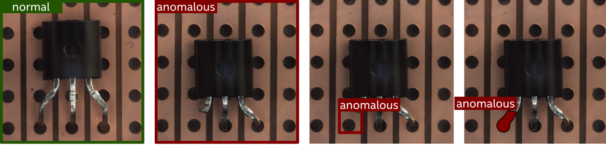
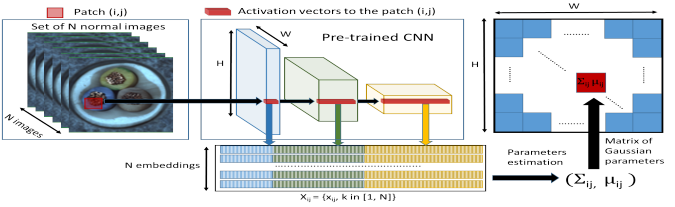
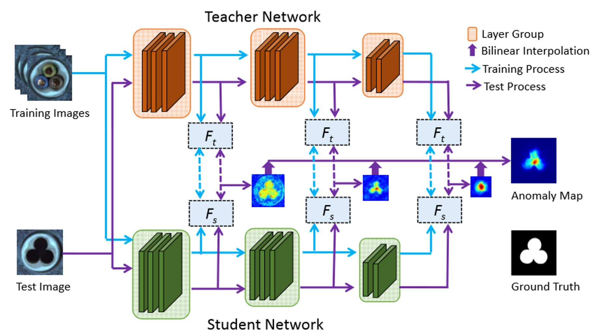

Anomaly Detection
=================

The datasets from real-world applications such as industrial, medical, and security are extremely unbalanced, with an abundance of normal images and a severe lack of abnormal samples. A second issue is that the definition and type of abnormality are constantly evolving, making it difficult to train a supervised model once and use it permanently.  An alternative approach is to train a model using only normal samples to learn normality.  During the validation or testing phases, a deviation from this would indicate an anomaly. The process of identifying such deviations or anomalies in data is known as anomaly detection.

This section examines the solutions for anomaly detection offered by the OpenVINO Training Extensions library.

Task Types
**********
OpenVINO Training Extensions supports the following anomaly task types:

* Anomaly Classification - (Image-level detection)
* Anomaly Detection - (Box-level localization)
* Anomaly Segmentation - (Pixel-level localization)

.. note::
   All anomaly task types are only trained on normal images. The different task types use the same models for generating the raw predictions, but differ in the post-processing that is applied to the raw predictions to localize the anomalous regions. Anomaly detection generates bounding-box predictions, while anomaly segmentation generates pixel-mask predictions. Anomaly classification does not perform localization of the anomalous regions within the image, but just outputs a normal vs. anomalous label for the entire image.

Anomaly Classification
----------------------
Anomaly classification is the task of predicting normal and abnormal images at the image level. As noted above, a model is trained on only normal images. During the testing phase, the model predicts an anomaly score indicating the likelihood of an image being abnormal. The threshold for anomaly classification is either set by the user or adaptively tuned by the algo backend. An image is classified as abnormal if the anomaly score is above the threshold.

Anomaly Detection
-----------------
Anomaly detection is the task of predicting normal and abnormal images at the box level. Similar to anomaly classification, a model is trained on normal images only. During the testing phase, the model outputs an anomaly heatmap showing the likelihood of each pixel being abnormal. After post-processing the heatmap, the model predicts a bounding box around the anomaly.

Anomaly Segmentation
--------------------
The anomaly segmentation task locates anomalies at the pixel level. Similar to anomaly classification and detection, a model is trained on only normal images. During the validation and testing phase, the model outputs an anomaly heatmap showing the likelihood of each pixel being abnormal. After post-processing the heatmap, the model predicts a mask around the anomaly.

.. _fig-anomaly-tasks:

   Anomaly task types (a) A normal image used during training. (b) An image-level prediction of an anomaly by anomaly classification task (c) A box-level prediction of an anomaly by an anomaly detection task (d) A pixel-level prediction of an anomaly by anomaly segmentation task

Dataset Format
**************
At the moment, the anomaly tasks support the MVTec AD dataset format, which is one of the most popular formats for detecting anomalies. 

.. code-block::

   MVTec/<category>
   ├── ground_truth
   │   ├── <sub_category_1>
   │   │   ├── 000_mask.png
   │   │   └── ...
   │   ├── ...
   │   └── <sub_category_n>
   │       ├── 000_mask.png
   │       └── ...
   ├── test
   │   ├── <sub_category_1>
   │   │   ├── 000.png
   │   │   └── ...
   │   ├── ...
   │   ├── contamination
   │   │   ├── 000.png
   │   │   └── ...
   │   └── good
   │       ├── 000.png
   │       └── ...
   └── train
      └── good
         ├── 000.png
         └── ...

Future releases of OpenVINO Training Extensions will support other benchmark datasets, such as Amazon's `Visual Anomaly (VisA) <https://github.com/amazon-science/spot-diff#data-download>`_ dataset. Meanwhile, you can use the `MVTec AD dataset <https://www.mvtec.com/company/research/datasets/mvtec-ad/>`_ to train and test anomaly detection models, or use MVTec dataset structure to train and test anomaly detection models on your own dataset.

Models
******
As mentioned above, the goal of visual anomaly detection is to learn a representation of normal behaviour in the data and then identify instances that deviate from this normal behaviour. OpenVINO Training Extensions supports several deep learning approaches to this task, including the following:

+-------+----------------------------------------------------------------------------------------------------------------------------------------------+--------------------------------------------------------------------------------------------------------------------------------------------------+--------------------------------------------------------------------------------------------------------------------------------------------+---------------------+-----------------+
| Name  | Classification                                                                                                                               | Detection                                                                                                                                        | Segmentation                                                                                                                               | Complexity (GFLOPs) | Model size (MB) |
+=======+==============================================================================================================================================+==================================================================================================================================================+============================================================================================================================================+=====================+=================+
| PADIM | `padim <https://github.com/openvinotoolkit/training_extensions/blob/develop/src/otx/recipe/anomaly_classification/padim.yaml>`_              | `padim <https://github.com/openvinotoolkit/training_extensions/blob/develop/src/otx/recipe/anomaly_detection/padim.yaml>`_                       | `padim <https://github.com/openvinotoolkit/training_extensions/blob/develop/src/otx/recipe/anomaly_segmentation/padim.yaml>`_              | 3.9                 | 168.4           |
+-------+----------------------------------------------------------------------------------------------------------------------------------------------+--------------------------------------------------------------------------------------------------------------------------------------------------+--------------------------------------------------------------------------------------------------------------------------------------------+---------------------+-----------------+
| STFPM | `stfpm <https://github.com/openvinotoolkit/training_extensions/blob/develop/src/otx/recipe/anomaly_classification/stfpm.yaml>`_              | `stfpm <https://github.com/openvinotoolkit/training_extensions/blob/develop/src/otx/recipe/anomaly_detection/stfpm.yaml>`_                       | `stfpm <https://github.com/openvinotoolkit/training_extensions/blob/develop/src/otx/recipe/anomaly_segmentation/stfpm.yaml>`_              | 5.6                 | 21.1            |
+-------+----------------------------------------------------------------------------------------------------------------------------------------------+--------------------------------------------------------------------------------------------------------------------------------------------------+--------------------------------------------------------------------------------------------------------------------------------------------+---------------------+-----------------+

Clustering-based Models
-----------------------
These models initially extract features from a CNN or transformer and subsequently use clustering algorithms to learn normality. The anomaly score is then calculated as the distance between the input image and the cluster center. OpenVINO Training Extensions currently supports `PADIM <https://arxiv.org/pdf/2011.08785.pdf>`_.

PADIM
^^^^^

Padim is a clustering-based anomaly detection approach. The model uses a patch-based mechanism that extracts patches from the input image and then uses a CNN to extract features from the patches. 

To eliminate the redundant information from the extracted features, the model randomly selects a subset of the features to reduce the dimensionality of the features. A multi-variate Gaussian distribution is fitted for each patch embedding. This means each patch of the set of training images has a corresponding multivariate Gaussian distribution. 

To predict the anomaly score, Mahalanobis distance is calculated to score each patch position of the test image. The matrices of Mahalanobis distances constitute the anomaly map, with higher scores indicating anomalous regions.

.. note::

   Since the PADIM model uses a pre-trained backbone to extract features, the training does not involve fine-tuning of neural network weights. This means that PADIM does not make use of an optimizer and a loss function.

Parameters
~~~~~~~~~~~~~~~~~~~~

Since the Padim model extracts features and uses clustering algorithms to learn normality, we use the following parameters for its training:

- ``Backbone``: The default backbone is ``ResNet18``. You can also use ``Wide ResNet50``.
- ``Layers``: The layers used for feature extraction. The default layers are ``layer1, layer2, layer3``.
- ``Pre-Trained``: Whether or not to use a pre-trained backbone. The default value is ``True``.
- ``N-Features``: The number of features to be retained for the dimensionality reduction step. Default values from the paper are available for: ``ResNet18 (100)`` and ``Wide ResNet50 (550)``.

Knowledge Distillation-based Models
-----------------------------------
Knowledge distillation is a deep learning technique in which a smaller model (student) is trained to imitate the behavior of a larger and more complex model (teacher). This technique is predicated on the notion that the knowledge contained in a large and complex model can be transferred to a smaller and simpler model, resulting in a model with comparable performance that is both more efficient and faster. OpenVINO Training Extensions currently supports `STFPM: Student-Teacher Feature Pyramid Matching for Unsupervised Anomaly Detection <https://arxiv.org/pdf/2103.04257.pdf>`_.

STFPM
^^^^^

The STFPM algorithm is composed of a pre-trained teacher network and a student network with the same architecture. The student network learns the distribution of anomaly-free images by matching the features to their corresponding features in the teacher network. 

Multiple-scale feature matching is utilized to enable the student network during training to receive a mixture of multi-level knowledge from the feature pyramid, thereby enabling the detection of anomalies of various sizes. To compute the anomaly scores during the inference, the student network's feature pyramid is compared to the teacher network's feature pyramid. 

The anomaly score is computed as the sum of the L2 distances between the student and teacher feature pyramids. This distance is then used to compute the anomaly map and the anomaly score.

Training Parameters
~~~~~~~~~~~~~~~~~~~~

Since STFPM trains the student network, we use the following parameters for its training:

- ``Backbone``: The default backbone is ``ResNet18``. You can also use ``Wide ResNet50``.
- ``Layers``: The layers used for feature extraction. The default layers are ``layer1, layer2, layer3``.
- ``Loss``: Loss is computed as the mean squared error between the student and teacher feature pyramids. The default loss is ``MSE`` and cannot be changed.
- ``Optimizer``: The default optimizer is ``SGD`` and cannot be changed. It uses the following parameters that can be changed:
   - ``Learning Rate``: The default learning rate is ``0.4``.
   - ``Momentum``: The default momentum is ``0.9``.
   - ``Weight Decay``: The default weight decay is ``0.0001``.

- ``Aditional Techniques``:
   - ``Early Stopping``: Early stopping is used to stop the training process when the validation loss stops improving. The default value of the early stopping patience is ``10``.

For more information on STFPM's training. We invite you to read Anomalib's `STFPM documentation <https://anomalib.readthedocs.io/en/v1.0.0/markdown/guides/reference/models/image/stfpm.html>`_.
