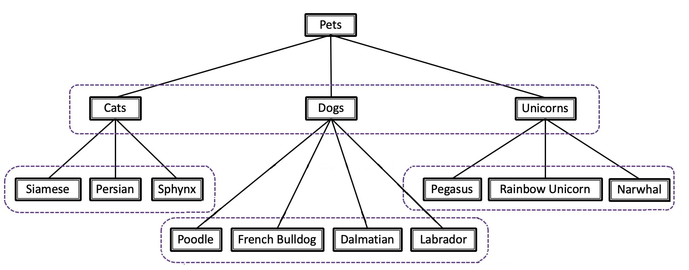

Hierarchical Classification
===========================

Hierarchical classification is an extension of the classification task where, besides the set of categories to predict, we have a hierarchical relationship between them.
The goal of this task is to predict the hierarchical tree of the categories for the given image.

We solve this task by assigning a separate head for each label group on each hierarchical level.
Specifically, we have a classifier that solves the multi-class classification problem and assigns one label from the given exclusive label group.

To create a non-exclusive label group, we can construct single-label exclusive groups for every label and each of them will be handled by an individual binary classifier.

In this fashion, we train different classifiers: one for each label group. We use the same training strategy as for :doc:`multi_class_classification` task.

Assume, we have a label tree as below:

.. _hierarchical_image_example:

The goal of our algorithm is to return the right branch of this tree. For example: ``Persian -> Cats -> Pets``

At the training / inference stage, we traverse the tree from head to leaves and obtain labels predicted by the corresponding classifier.

Let's say, we forward an image with the label tree pictured above. On the first level, our corresponding classifier returns 3 predictions.

We perform an **argmax** operation and obtain, for example, class ``Cats``. Then, we choose a classifier related to ``{Siamse, Persian, Sphynx}`` label group,
obtain its predictions, and after performing the **argmax** operation we choose our last leaf label.

After that, we can easily reconstruct the final predicted tree branch: ``Persian -> Cats -> Pets``.

**************
Dataset Format
**************
.. _hierarchical_dataset:

For hierarchical image classification, we created our custom dataset format that is supported by `Datumaro <https://github.com/openvinotoolkit/datumaro>`_.
An example of the annotations format and dataset structure can be found in our `sample <https://github.com/openvinotoolkit/training_extensions/tree/develop/tests/assets/hlabel_classification>`_.

.. note::

    Please, refer to our :doc:`dedicated tutorial <../../../tutorials/base/how_to_train/classification>` for more information how to train, validate and optimize classification models.

******
Models
******

We use the same model recipes as for Multi-class Classification. Please, refer: :ref:`Classification Models <classification_models>`.

To see which models are available for the task, the following command can be executed:

.. code-block:: shell

        (otx) ...$ otx find --task H_LABEL_CLS

.. ********************
.. Incremental Learning
.. ********************

.. To be added soon
