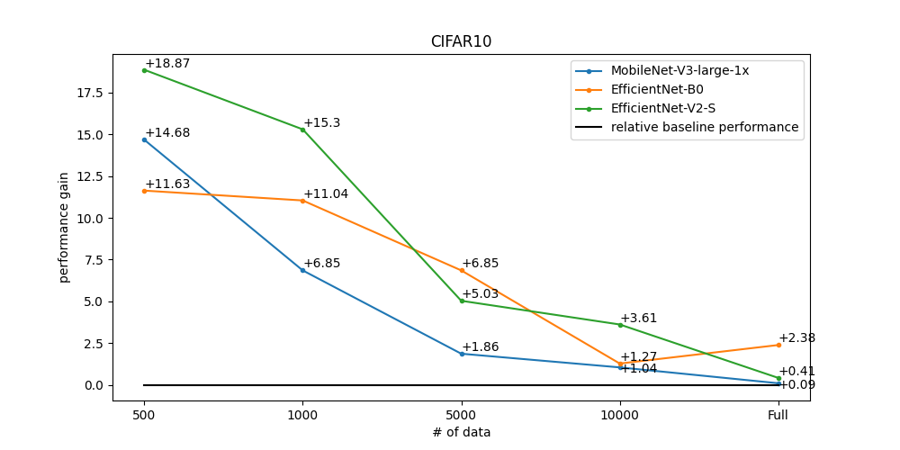
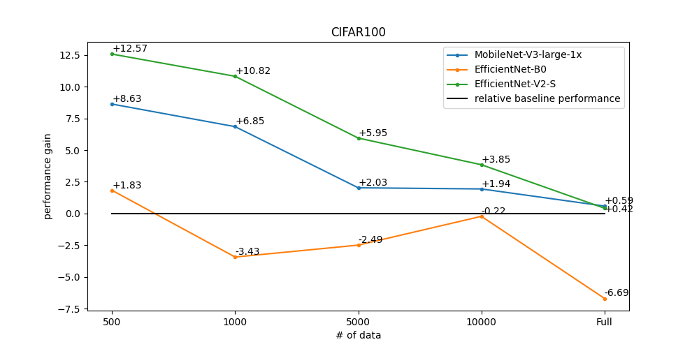
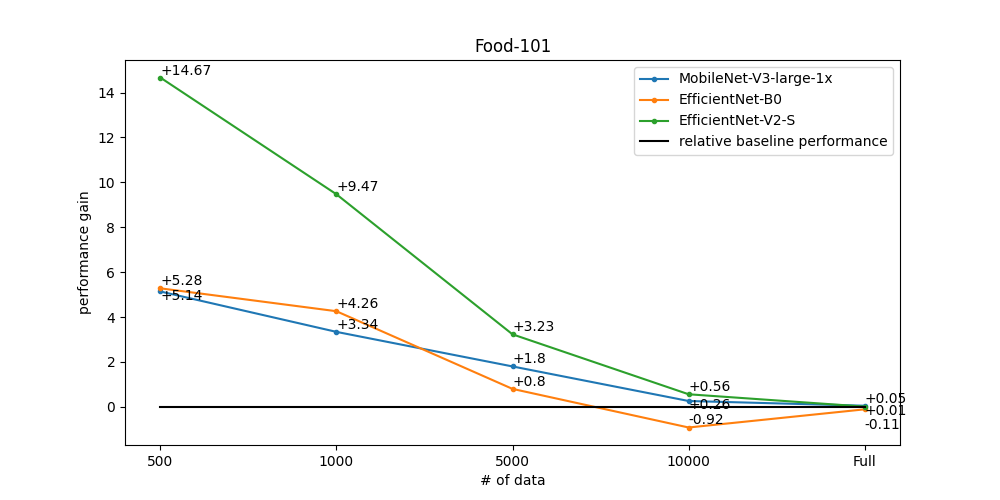

Multi-class Classification
==========================

Multi-class classification is the problem of classifying instances into one of two or more classes. We solve this problem in a common fashion, based on the feature extractor backbone and classifier head that predicts the distribution probability of the categories from the given corpus.
For the supervised training we use the following algorithms components:

.. _mcl_cls_supervised_pipeline:

- ``Augmentations``: Besides basic augmentations like random flip and random rotate, we use `Augmix <https://arxiv.org/abs/1912.02781>`_. This advanced type of augmentations helps to significantly expand the training distribution.

- ``Optimizer``: `Sharpness Aware Minimization (SAM) <https://arxiv.org/abs/2209.06585>`_. Wrapper upon the `SGD <https://en.wikipedia.org/wiki/Stochastic_gradient_descent>`_ optimizer that helps to achieve better generalization minimizing simultaneously loss value and loss sharpness.

- ``Learning rate schedule``: `Cosine Annealing <https://arxiv.org/abs/1608.03983v5>`_. It is a common learning rate scheduler that tends to work well on average for this task on a variety of different datasets.

- ``Loss function``: We use standard `Cross Entropy Loss <https://en.wikipedia.org/wiki/Cross_entropy>`_  to train a model. However, for the class-incremental scenario we use `Influence-Balanced Loss <https://arxiv.org/abs/2110.02444>`_. IB loss is a solution for the class imbalance, which avoids overfitting to the majority classes re-weighting the influential samples.

- ``Additional training techniques``
    - `No Bias Decay (NBD) <https://arxiv.org/abs/1812.01187>`_: To add adaptability to the training pipeline and prevent overfitting.
    - ``Early stopping``: To add adaptability to the training pipeline and prevent overfitting. You can use early stopping like the below command.

      .. code-block::

        $ otx train {TEMPLATE} ... \
            params \
            --learning_parameters.enable_early_stopping=True

    - `Balanced Sampler <https://github.dev/openvinotoolkit/training_extensions/blob/develop/src/otx/mpa/modules/datasets/samplers/balanced_sampler.py#L11>`_: To create an efficient batch that consists of balanced samples over classes, reducing the iteration size as well.

**************
Dataset Format
**************

We support a commonly used format for multi-class image classification task: `ImageNet <https://www.image-net.org/>`_ class folder format.
This format has the following structure:

::

    data
    ├── train
        ├── class 0
            ├── 0.png
            ├── 1.png
            ...
            └── N.png
        ├── class 1
            ├── 0.png
            ├── 1.png
            ...
            └── N.png
        ...
        └── class N
            ├── 0.png
            ├── 1.png
            ...
            └── N.png
    └── val
        ...

.. note::

    Please, refer to our :doc:`dedicated tutorial <../../../tutorials/base/how_to_train/classification>` for more information how to train, validate and optimize classification models.

******
Models
******
.. _classification_models:

We support the following ready-to-use model templates:

+------------------------------------------------------------------------------------------------------------------------------------------------------------------------------------------------------------------+-----------------------+---------------------+-----------------+
| Template ID                                                                                                                                                                                                      | Name                  | Complexity (GFLOPs) | Model size (MB) |
+==================================================================================================================================================================================================================+=======================+=====================+=================+
| `Custom_Image_Classification_MobileNet-V3-large-1x <https://github.com/openvinotoolkit/training_extensions/blob/develop/src/otx/algorithms/classification/configs/mobilenet_v3_large_1_cls_incr/template.yaml>`_ | MobileNet-V3-large-1x | 0.44                | 4.29            |
+------------------------------------------------------------------------------------------------------------------------------------------------------------------------------------------------------------------+-----------------------+---------------------+-----------------+
| `Custom_Image_Classification_EfficinetNet-B0 <https://github.com/openvinotoolkit/training_extensions/blob/develop/src/otx/algorithms/classification/configs/efficientnet_b0_cls_incr/template.yaml>`_            | EfficientNet-B0       | 0.81                | 4.09            |
+------------------------------------------------------------------------------------------------------------------------------------------------------------------------------------------------------------------+-----------------------+---------------------+-----------------+
| `Custom_Image_Classification_EfficientNet-V2-S <https://github.com/openvinotoolkit/training_extensions/blob/develop/src/otx/algorithms/classification/configs/efficientnet_v2_s_cls_incr/template.yaml>`_        | EfficientNet-V2-S     | 5.76                | 20.23           |
+------------------------------------------------------------------------------------------------------------------------------------------------------------------------------------------------------------------+-----------------------+---------------------+-----------------+

`EfficientNet-V2-S <https://arxiv.org/abs/2104.00298>`_ has more parameters and Flops and needs more time to train, meanwhile providing superior classification performance. `MobileNet-V3-large-1x <https://arxiv.org/abs/1905.02244>`_ is the best choice when training time and computational cost are in priority, nevertheless, this template provides competitive accuracy as well.
`EfficientNet-B0 <https://arxiv.org/abs/1905.11946>`_ consumes more Flops compared to MobileNet, providing better performance on large datasets, but may be not so stable in case of a small amount of training data.

Besides this, we support public backbones from `torchvision <https://pytorch.org/vision/stable/index.html>`_, `pytorchcv <https://github.com/osmr/imgclsmob>`_, `mmcls <https://github.com/open-mmlab/mmclassification>`_ and `OpenVino Model Zoo <https://github.com/openvinotoolkit/open_model_zoo>`_.
Please, refer to the :doc:`tutorial <../../../tutorials/advanced/backbones>` how to customize models and run public backbones.

To see which public backbones are available for the task, the following command can be executed:

.. code-block::

        $ otx find --backbone {torchvision, pytorchcv, mmcls, omz.mmcls}

In the table below the top-1 accuracy on some academic datasets using our :ref:`supervised pipeline <mcl_cls_supervised_pipeline>` is presented. The results were obtained on our templates without any changes. We use 224x224 image resolution, for other hyperparameters, please, refer to the related template. We trained each model with single Nvidia GeForce RTX3090.

+-----------------------+-----------------+-----------+-----------+-----------+
| Model name            | CIFAR10         |CIFAR100   |flowers*   | cars*     |
+=======================+=================+===========+===========+===========+
| MobileNet-V3-large-1x | 93.36           | 83.01     | 96.45     | 83.24     |
+-----------------------+-----------------+-----------+-----------+-----------+
| EfficientNet-B0       | 94.86           | 84.73     | 96.86     | 85.70     |
+-----------------------+-----------------+-----------+-----------+-----------+
| EfficientNet-V2-S     | 96.13           | 90.36     | 97.68     | 86.74     |
+-----------------------+-----------------+-----------+-----------+-----------+
\* These datasets were splitted with auto-split (80% train, 20% test).

************************
Semi-supervised Learning
************************

Semi-SL (Semi-supervised Learning) is a type of machine learning algorithm that uses both labeled and unlabeled data to improve the performance of the model. This is particularly useful when labeled data is limited, expensive or time-consuming to obtain.

We use `FixMatch <https://arxiv.org/abs/2001.07685>`_ as a core algorithm for Semi-SL task solving. It is a specific implementation of Semi-SL that has been shown to be effective in various applications. FixMatch introduces pseudo-labeling, which is the process of generating labels for the unlabeled data and treating them as if they were labeled data. Pseudo-labeling is based on the idea that the model's prediction for the unlabeled data is likely to be correct, which can improve the model's accuracy and reduce the need for labeled data.

In Semi-SL, the pseudo-labeling process is combined with a consistency loss that ensures that the predictions of the model are consistent across augmented versions of the same data. This helps to reduce the impact of noisy or incorrect labels that may arise from the pseudo-labeling process. Additionally, our algorithm uses a combination of strong data augmentations and a specific optimizer called Sharpness-Aware Minimization (SAM) to further improve the accuracy of the model.

Overall, OpenVINO™ Training Extensions utilizes powerful techniques for improving the performance of Semi-SL algorithm with limited labeled data. They can be particularly useful in domains where labeled data is expensive or difficult to obtain, and can help to reduce the time and cost associated with collecting labeled data.

.. _mcl_cls_semi_supervised_pipeline:

- ``Pseudo-labeling (FixMatch)``: A specific implementation of Semi-SL that combines the use of pseudo-labeling with a consistency loss, strong data augmentations, and a specific optimizer called Sharpness-Aware Minimization (SAM) to improve the performance of the model.

- ``Adaptable Threshold``: A novel addition to our solution that calculates a class-wise threshold for pseudo-labeling, which can solve the issue of imbalanced data and produce high-quality pseudo-labels that improve the overall score.

- ``Unlabeled Warm-Up Loss``: A technique for preventing the initial unstable learning of pseudo-labeling by increasing the coefficient of the unlabeled loss from 0 to 1.

- ``Exponential Moving Average (EMA)``: A technique for maintaining a moving average of the model's parameters, which can improve the generalization performance of the model.

- ``Additional techniques``: Other than that, we use several solutions that apply to supervised learning (No bias Decay, Augmentations, Early-Stopping, etc.)

Please, refer to the :doc:`tutorial <../../../tutorials/advanced/semi_sl>` on how to train semi-supervised learning.
Training time depends on the number of images and can be up to several times longer than conventional supervised learning.

In the table below the top-1 accuracy on some academic datasets using our pipeline is presented. Same as the supervised setting except for an image for unlabeled and additional batch size.

- 4 labeled images per class including unlabeled dataset for Semi-SL

+-----------------------+---------+---------+-------+---------+--------+---------+
|        Dataset        | CIFAR10 |         | SVHN  |         | FMNIST |         |
+=======================+=========+=========+=======+=========+========+=========+
|                       |   SL    | Semi-SL |  SL   | Semi-SL |   SL   | Semi-SL |
+-----------------------+---------+---------+-------+---------+--------+---------+
| MobileNet-V3-large-1x |  40.75  |  43.13  | 23.32 |  27.85  |  68.2  |  71.84  |
+-----------------------+---------+---------+-------+---------+--------+---------+
|   EfficientNet-B0     |  42.24  |  44.23  | 28.09 |  32.96  | 68.58  |  70.79  |
+-----------------------+---------+---------+-------+---------+--------+---------+
|  EfficientNet-V2-S    |  36.03  |  39.66  | 16.81 |  20.28  | 65.99  |  69.61  |
+-----------------------+---------+---------+-------+---------+--------+---------+

- 10 labeled images per class including unlabeled dataset for Semi-SL

+-----------------------+---------+---------+-------+---------+--------+---------+
|        Dataset        | CIFAR10 |         | SVHN  |         | FMNIST |         |
+=======================+=========+=========+=======+=========+========+=========+
|                       |   SL    | Semi-SL |  SL   | Semi-SL |   SL   | Semi-SL |
+-----------------------+---------+---------+-------+---------+--------+---------+
| MobileNet-V3-large-1x |  50.77  |  52.16  | 38.73 |  48.36  | 73.33  |  77.04  |
+-----------------------+---------+---------+-------+---------+--------+---------+
|   EfficientNet-B0     |  52.69  |  58.35  | 46.04 |  61.79  | 74.56  |  80.14  |
+-----------------------+---------+---------+-------+---------+--------+---------+
|  EfficientNet-V2-S    |  48.84  |   55    | 26.16 |  47.99  |  74.6  |  80.92  |
+-----------------------+---------+---------+-------+---------+--------+---------+

.. note::
    This result can vary greatly depending on the image selected for each class. Also, since there are few labeled settings for the Semi-SL algorithm. Some models may require larger datasets for better results.

************************
Self-supervised Learning
************************
.. _selfsl_multi_class_classification:

Self-supervised learning can be one of the solutions if the user has a small data set, but label information is not yet available.
General self-supervised Learning in academia is commonly used to obtain well-pretrained weights from a source dataset without label information.
However, in real-world industries, it is difficult to apply because of small datasets, limited resources, or training in minutes.

For these cases, OpenVINO™ Training Extensions provides improved self-supervised learning recipes that can be applied to the above harsh environments.
We adapted `BYOL <https://arxiv.org/abs/2006.07733>`_ as our self-supervised method.
This algorithm will require some additional training time, meanwhile, improved performance is expected, especially in low-data regimes.
OpenVINO™ Training Extensions allows to perform a pre-training phase on any images to further use obtained weights on the target dataset.

Below is graphs of performance improvement for three baseline datasets: CIFAR10, CIFAR100, and Food-101.
The graphs below show how much performance improvement over baseline was achieved using our self-supervised learning recipes.
We created subset datasets by sampling images to check performance from small to large datasets.
In particular, the smaller the data, the greater the performance improvement can be expected.
To get the below performance, we had two steps:

- Train the models using only images without label information to get pretrained weights for a few epochs.
- Fine-tune the models with pretrained weights using subset datasets and get performance.

We additionally obtained baseline performance from supervised learning using subset datasets for comparison.
Each subset dataset has 500, 1000, 5000, 10000, and the whole images, respectively.

To enable self-supervised training, the command below can be executed. The folder with images for pre-training is needed to be passed in ``--train-data-root`` folder.
Unlike other tasks, ``--val-data-root`` is not needed.

.. code-block::

  $ otx train EfficientNet-V2-S \
              --train-data-root path/to/folder/with/images

.. note::
    It is also possible to pass a full imagenet dataset format to ``--train-data-root`` instead of just a folder with images.
    However, it will be required to add ``--train-type Selfsupervised`` option into the command line. Otherwise, ordinary supervised training will be started with auto-split functionality.

After self-supervised training, pretrained weights can be use for supervised (incremental) learning like the below command:

.. code-block::

  $ otx train EfficientNet-V2-S \
              --train-data-roots path/to/train/subset \
              --val-data-roots path/to/val/subset \
              --load-weights={PATH/PRETRAINED/WEIGHTS}

*******************************
Supervised Contrastive Learning
*******************************

To enhance the performance of the algorithm in the case when we have a small number of data, `Supervised Contrastive Learning (SupCon) <https://arxiv.org/abs/2004.11362>`_ can be used.
More specifically, we train a model with two heads: classification head with Influence-Balanced Loss and contrastive head with `Barlow Twins loss <https://arxiv.org/abs/2103.03230>`_.
The below table shows how much performance SupCon improved compared with baseline performance on three baseline datasets with 10 samples per class: CIFAR10, Eurosat-10, and Food-101.

+-----------------------+---------+---------+------------+---------+----------+---------+
| Model name            | CIFAR10 |         | Eurosat-10 |         | Food-101 |         |
+=======================+=========+=========+============+=========+==========+=========+
|                       | SL      | SupCon  | SL         | SupCon  | SL       | SupCon  |
+-----------------------+---------+---------+------------+---------+----------+---------+
| MobileNet-V3-large-1x | 55.06   | 58.88   | 77.60      | 78.70   | 34.83    | 34.38   |
+-----------------------+---------+---------+------------+---------+----------+---------+
| EfficientNet-B0       | 42.81   | 46.35   | 66.87      | 70.23   | 37.26    | 39.17   |
+-----------------------+---------+---------+------------+---------+----------+---------+
| EfficientNet-V2-S     | 59.78   | 63.13   | 81.84      | 83.12   | 51.32    | 54.84   |
+-----------------------+---------+---------+------------+---------+----------+---------+

The SupCon training can be launched by adding additional option to template parameters like the below.
It can be launched only with supervised (incremental) training type.

.. code-block::

  $ otx train src/otx/algorithms/classification/configs/efficientnet_b0_cls_incr/template.yaml \
              --train-data-roots=tests/assets/imagenet_dataset_class_incremental \
              --val-data-roots=tests/assets/imagenet_dataset_class_incremental \
              params \
              --learning_parameters.enable_supcon=True

.. note::
    SL stands for Supervised Learning.

.. ********************
.. Incremental Learning
.. ********************

.. To be added soon