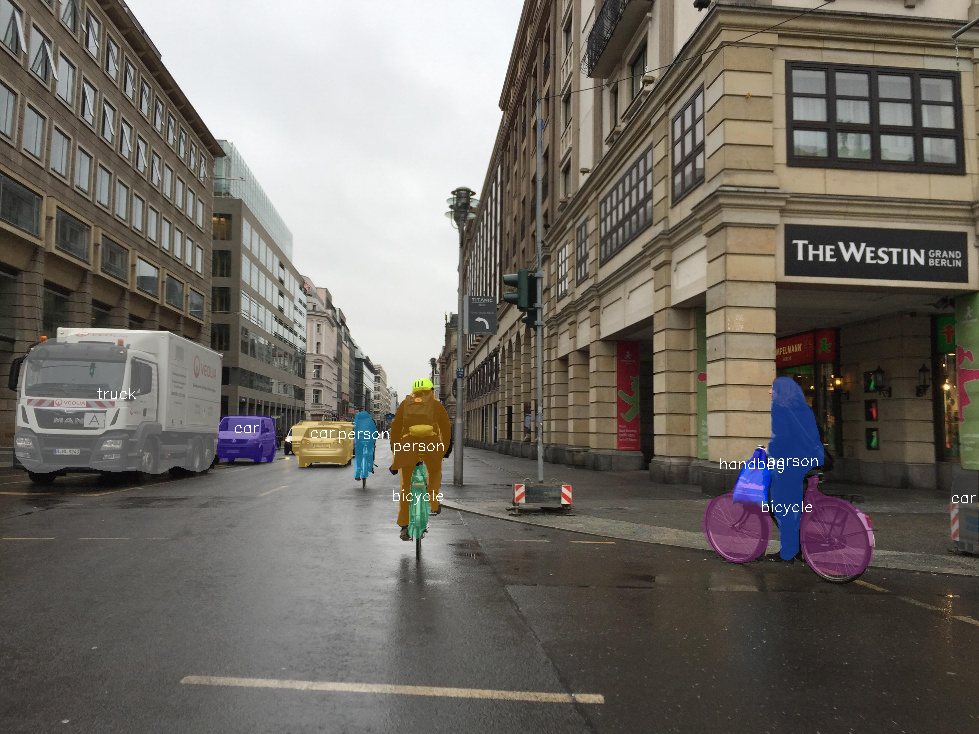

Instance Segmentation
=====================

Instance segmentation is a computer vision task that involves identifying and segmenting individual objects within an image.

It is a more advanced version of object detection, as it doesn't only detect the presence of an object in an image but also segments the object by creating a mask that separates it from the background. This allows getting more detailed information about the object, such as its shape and location, to be extracted.

Instance segmentation is commonly used in applications such as self-driving cars, robotics, and image-editing software.

.. _instance_segmentation_image_example:

|

We solve this problem in the `MaskRCNN <https://arxiv.org/abs/1703.06870>`_ manner. The main idea of Mask R-CNN is to add a branch for predicting an object mask in parallel with the existing branch for bounding box regression and object classification.

This is done by using a fully convolutional network (FCN) on top of the feature map generated by the last convolutional layer of the backbone network. The model first generates region proposals, and then uses a RoIAlign layer to align the region proposals with the feature map, then the FCN predicts the class and box offset for each proposal and the mask for each class.

The mask branch is trained to predict a binary mask for each object instance, where the mask is aligned with the object's bounding box and has the same size as the region of interest (RoI). The predicted mask is then used to segment the object from the background.

For the supervised training we use the following algorithms components:

.. _instance_segmentation_supervised_pipeline:

- ``Augmentations``: We use only a random flip for both augmentations pipelines, train and validation.

- ``Optimizer``: We use `SGD <https://en.wikipedia.org/wiki/Stochastic_gradient_descent>`_ optimizer with the weight decay set to **1e-4** and momentum set to **0.9**.

- ``Learning rate schedule``: For scheduling training process we use **ReduceLrOnPlateau** with linear learning rate warmup for **200** iterations. This method monitors a target metric (in our case we use metric on the validation set) and if no improvement is seen for a ``patience`` number of epochs, the learning rate is reduced.

- ``Loss functions``: For the bounding box regression we use **L1 Loss** (the sum of the absolute differences between the ground truth value and the predicted value), `Cross Entropy Loss <https://en.wikipedia.org/wiki/Cross_entropy>`_ for the categories classification and segmentation masks prediction.

- Additionally, we use the **Exponential Moving Average (EMA)** for the model's weights and the **early stopping** to add adaptability to the training pipeline and prevent overfitting.

**************
Dataset Format
**************

For the dataset handling inside OpenVINO™ Training Extensions, we use `Dataset Management Framework (Datumaro) <https://github.com/openvinotoolkit/datumaro>`_. For instance segmentation we support `COCO <https://cocodataset.org/#format-data>`_ dataset format.
If you have your dataset in those formats, then you can simply run using one line of code:

.. code-block::

    $ otx train  <model_template> --train-data-roots <path_to_data_root> \
                                            --val-data-roots <path_to_data_root>

.. note::

    Please, refer to our :doc:`dedicated tutorial <../../../tutorials/base/how_to_train/instance_segmentation>` how to train, validate and optimize instance segmentation model for more details.

******
Models
******

We support the following ready-to-use model templates:

+--------------------------------------------------------------------------------------------------------------------------------------------------------------------------------------------------------------------------------------------+----------------------------+---------------------+-----------------+
| Template ID                                                                                                                                                                                                                                | Name                       | Complexity (GFLOPs) | Model size (MB) |
+============================================================================================================================================================================================================================================+============================+=====================+=================+
| `Custom_Counting_Instance_Segmentation_MaskRCNN_EfficientNetB2B <https://github.com/openvinotoolkit/training_extensions/blob/develop/src/otx/algorithms/detection/configs/instance_segmentation/efficientnetb2b_maskrcnn/template.yaml>`_      | MaskRCNN-EfficientNetB2B   | 68.48           | 13.27           |
+--------------------------------------------------------------------------------------------------------------------------------------------------------------------------------------------------------------------------------------------+----------------------------+---------------------+-----------------+
| `Custom_Counting_Instance_Segmentation_MaskRCNN_ResNet50 <https://github.com/openvinotoolkit/training_extensions/blob/develop/src/otx/algorithms/detection/configs/instance_segmentation/resnet50_maskrcnn/template.yaml>`_                    | MaskRCNN-ResNet50          | 533.80          | 177.90          |
+--------------------------------------------------------------------------------------------------------------------------------------------------------------------------------------------------------------------------------------------+----------------------------+---------------------+-----------------+
| `Custom_Counting_Instance_Segmentation_MaskRCNN_ConvNeXt <https://github.com/openvinotoolkit/training_extensions/blob/develop/src/otx/algorithms/detection/configs/instance_segmentation/convnext_maskrcnn/template.yaml>`_                    | MaskRCNN-ConvNeXt          | 266.78          | 192.4          |
+--------------------------------------------------------------------------------------------------------------------------------------------------------------------------------------------------------------------------------------------+----------------------------+---------------------+-----------------+

MaskRCNN-ResNet50 utilizes the `ResNet-50 <https://arxiv.org/abs/1512.03385>`_ architecture as the backbone network for extracting image features. This choice of backbone network results in a higher number of parameters and FLOPs, which consequently requires more training time. However, the model offers superior performance in terms of accuracy.

On the other hand, MaskRCNN-EfficientNetB2B employs the `EfficientNet-B2 <https://arxiv.org/abs/1905.11946>`_ architecture as the backbone network. This selection strikes a balance between accuracy and speed, making it a preferable option when prioritizing training time and computational cost.

Recently, we have made updates to MaskRCNN-ConvNeXt, incorporating the `ConvNeXt backbone <https://arxiv.org/abs/2201.03545>`_. Through our experiments, we have observed that this variant achieves better accuracy compared to MaskRCNN-ResNet50 while utilizing less GPU memory. However, it is important to note that the training time and inference duration may slightly increase. If minimizing training time is a significant concern, we recommend considering a switch to MaskRCNN-EfficientNetB2B.

.. In the table below the `mAP <https://en.wikipedia.org/wiki/S%C3%B8rensen%E2%80%93Dice_coefficient>`_ metric on some academic datasets using our :ref:`supervised pipeline <instance_segmentation_supervised_pipeline>` is presented. The results were obtained on our templates without any changes. We use 1024x1024 image resolution, for other hyperparameters, please, refer to the related template. We trained each model with single Nvidia GeForce RTX3090.

.. +---------------------------+--------------+------------+-----------------+
.. | Model name                | ADE20k       | Cityscapes | Pascal-VOC 2007 |
.. +===========================+==============+============+=================+
.. | MaskRCNN-EfficientNetB2B  | N/A          | N/A        | N/A             |
.. +---------------------------+--------------+------------+-----------------+
.. | MaskRCNN-ResNet50         | N/A          | N/A        | N/A             |
.. +---------------------------+--------------+------------+-----------------+
.. | MaskRCNN-ConvNeXt         | N/A          | N/A        | N/A             |
.. +---------------------------+--------------+------------+-----------------+

.. *******************
.. Tiling Pipeline
.. *******************

.. To be added soon

.. ************************
.. Semi-supervised Learning
.. ************************

.. To be added soon

.. ************************
.. Self-supervised Learning
.. ************************

.. To be added soon

.. ********************
.. Incremental Learning
.. ********************

.. To be added soon