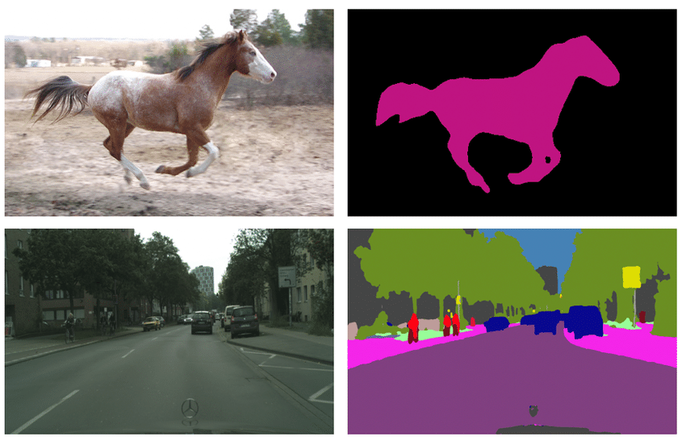

Semantic Segmentation
=====================

Semantic segmentation is a computer vision task in which an algorithm assigns a label or class to each pixel in an image.
For example, semantic segmentation can be used to identify the boundaries of different objects in an image, such as cars, buildings, and trees.
The output of semantic segmentation is typically an image where each pixel is colored with a different color or label depending on its class.

.. _semantic_segmentation_image_example:

|

We solve this task by utilizing `FCN Head <https://arxiv.org/pdf/1411.4038.pdf>`_ with implementation from `MMSegmentation <https://mmsegmentation.readthedocs.io/en/latest/_modules/mmseg/models/decode_heads/fcn_head.html>`_ on the multi-level image features obtained by the feature extractor backbone (`Lite-HRNet <https://arxiv.org/abs/2104.06403>`_).
For the supervised training we use the following algorithms components:

.. _semantic_segmentation_supervised_pipeline:

- ``Augmentations``: Besides basic augmentations like random flip, random rotate and random crop, we use mixing images technique with different `photometric distortions <https://mmsegmentation.readthedocs.io/en/latest/api.html#mmseg.datasets.pipelines.PhotoMetricDistortion>`_.

- ``Optimizer``: We use `Adam <https://arxiv.org/abs/1412.6980>`_ optimizer with weight decay set to zero and gradient clipping with maximum quadratic norm equals to 40.

- ``Learning rate schedule``: For scheduling training process we use **ReduceLROnPlateau** with linear learning rate warmup for 100 iterations. This method monitors a target metric (in our case we use metric on the validation set) and if no improvement is seen for a ``patience`` number of epochs, the learning rate is reduced.

- ``Loss function``: We use standard `Cross Entropy Loss <https://en.wikipedia.org/wiki/Cross_entropy>`_  to train a model.

- ``Additional training techniques``
    - ``Early stopping``: To add adaptability to the training pipeline and prevent overfitting. You can use early stopping like the below command.

      .. code-block::

        $ otx train {TEMPLATE} ... \
                    params \
                    --learning_parameters.enable_early_stopping=True

**************
Dataset Format
**************

For the dataset handling inside OpenVINO™ Training Extensions, we use `Dataset Management Framework (Datumaro) <https://github.com/openvinotoolkit/datumaro>`_.

At this end we support `Common Semantic Segmentation <https://openvinotoolkit.github.io/datumaro/docs/formats/common_semantic_segmentation/>`_ data format.
If you organized supported dataset format, starting training will be very simple. We just need to pass a path to the root folder and desired model template to start training:

.. code-block::

    $ otx train --template <model_template> --train-data-roots <path_to_data_root> \
                                            --val-data-roots <path_to_data_root>

.. note::

    Please, refer to our :doc:`dedicated tutorial <../../../tutorials/base/how_to_train/semantic_segmentation>` for more information on how to train, validate and optimize semantic segmentation model for more details.

******
Models
******
.. _semantic_segmentation_models:

We support the following ready-to-use model templates:

+------------------------------------------------------------------------------------------------------------------------------------------------------------------------------------------------------------------------------+------------------------+---------------------+-----------------+
| Template ID                                                                                                                                                                                                                  | Name                   | Complexity (GFLOPs) | Model size (MB) |
+==============================================================================================================================================================================================================================+========================+=====================+=================+
| `Custom_Semantic_Segmentation_Lite-HRNet-s-mod2_OCR <https://github.com/openvinotoolkit/training_extensions/blob/develop/otx/algorithms/segmentation/configs/ocr_lite_hrnet_s_mod2/template.yaml>`_                          | Lite-HRNet-s-mod2      | 1.44                | 3.2             |
+------------------------------------------------------------------------------------------------------------------------------------------------------------------------------------------------------------------------------+------------------------+---------------------+-----------------+
| `Custom_Semantic_Segmentation_Lite-HRNet-18-mod2_OCR <https://github.com/openvinotoolkit/training_extensions/blob/develop/otx/algorithms/segmentation/configs/ocr_lite_hrnet_18_mod2/template.yaml>`_                        | Lite-HRNet-18-mod2     | 2.82                | 4.3             |
+------------------------------------------------------------------------------------------------------------------------------------------------------------------------------------------------------------------------------+------------------------+---------------------+-----------------+
| `Custom_Semantic_Segmentation_Lite-HRNet-x-mod3_OCR <https://github.com/openvinotoolkit/training_extensions/blob/develop/otx/algorithms/segmentation/configs/ocr_lite_hrnet_x_mod3/template.yaml>`_                          | Lite-HRNet-x-mod3      | 9.20                | 5.7             |
+------------------------------------------------------------------------------------------------------------------------------------------------------------------------------------------------------------------------------+------------------------+---------------------+-----------------+

All of these models are members of the same `Lite-HRNet <https://arxiv.org/abs/2104.06403>`_ backbones family. They differ in the trade-off between accuracy and inference/training speed. ``Lite-HRNet-x-mod3`` is the template with heavy-size architecture for accurate predictions but it requires long training.
Whereas the ``Lite-HRNet-s-mod2`` is the lightweight architecture for fast inference and training. It is the best choice for the scenario of a limited amount of data. The ``Lite-HRNet-18-mod2`` model is the middle-sized architecture for the balance between fast inference and training time.

.. In the table below the `Dice score <https://en.wikipedia.org/wiki/S%C3%B8rensen%E2%80%93Dice_coefficient>`_ on some academic datasets using our :ref:`supervised pipeline <semantic_segmentation_supervised_pipeline>` is presented. The results were obtained on our templates without any changes. We use 512x512 image crop resolution, for other hyperparameters, please, refer to the related template. We trained each model with single Nvidia GeForce RTX3090.

.. +-----------------------+--------------+------------+-----------------+
.. | Model name            | ADE20k       | Cityscapes | Pascal-VOC 2012 |
.. +=======================+==============+============+=================+
.. | Lite-HRNet-s-mod2     | N/A          | N/A        | N/A             |
.. +-----------------------+--------------+------------+-----------------+
.. | Lite-HRNet-18-mod2    | N/A          | N/A        | N/A             |
.. +-----------------------+--------------+------------+-----------------+
.. | Lite-HRNet-x-mod3     | N/A          | N/A        | N/A             |
.. +-----------------------+--------------+------------+-----------------+

************************
Semi-supervised Learning
************************

To solve :ref:`Semi-supervised learning <semi_sl_explanation>` problem for the semantic segmentation we use the `Mean Teacher algorithm <https://arxiv.org/abs/1703.01780>`_.

The basic idea of this approach is to use two models during training: a "student" model, which is the main model being trained, and a "teacher" model, which acts as a guide for the student model.
The student model is updated based on the ground truth annotations (for the labeled data) and pseudo-labels (for the unlabeled data) which are the predictions of the teacher model.
The teacher model is updated based on the moving average of the student model's parameters. So, we don't use backward loss propagation for the teacher model's parameters.
After training, only the student model is used for prediction.

We utilize the same core algorithm's parameters as for the :ref:`supervised pipeline <semantic_segmentation_supervised_pipeline>`. The main difference is to use of different augmentation pipelines for the labeled and unlabeled data.
We use only basic augmentations (random flip, random rotate, random crop) for the labeled data and stronger for the unlabeled (color distortion).
It helps with a better generalization and prevents unnecessary overfitting on the pseudo-labels generated by the teacher model.

.. In the table below the `Dice score <https://en.wikipedia.org/wiki/S%C3%B8rensen%E2%80%93Dice_coefficient>`_ with our middle template on some datasets is presented. For comparison, we present the supervised baseline trained on the labeled data only.
.. The results were obtained on our templates without any changes. We use 512x512 image resolution, for other hyperparameters, please, refer to the `related template <https://github.com/openvinotoolkit/training_extensions/blob/develop/otx/algorithms/segmentation/configs/ocr_lite_hrnet_18_mod2/template.yaml>`_. We trained each model with single Nvidia GeForce RTX3090.
.. For `Cityscapes <https://www.cityscapes-dataset.com/>`__ and `Pascal-VOC <http://host.robots.ox.ac.uk/pascal/VOC/voc2012/index.html>`_ we use splits with different ratios of labeled to unlabeled data like `here <https://github.com/charlesCXK/TorchSemiSeg>`_.
.. For the `DIS5K <https://xuebinqin.github.io/dis/index.html>`_ we prepared random splits for the train data with different ratios of labeled to unlabeled images. We use the validation set for testing purposes.

.. +-------------------------------------+--------------+------------+-----------------+
.. | Model name                          |  DIS5K       | Cityscapes | Pascal-VOC      |
.. +=====================================+==============+============+=================+
.. | Supervised Lite-HRNet-18-mod2 (1/8) | N/A          | N/A        | N/A             |
.. +-------------------------------------+--------------+------------+-----------------+
.. | Semi-SL Lite-HRNet-18-mod2 (1/8)    | N/A          | N/A        | N/A             |
.. +-------------------------------------+--------------+------------+-----------------+
.. | Supervised Lite-HRNet-18-mod2 (1/16)| N/A          | N/A        | N/A             |
.. +-------------------------------------+--------------+------------+-----------------+
.. | Semi-SL Lite-HRNet-18-mod2 (1/16)   | N/A          | N/A        | N/A             |
.. +-------------------------------------+--------------+------------+-----------------+

************************
Self-supervised Learning
************************
.. _selfsl_semantic_segmentation:

Self-supervised learning can be one of the solutions if the user has a small data set, but label information is not yet available.
General self-supervised Learning in academia is commonly used to obtain well-pretrained weights from a source dataset without label information.
However, in real-world industries, it is difficult to apply because of small datasets, limited resources, or training in minutes.

For these cases, OpenVINO™ Training Extensions provides improved self-supervised learning recipes that can be applied to the above harsh environments.
We adapted `DetCon <https://arxiv.org/abs/2103.10957>`_ as our self-supervised method.
It takes some time to use these self-supervised learning recipes, but you can expect improved performance, especially in small-data regimes.

The below table shows how much performance (mDice) self-supervised methods improved compared with baseline performance on the subsets of Pascal VOC 2012 with three classes (person, car, bicycle).
To get the below performance, we had two steps:

- Train the models using only images containing at less one class of the three classes without label information to get pretrained weights for a few epochs.
- Fine-tune the models with pretrained weights using subset datasets and get performance.

We additionally obtained baseline performance from supervised learning using subset datasets for comparison.
Each subset dataset has 8, 16, and 24 images, respectively.

+--------------------+-------+---------+-------+---------+-------+---------+
| Model name         | #8    |         | #16   |         | #24   |         |
+====================+=======+=========+=======+=========+=======+=========+
|                    | SL    | Self-SL | SL    | Self-SL | SL    | Self-SL |
+--------------------+-------+---------+-------+---------+-------+---------+
| Lite-HRNet-s-mod2  | 48.30 | 53.55   | 57.08 | 58.96   | 62.40 | 63.46   |
+--------------------+-------+---------+-------+---------+-------+---------+
| Lite-HRNet-18-mod2 | 53.47 | 49.20   | 56.69 | 58.72   | 62.81 | 63.63   |
+--------------------+-------+---------+-------+---------+-------+---------+
| Lite-HRNet-x-mod3  | 50.23 | 50.93   | 60.09 | 61.61   | 62.66 | 64.87   |
+--------------------+-------+---------+-------+---------+-------+---------+

Unlike other tasks, two things are considered to use self-supervised learning:

- ``--train-data-roots`` must be set to a directory only containing images, not ground truths.
  DetCon uses pseudo masks created in ``detcon_mask`` directory for training. If they are not created yet, they will be created first.
- ``--val-data-roots`` is not needed.

To enable self-supervised training, the command below can be executed:

.. code-block::

  $ otx train otx/algorithms/segmentation/configs/ocr_lite_hrnet_s_mod2/template.yaml \
              --train-data-roots=tests/assets/common_semantic_segmentation_dataset/train/images \
              params \
              --algo_backend.train_type=Selfsupervised

After self-supervised training, pretrained weights can be use for supervised (incremental) learning like the below command:

.. code-block::

  $ otx train otx/algorithms/segmentation/configs/ocr_lite_hrnet_s_mod2/template.yaml \
              --train-data-roots=tests/assets/common_semantic_segmentation_dataset/train \
              --val-data-roots=tests/assets/common_semantic_segmentation_dataset/val \
              --load-weights={PATH/PRETRAINED/WEIGHTS}

.. note::
    SL stands for Supervised Learning.

*******************************
Supervised Contrastive Learning
*******************************

To enhance the performance of the algorithm in case when we have a small number of data, `Supervised Contrastive Learning (SupCon) <https://arxiv.org/abs/2004.11362>`_ can be used.

More specifically, we train a model with two heads: segmentation head with Cross Entropy Loss and contrastive head with `DetCon loss <https://arxiv.org/abs/2103.10957>`_.
As of using this advanced approach, we can expect improved performance and reduced training time rather than supervised learning.
The below table shows how much performance (mDice) SupCon improved compared with baseline performance on the subsets of Pascal VOC 2012 with three classes (person, car, bicycle).
Each subset dataset has 8, 16, and 24 images, respectively.

+--------------------+-------+--------+-------+-------+--------+-------+-------+--------+-------+
| Model name         | #8    |        |       | #16   |        |       | #24   |        |       | 
+====================+=======+========+=======+=======+========+=======+========+=======+=======+
|                    | SL    | SupCon | TR    | SL    | SupCon | TR    | SL    | SupCon | TR    |
+--------------------+-------+--------+-------+-------+--------+-------+-------+--------+-------+
| Lite-HRNet-s-mod2  | 52.30 | 54.24  | 0.83x | 59.58 | 61.44  | 0.93x | 62.86 | 64.30  | 1.03x |
+--------------------+-------+--------+-------+-------+--------+-------+-------+--------+-------+
| Lite-HRNet-18-mod2 | 53.00 | 56.16  | 0.71x | 61.44 | 60.08  | 0.91x | 64.26 | 64.82  | 0.91x |
+--------------------+-------+--------+-------+-------+--------+-------+-------+--------+-------+
| Lite-HRNet-x-mod3  | 53.71 | 58.67  | 0.83x | 58.43 | 61.52  | 0.73x | 64.72 | 65.83  | 0.73x |
+--------------------+-------+--------+-------+-------+--------+-------+-------+--------+-------+

The SupCon training can be launched by adding additional option to template parameters like the below.
It can be launched only with supervised (incremental) training type.

.. code-block::

  $ otx train otx/algorithms/segmentation/configs/ocr_lite_hrnet_s_mod2/template.yaml \
              --train-data-roots=tests/assets/common_semantic_segmentation_dataset/train \
              --val-data-roots=tests/assets/common_semantic_segmentation_dataset/val \
              params \
              --learning_parameters.enable_supcon=True

.. note::
    SL : Supervised Learning / TR : Training Time Ratio of SupCon compared with supervised learning

.. ********************
.. Incremental Learning
.. ********************

.. To be added soon