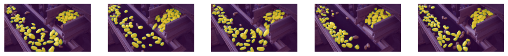

Visual Prompting (Zero-shot learning)
=====================================

Visual prompting is a computer vision task that uses a combination of an image and prompts, such as texts, bounding boxes, points, and so on to troubleshoot problems.
Using these useful prompts, the main purpose of this task is to obtain labels from unlabeled datasets, and to use generated label information on particular domains or to develop a new model with the generated information.

This section examines the solutions for visual prompting offered by the OpenVINO Training Extensions library.
`Segment Anything (SAM) <https://arxiv.org/abs/2304.02643>`_, is one of the most famous visual prompting methods and this model will be used to adapt a new dataset domain.
Especially, in this section, we try to automatically predict given images without any training, called as ``zero-shot learning``.
Unlike fine-tuning, zero-shot learning needs only pre-processing component.

.. _zero_shot_visual_prompting_pipeline:

- ``Pre-processing``: Resize an image according to the longest axis and pad the rest with zero. This pre-processing step is internalized in the model for standalone usecases unlike other models.

.. note::

    In OTX 2.0, zero-shot learning supports various types of prompts, such as bounding boxes, points, and masks. (Polygon will be available soon.)
    Regardless of the prompt types, prediction will be made in the order prompts come in.

.. note::

    Currently, Post-Training Quantization (PTQ) for `SAM <https://arxiv.org/abs/2304.02643>`_ is only supported, not Quantization Aware Training (QAT).

**************
Dataset Format
**************
.. _zero_shot_visual_prompting_dataset:

For the dataset handling inside OpenVINO™ Training Extensions, we use `Dataset Management Framework (Datumaro) <https://github.com/openvinotoolkit/datumaro>`_.

We support four dataset formats for zero-shot visual prompting:

- `Common Semantic Segmentation <https://openvinotoolkit.github.io/datumaro/stable/docs/data-formats/formats/common_semantic_segmentation.html>`_ for semantic segmentation

- `COCO <https://openvinotoolkit.github.io/datumaro/stable/docs/data-formats/formats/coco.html>`_ for instance segmentation

- `Pascal VOC <https://openvinotoolkit.github.io/datumaro/stable/docs/data-formats/formats/pascal_voc.html>`_ for instance segmentation and semantic segmentation

- `Datumaro <https://openvinotoolkit.github.io/datumaro/stable/docs/data-formats/formats/datumaro.html>`_ for custom format dataset

******
Models
******
.. _zero_shot_visual_prompting_model:

We support the following model recipes in experimental phase:

+-------------------------------------------------------------------------------------------------------------------------------------------------------------+------------------------+---------------------+-----------------+
|                                                                         Template ID                                                                         |          Name          | Complexity (GFLOPs) | Model size (MB) |
+=============================================================================================================================================================+========================+=====================+=================+
| `Zero_Shot_SAM_Tiny_ViT <https://github.com/openvinotoolkit/training_extensions/blob/develop/src/otx/recipe/zero_shot_visual_prompting/sam_tiny_vit.yaml>`_ | Zero_Shot_SAM_Tiny_ViT | 38.54               | 47              |
+-------------------------------------------------------------------------------------------------------------------------------------------------------------+------------------------+---------------------+-----------------+
| `Zero_Shot_SAM_ViT_B <https://github.com/openvinotoolkit/training_extensions/blob/develop/src/otx/recipe/zero_shot_visual_prompting/sam_vit_b.yaml>`_       | Zero_Shot_SAM_ViT_B    | 454.76              | 363             |
+-------------------------------------------------------------------------------------------------------------------------------------------------------------+------------------------+---------------------+-----------------+

***************
Simple tutorial
***************
.. _zero_shot_visual_prompting_tutorial:

There are two steps for zero-shot inference: ``learn`` and ``infer``.
``Learn`` is to extract reference features from given reference images and prompts. These extracted reference features will be used to get point candidates on given target images.
Extracted reference features will be returned as outputs and saved at a given path for OTX standalone usecase.
You can do ``learn`` with the following source code:

.. code-block:: shell

    (otx) ...$ otx train \
        --config <model_config_path> \
        --data_root <path_to_data_root>

``Infer`` is to get predicted masks on given target images. Unlike ``learn``, this stage doesn't need any prompt information.

.. code-block::

    (otx) ...$ otx test 
        --config <model_config_path> \
        --data_root <path_to_data_root> \
        --checkpoint <path_to_weights_from_learn>

For example, when the positive (green) and the negative (red) points were given with the reference image for ``learn`` stage, you can get basic `SAM <https://arxiv.org/abs/2304.02643>`_ prediction result (left).
If you give the same reference image as the target image for ``infer`` stage, you can get target prediction results (right).

.. list-table::

    * - .. figure:: ../../../../../utils/images/vpm_ref_result.png

      - .. figure:: ../../../../../utils/images/vpm_ref_prediction.png

You can get target prediction results for other given images like below.

