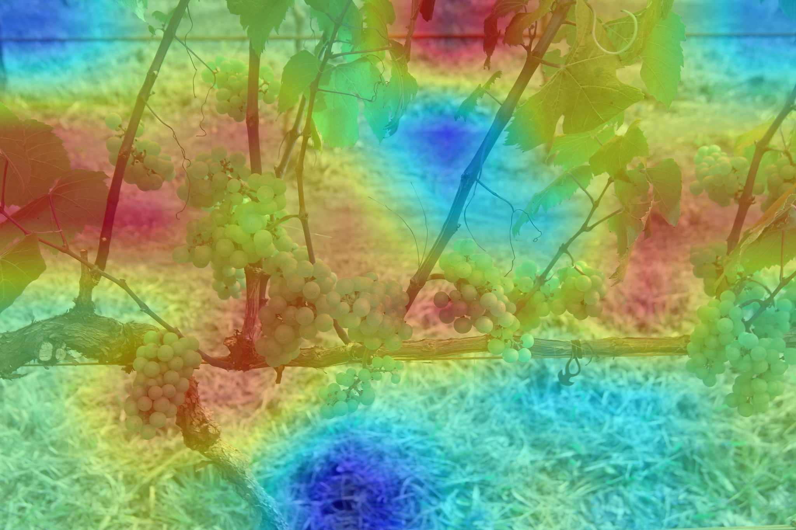

XAI Tutorial
============

This guide explains the model behavior, which is trained through :doc:`previous stage <how_to_train/index>`.
It allows displaying the saliency maps, which provide the locality where the model gave an attention to predict a specific category.

To be specific, this tutorial uses as an example of the ATSS model trained through ``otx train`` and saved as ``otx-workspace/.latest/train/checkpoints/epoch_*.pth``.

.. note::

    This tutorial uses an object detection model for example, however for other tasks the functionality remains the same - you just need to replace the input dataset with your own.

For visualization we use images from WGISD dataset from the :doc:`object detection tutorial <how_to_train/detection>` together with trained model.

1. Activate the virtual environment 
created in the previous step.

.. code-block:: shell

  .otx/bin/activate
  # or by this line, if you created an environment, using tox
  . venv/otx/bin/activate

2. ``otx explain`` command returns saliency maps, 
which are heatmaps with red-colored areas indicating focus. Here's an example how to generate saliency maps from trained checkpoint:

.. tab-set::

    .. tab-item:: CLI (with work_dir)

        .. code-block:: shell

            (otx) ...$ otx explain --work_dir otx-workspace \
                                   --dump True # Wherether to save saliency map images or not

    .. tab-item:: CLI (with config)

        .. code-block:: shell

            (otx) ...$ otx explain --config  src/otx/recipe/detection/atss_mobilenetv2.yaml \
                                   --data_root data/wgisd \
                                   --checkpoint otx-workspace/20240312_051135/checkpoints/epoch_033.ckpt \
                                   --dump True # Wherether to save saliency map images or not

    .. tab-item:: API

        .. code-block:: python

            engine.explain(
                checkpoint="<checkpoint-path>",
                datamodule=OTXDataModule(...), # The data module to use for predictions
                explain_config=ExplainConfig(postprocess=True),
                dump=True # Wherether to save saliency map images or not
              )

3. The generated saliency maps will appear in  ``otx-workspace/.latest/explain/saliency_maps`` folder. 
It will contain a pair of generated images with saliency maps for each image used for the explanation process: 

- saliency map - where red color means more attention of the model
- overlay - where the saliency map is combined with the original image:

|

4. To explain the exported IR model, it should be converted with additional outputs ``saliency_map`` and ``feature_map``.
To do that we should use ``--explain True`` parameter during export.

.. tab-set::

    .. tab-item:: CLI

        .. code-block:: shell

            (otx) ...$ otx export ... --explain True
            (otx) ...$ otx explain ... --checkpoint otx-workspace/20240312_052847/exported_model.xml

    .. tab-item:: API

        .. code-block:: python

            engine.export(..., explain=True)
            engine.explain(..., checkpoint="<xml_weights_path>")

5. We can parametrize the explanation process by specifying 
the following parameters in ``ExplainConfig``:

- ``target_explain_group`` - for which target saliency maps will be generated:

  - ``IMAGE`` - a single global activation map regardless of the classes that the model can detect.
  - ``ALL`` - saliency map for each class that the model can detect.
  - ``PREDICTIONS`` - saliency map for each predicted class.

- ``postprocess``:

  - ``False`` **default** - no postprocessing, low-resolution grayscale maps are returned.
  - ``True`` - resizes and applies colormap to the saliency map.

.. tab-set::

    .. tab-item:: CLI

        .. code-block:: shell

            (otx) ...$ otx explain ... --explain_config.postprocess True 
                                       --explain_config.target_explain_group PREDICTIONS

    .. tab-item:: API

        .. code-block:: python

            engine.explain(...,
                           explain_config=ExplainConfig(
                             postprocess=True,
                             target_explain_group=TargetExplainGroup.PREDICTIONS
                           )
              )

6. The explanation algorithm is chosen automatically 
based on the used model:

- ``Recipro-CAM`` - for CNN classification models
- ``ViT Recipro-CAM`` - for transformer-based classification models

- ``DetClassProbabilityMap`` - for single-stage detector models
- ``InstSegExplainAlgo`` - for MaskRCNN and RTMDetInst instance segmentation models

.. note::

  Learn more about Explainable AI and its algorithms in :doc:`XAI explanation section <../../explanation/additional_features/xai>`
