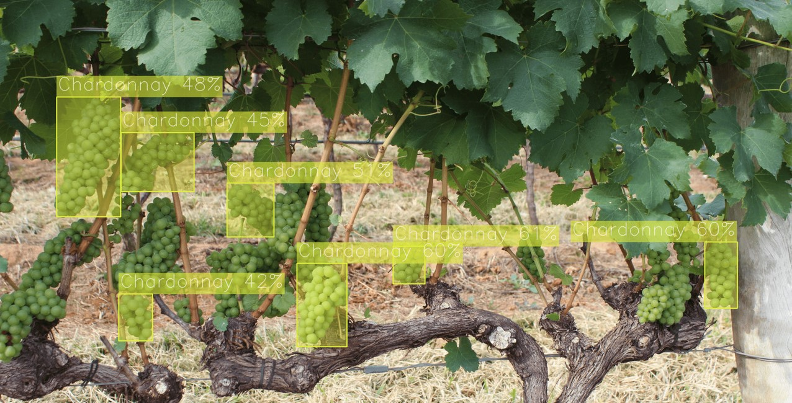

Deploy & Demo
=============

This guide explains how to deploy a model trained in the :doc:`previous stage <how_to_train/index>` and visualize it outside of this repository.
As a result of this step, you'll get the exported model together with the self-contained python package and a demo application to visualize results in other environments without a long installation process.

******
Export
******

1. Activate the virtual environment
created in the previous step.

.. code-block:: shell

    source .otx/bin/activate
    # or by this line, if you created an environment, using tox
    . venv/otx/bin/activate

2. ``otx export`` returns an ``.onnx``, ``openvino.xml(.bin)`` and ``.zip``
exportable code with demo depending on the export type passed to CLI or API.

You can export the model in OpenVINO format and FP32
using the command below. Specify the path to the trained PyTorch model using ``--checkpoint`` parameter:

.. code-block:: shell

    otx export -c CONFIG --checkpoint CHECKPOINT --export_format {ONNX,OPENVINO,EXPORTABLE_CODE} --export_precision {FP16,FP32} --work-dir WORK_DIR

You can also specify ``export_format`` nad ``export_precision`` parameters.
For example, to export a model with precision FP16 and format ONNX, execute:

.. code-block:: shell

    otx export -c CONFIG --checkpoint CHECKPOINT --export_format ONNX --export_precision FP16 --work-dir outputs/deploy

******
Deploy
******

1. It is also possible to obtain a ``.zip``  archive with OpenVINO model and demo to run on your own testing images with visualization possibility.
The exported archive will consist of the following file structure:

- ``LICENSE``
- ``README.md``

- model

  - ``model.xml`` and ``model.bin`` - model exported to the OpenVINO™ format
  - ``config.json`` - file containing the post-processing info and meta information about labels in the dataset

- python

  - ``demo_package`` - package folder with necessary modules needed to run demo
  - ``demo.py``- simple demo to visualize results of model inference
  - ``requirements.txt`` - minimal packages required to run the demo
  - ``setup.py``

3. You can deploy the model,
using the command below:

.. code-block:: shell

    (otx) ...$ otx export -c CONFIG
               --checkpoint {PYTORCH_CHECKPOINT}
               --export_format EXPORTABLE_CODE
               --work-dir outputs/deploy

After that, you can use the resulting ``exportable_code.zip`` archive in other applications.

4. It is also possible to pass already exported/optimized OpenVINO IR model
to create archive with demo and pack in the IR model.

.. code-block:: shell

    (otx) ...$ otx export -c CONFIG
               --checkpoint {OPENVINO_IR.XML}
               --work-dir outputs/deploy

.. note::

    You can also obtain ``exportable_code.zip`` right away during model optimization passing ``export_demo_package=True`` parameter to CLI or API call.

*************
Demonstration
*************

Using the exported demo, we're able to run the model in the demonstration mode outside of this repository, using only the ported ``.zip`` archive with minimum required packages.
The demo allows us to apply our model on the custom data or the online footage from a web camera and see how it will work in a real-life scenario. It is not required to install OTX or PyTorch.

1. Unzip the ``exportable_code.zip``
archive.

.. code-block::

    unzip  outputs/deploy/.latest/export/exportable_code.zip -d outputs/deploy/

2. To run the demo in exportable code, we can use a brand-new virtual environment,
where we need to install a minimalistic set of packages required for inference only.

.. code-block::

    python3 -m venv demo_venv --prompt="demo"
    source demo_venv/bin/activate
    python -m pip install -e .

3. The following line will run the demo on your input source,
using the model in the ``model`` folder. You can pass as ``input`` a single image, a folder of images, a video file, or a web camera id.

.. code-block::

    (demo) ...$ python outputs/deploy/python/demo.py --input docs/utils/images/wgisd_dataset_sample.jpg \
                                                      --model outputs/deploy/model

You can press ``Q`` to stop inference during the demo running.

For example, the model inference on the image from the WGISD dataset will look like this:

.. note::

    If you provide a single image as input, the demo processes and renders it quickly, then exits. To continuously
    visualize inference results on the screen, and apply the ``loop`` option, which enforces processing a single image in a loop.
    In this case, you can stop the demo by pressing `Q` button or killing the process in the terminal (``Ctrl+C`` for Linux).

To learn how to run the demo on Windows and MacOS, please refer to the ``outputs/deploy/python/README.md`` file in exportable code.

4. To save inference results with predictions on it, we can specify the folder path, using ``--output``.
It works for images, videos, image folders and web cameras. To prevent issues, do not specify it together with a ``--loop`` parameter.

.. code-block::

    (demo) ...$ python outputs/deploy/python/demo.py --input docs/utils/images/wgisd_dataset_sample.jpg \
                                                      --model outputs/deploy/model \
                                                      --output resulted_images

5. To run a demo on a web camera, we need to know its ID.
We can check a list of camera devices by running this command line on Linux system:

.. code-block::

    sudo apt-get install v4l-utils
    v4l2-ctl --list-devices

The output will look like this:

.. code-block::

    Integrated Camera (usb-0000:00:1a.0-1.6):
        /dev/video0

After that, we can use this ``/dev/video0`` as a camera ID for ``--input``.
