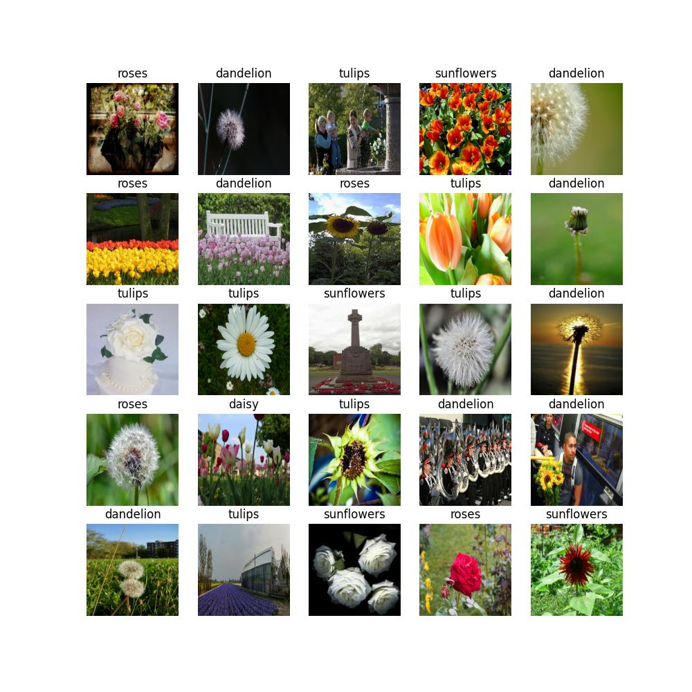

Classification  model
================================

This live example shows how to easily train, validate, optimize and export classification model on the `flowers dataset <https://www.tensorflow.org/hub/tutorials/image_feature_vector#the_flowers_dataset>`_ from TensorFlow.
To learn more about Classification task, refer to :doc:`../../../explanation/algorithms/classification/index`.

.. note::

  To learn deeper how to manage training process of the model including additional parameters and its modification, refer to :doc:`./detection`.

  To learn how to deploy the trained model, refer to: :doc:`../deploy`.

  To learn how to run the demo and visualize results, refer to: :doc:`../demo`.

The process has been tested on the following configuration.

- Ubuntu 20.04
- NVIDIA GeForce RTX 3090
- Intel(R) Core(TM) i9-10980XE
- CUDA Toolkit 11.1

.. note::

  While this example shows how to work with :doc:`multi-class classification <../../../explanation/algorithms/classification/multi_class_classification>`, it is easy to extend it for the :doc:`multi-label <../../../explanation/algorithms/classification/multi_label_classification>` or :doc:`hierarchical <../../../explanation/algorithms/classification/hierarhical_classification>` classification.
  Substitute the dataset with a multi-label or hierarchical one. Everything else remains the same.

*************************
Setup virtual environment
*************************

1. You can follow the installation process from a :doc:`quick start guide <../../../get_started/installation>`
to create a universal virtual environment for OpenVINO™ Training Extensions.

2. Activate your virtual
environment:

.. code-block::

  .otx/bin/activate
  # or by this line, if you created an environment, using tox
  . venv/otx/bin/activate

***************************
Dataset preparation
***************************

Download and prepare a `flowers dataset <https://www.tensorflow.org/hub/tutorials/image_feature_vector#the_flowers_dataset>`_
with the following command:

.. code-block::

  cd data
  wget http://download.tensorflow.org/example_images/flower_photos.tgz
  tar -xzvf flower_photos.tgz
  cd ..

|

|

This dataset contains images of 5 different flower categories and is stored in the ImageNet format which is supported by OpenVINO™ Training Extensions:

.. code-block::

  flower_photos
    ├── daisy
    ├── dandelion
    ├── roses
    ├── sunflowers
    ├── tulips

*********
Training
*********

1. First of all, you need to choose which classification model you want to train.
The list of supported templates for classification is available with the command line below.

.. note::

  The characteristics and detailed comparison of the models could be found in :doc:`Explanation section <../../../explanation/algorithms/classification/multi_class_classification>`.

  You also can modify the architecture of supported models with various backbones. To do that, please refer to the :doc:`advanced tutorial for model customization <../../advanced/backbones>`.

.. code-block::

  (otx) ...$ otx find --task classification

  +----------------+---------------------------------------------------+-----------------------+---------------------------------------------------------------------------------------+
  |      TASK      |                         ID                        |          NAME         |                                          PATH                                         |
  +----------------+---------------------------------------------------+-----------------------+---------------------------------------------------------------------------------------+
  | CLASSIFICATION | Custom_Image_Classification_MobileNet-V3-large-1x | MobileNet-V3-large-1x | src/otx/algorithms/classification/configs/mobilenet_v3_large_1_cls_incr/template.yaml |
  | CLASSIFICATION |    Custom_Image_Classification_EfficinetNet-B0    |    EfficientNet-B0    |    src/otx/algorithms/classification/configs/efficientnet_b0_cls_incr/template.yaml   |
  | CLASSIFICATION |   Custom_Image_Classification_EfficientNet-V2-S   |   EfficientNet-V2-S   |   src/otx/algorithms/classification/configs/efficientnet_v2_s_cls_incr/template.yaml  |
  +----------------+---------------------------------------------------+-----------------------+---------------------------------------------------------------------------------------+

To have a specific example in this tutorial, all commands will be run on the :ref:`MobileNet-V3-large-1x <classification_models>`  model. It's a light model, that achieves competitive accuracy while keeping the inference fast.

2.  Next, you need to create train/validation sets. OpenVINO™ Training Extensions supports auto-split functionality for the multi-class classification.
For other classification types you need to prepare splits in advance.

.. note::

  Currently, OpenVINO™ Training Extensions supports auto-split only for multi-class classification. For the multi-label and hierarchical tasks you need to prepare data splits in advance.

Let's prepare an OpenVINO™ Training Extensions classification workspace running the following command:

.. code-block::

  (otx) ...$ otx build --train-data-roots data/flower_photos --model MobileNet-V3-large-1x

  [*] Load Model Template ID: Custom_Image_Classification_MobileNet-V3-large-1x
  [*] Load Model Name: MobileNet-V3-large-1x
  [*] Saving data configuration file to: ./otx-workspace-CLASSIFICATION/data.yaml

  (otx) ...$ cd ./otx-workspace-CLASSIFICATION

It will create **otx-workspace-CLASSIFICATION** with all necessary configs for MobileNet-V3-large-1x, prepared ``data.yaml`` to simplify CLI commands launch and splitted dataset named ``splitted_dataset``.

3. To start training you need to call ``otx train``
command in our workspace:

.. code-block::

  (otx) ...$ otx train

That's it! The training will return artifacts: ``weights.pth`` and ``label_schema.json``, which are needed as input for the further commands: ``export``, ``eval``,  ``optimize``,  etc.

The training time highly relies on the hardware characteristics, for example on 1 NVIDIA GeForce RTX 3090 the training took about 8 minutes.

After that, you have the PyTorch classification model trained with OpenVINO™ Training Extensions, which you can use for evaluation, export, optimization and deployment.

.. note::
  If you specified ``--workspace``, you also can visualize the training using ``Tensorboard`` as these logs are located in ``<work_dir>/tf_logs``.

***********
Validation
***********

1. ``otx eval`` runs evaluation of a trained
model on a specific dataset.

The eval function receives test annotation information and model snapshot, trained in the previous step.
Please note, ``label_schema.json`` file contains meta information about the dataset and it should be located in the same folder as the model snapshot.

``otx eval`` will calculate a top-1 accuracy score for multi-class classification.

2. The command below will run validation on our dataset
and save performance results in ``performance.json`` file:

.. code-block::

  (otx) ...$ otx eval --test-data-roots splitted_dataset/val \
                      --load-weights models/weights.pth \
                      --output outputs

You will get a similar validation output:

.. code-block::

  ...

  2023-02-03 23:43:29,514 | INFO : run task done.
  2023-02-03 23:43:35,859 | INFO : called evaluate()
  2023-02-03 23:43:35,870 | INFO : Accuracy after evaluation: 0.9659400544959128
  2023-02-03 23:43:35,871 | INFO : Evaluation completed
  Performance(score: 0.9659400544959128, dashboard: (3 metric groups))

*********
Export
*********

1. ``otx export`` exports a trained Pytorch `.pth` model to the OpenVINO™ Intermediate Representation (IR) format.
It allows running the model on the Intel hardware much more efficient, especially on the CPU. Also, the resulting IR model is required to run PTQ optimization. IR model consists of 2 files: ``openvino.xml`` for weights and ``openvino.bin`` for architecture.

2. You can run the below command line to export the trained model
and save the exported model to the ``openvino_model`` folder:

.. code-block::

  (otx) ...$ otx export --load-weights models/weights.pth \
                        --output openvino_model

  ...

  2023-02-02 03:23:03,057 | INFO : run task done.
  2023-02-02 03:23:03,064 | INFO : Exporting completed

3. You can check the accuracy of the IR model and the consistency between the exported model and the PyTorch model,
using ``otx eval`` and passing the IR model path to the ``--load-weights`` parameter.

.. code-block::

  (otx) ...$ otx eval --test-data-roots splitted_dataset/val \
                      --load-weights openvino_model/openvino.xml \
                      --output openvino_model

  ...

  Performance(score: 0.9659400544959128, dashboard: (3 metric groups))

*************
Optimization
*************

1. You can further optimize the model with ``otx optimize``.
It uses NNCF or PTQ depending on the model and transforms it to ``INT8`` format.

Please, refer to :doc:`optimization explanation <../../../explanation/additional_features/models_optimization>` section for more details on model optimization.

2. Command example for optimizing
a PyTorch model (`.pth`) with OpenVINO™ NNCF.

.. code-block::

  (otx) ...$ otx optimize --load-weights models/weights.pth --output nncf_model

  ...

  INFO:nncf:Loaded 983/983 parameters
  2023-02-04 00:06:11,725 | INFO : run task done.
  2023-02-04 00:06:16,924 | INFO : called evaluate()
  2023-02-04 00:06:16,935 | INFO : Accuracy after evaluation: 0.9591280653950953
  2023-02-04 00:06:16,936 | INFO : Evaluation completed
  Performance(score: 0.9591280653950953, dashboard: (3 metric groups))

The optimization time relies on the hardware characteristics, for example on 1 NVIDIA GeForce RTX 3090 and Intel(R) Core(TM) i9-10980XE it took about 10 minutes.

3.  Command example for optimizing
OpenVINO™ model (.xml) with OpenVINO™ PTQ.

.. code-block::

  (otx) ...$ otx optimize --load-weights openvino_model/openvino.xml \
                          --output ptq_model

  ...

  Performance(score: 0.9577656675749319, dashboard: (3 metric groups))

Please note, that PTQ will take some time (generally less than NNCF optimization) without logging to optimize the model.

4. Now you have fully trained, optimized and exported an
efficient model representation ready-to-use classification model.

The following tutorials provide further steps on how to :doc:`deploy <../deploy>` and use your model in the :doc:`demonstration mode <../demo>` and visualize results.
The examples are provided with an object detection model, but it is easy to apply them for classification by substituting the object detection model with classification one.
