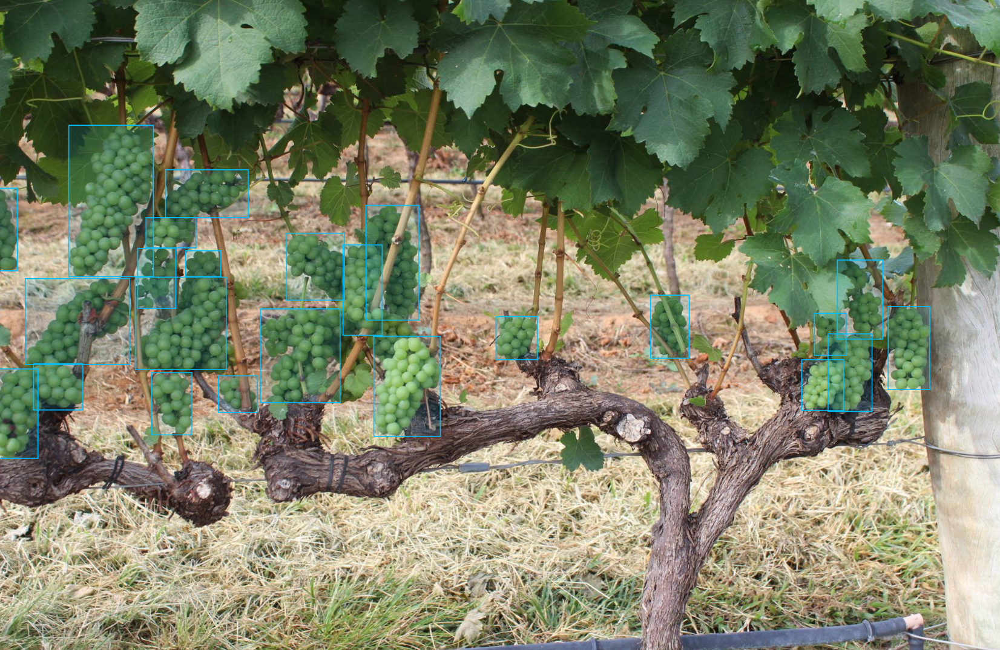

Object Detection model
======================

This tutorial reveals end-to-end solution from installation to model export and optimization for object detection task on a specific example.

To learn more about Object Detection task, refer to :doc:`../../../explanation/algorithms/object_detection/object_detection`.

On this page, we show how to train, validate, export and optimize ATSS model on WGISD public dataset.

To have a specific example in this tutorial, all commands will be run on the ATSS model. It's a medium model, that achieves relatively high accuracy while keeping the inference fast.

.. note::

  To learn how to deploy the trained model and run the exported demo, refer to :doc:`../deploy`.

  To learn how to run the demo in CLI and visualize results, refer to :doc:`../demo`.

The process has been tested on the following configuration.

- Ubuntu 20.04
- NVIDIA GeForce RTX 3090
- Intel(R) Core(TM) i9-10980XE CPU
- CUDA Toolkit 11.1

*************************
Setup virtual environment
*************************

1. You can follow the installation process from a :doc:`quick start guide <../../../get_started/installation>`
to create a universal virtual environment for OpenVINO™ Training Extensions.

2. Activate your virtual
environment:

.. code-block::

  .otx/bin/activate
  # or by this line, if you created an environment, using tox
  . venv/otx/bin/activate

.. _wgisd_dataset_descpiption:

***************************
Dataset preparation
***************************

..  note::

  Currently, we support the following object detection dataset formats:

  - `COCO <https://cocodataset.org/#format-data>`_
  - `Pascal-VOC <https://openvinotoolkit.github.io/datumaro/stable/docs/data-formats/formats/pascal_voc.html>`_
  - `YOLO <https://openvinotoolkit.github.io/datumaro/stable/docs/data-formats/formats/yolo.html>`_

1. Clone a repository with
`WGISD dataset <https://github.com/thsant/wgisd>`_.

.. code-block::

  mkdir data ; cd data
  git clone https://github.com/thsant/wgisd.git
  cd wgisd
  git checkout 6910edc5ae3aae8c20062941b1641821f0c30127

This dataset contains images of grapevines with the annotation for different varieties of grapes.

- ``CDY`` - Chardonnay
- ``CFR`` - Cabernet Franc
- ``CSV`` - Cabernet Sauvignon
- ``SVB`` - Sauvignon Blanc
- ``SYH`` - Syrah

It's a great example to start with. The model achieves high accuracy right from the beginning of the training due to relatively large and focused objects. Also, these objects are distinguished by a person, so we can check inference results just by looking at images.

|

|

2. To run the training using :doc:`auto-configuration feature <../../../explanation/additional_features/auto_configuration>`,
we need to reformat the dataset according to this structure:

.. code-block::

  wgisd
  ├── annotations/
      ├── instances_train.json
      ├── instances_val.json
      (Optional)
      └── instances_test.json
  ├──images/
      (The split on folders is optional)
      ├── train
      ├── val
      └── test
  (There may be more extra unrelated folders)

We can do that by running these commands:

.. code-block::

  # format images folder
  mv data images

  # format annotations folder
  mv coco_annotations annotations

  # rename annotations to meet *_train.json pattern
  mv annotations/train_bbox_instances.json annotations/instances_train.json
  mv annotations/test_bbox_instances.json annotations/instances_val.json

  cd ../..

*********
Training
*********

1. First of all, you need to choose which object detection model you want to train.
The list of supported templates for object detection is available with the command line below.

.. note::

  The characteristics and detailed comparison of the models could be found in :doc:`Explanation section <../../../explanation/algorithms/object_detection/object_detection>`.

  To modify the architecture of supported models with various backbones, please refer to the :doc:`advanced tutorial for backbone replacement <../../advanced/backbones>`.

.. code-block::

  (otx) ...$ otx find --template --task DETECTION
  +-----------+-----------------------------------+------------------+------------------------------------------------------------------------------------+
  |    TASK   |                 ID                |       NAME       |                                     BASE PATH                                      |
  +-----------+-----------------------------------+------------------+------------------------------------------------------------------------------------+
  | DETECTION | Custom_Object_Detection_Gen3_ATSS | MobileNetV2-ATSS |   src/otx/algorithms/detection/configs/detection/mobilenetv2_atss/template.yaml    |
  | DETECTION |  Object_Detection_ResNeXt101_ATSS | ResNeXt101-ATSS  |    src/otx/algorithms/detection/configs/detection/resnext101_atss/template.yaml    |
  | DETECTION |  Custom_Object_Detection_Gen3_SSD |       SSD        |    src/otx/algorithms/detection/configs/detection/mobilenetv2_ssd/template.yaml    |
  | DETECTION |      Object_Detection_YOLOX_L     |     YOLOX-L      |  src/otx/algorithms/detection/configs/detection/cspdarknet_yolox_l/template.yaml   |
  | DETECTION |      Object_Detection_YOLOX_S     |     YOLOX-S      |  src/otx/algorithms/detection/configs/detection/cspdarknet_yolox_s/template.yaml   |
  | DETECTION |   Custom_Object_Detection_YOLOX   |    YOLOX-TINY    | src/otx/algorithms/detection/configs/detection/cspdarknet_yolox_tiny/template.yaml |
  | DETECTION |      Object_Detection_YOLOX_X     |     YOLOX-X      |  src/otx/algorithms/detection/configs/detection/cspdarknet_yolox_x/template.yaml   |
  +-----------+-----------------------------------+------------------+------------------------------------------------------------------------------------+  

.. _detection_workspace:

2. On this step we will create **otx-workspace-Detection**
with:

- all necessary configs for Custom_Object_Detection_Gen3_ATSS
- prepared ``data.yaml`` to simplify CLI commands launch
- train/validation sets, based on provided annotation.

It may be counterintuitive, but for ``--train-data-roots`` we need to pass the path to the dataset folder root (in our case it's ``data/wgisd``) instead of the folder with validation images.
This is because the function automatically detects annotations and images according to the expected folder structure we achieved above.
So, if you'd like to add ``--val-data-roots``, please note, that it should also be a path to a dataset folder root.

On contrary, if we omit adding ``--val-data-roots``, the function will find images for validation according to validation annotation and create ``splitted_dataset`` folder inside the workplace with the desired split.

Let's prepare the object detection workspace running the following command:

.. code-block::

  # we can specify the template by its ID
  (otx) ...$ otx build Custom_Object_Detection_Gen3_ATSS --train-data-roots data/wgisd

  # or its name
  (otx) ...$ otx build MobileNetV2-ATSS --train-data-roots data/wgisd

  # or its path
  (otx) ...$ otx build src/otx/algorithms/detection/configs/detection/mobilenetv2_atss/template.yaml --train-data-roots data/wgisd

  ...
  [*] Workspace Path: otx-workspace-DETECTION
  [*] Load Model Template ID: Custom_Object_Detection_Gen3_ATSS
  [*] Load Model Name: MobileNetV2-ATSS
  [*]     - Updated: otx-workspace-DETECTION/model.py
  [*]     - Updated: otx-workspace-DETECTION/data_pipeline.py
  [*]     - Updated: otx-workspace-DETECTION/tile_pipeline.py
  [*]     - Updated: otx-workspace-DETECTION/deployment.py
  [*]     - Updated: otx-workspace-DETECTION/hpo_config.yaml
  [*]     - Updated: otx-workspace-DETECTION/compression_config.json
  [*] Found validation data in your dataset. It'll be used as validation data.
  [*] Update data configuration file to: otx-workspace-DETECTION/data.yaml

.. warning::

  If you want to rebuild your current workspace by running ``otx build`` with other parameters, it's better to delete the original workplace before that to prevent mistakes.

Check ``otx-workspace-DETECTION/data.yaml`` to ensure, which data subsets will be used for training and validation, and update it if necessary.

.. code-block::

  data:
  train:
    ann-files: null
    data-roots: <training_extensions_path>/otx-workspace-DETECTION/splitted_dataset/train
  val:
    ann-files: null
    data-roots: <training_extensions_path>/otx-workspace-DETECTION/splitted_dataset/val
  test:
    ann-files: null
    data-roots: null
  unlabeled:
    file-list: null
    data-roots: null

We also can modify the backbone of the model, by adding ``--backbone`` parameter.
We can find the available backbone by running ``otx find`` with the framework parameter.
Learn more about modified backbones in :doc:`advanced tutorial for backbone replacement <../../advanced/backbones>`.

3. ``otx train`` trains a model (a particular model template)
on a dataset and results in two files:

- ``weights.pth`` - a model snapshot
- ``label_schema.json`` - a label schema used in training, created from a dataset

These are needed as inputs for the further commands: ``export``, ``eval``,  ``optimize``,  ``deploy`` and ``demo``.

4. The following command line starts training of the medium object
detection model on the first GPU on WGISD dataset:

.. code-block::

  (otx) ...$ cd otx-workspace-DETECTION/
  (otx) ...$ otx train  --output ../outputs --workspace ../outputs/logs --gpus 1

To start multi-gpu training, list the indexes of GPUs you want to train on or omit `gpus` parameter, so training will run on all available GPUs.

4. ``(Optional)`` Additionally, we can tune training parameters such as batch size, learning rate, patience epochs or warm-up iterations.
Learn more about template-specific parameters using ``otx train params --help``.

It can be done by manually updating parameters in the ``template.yaml`` file in your workplace or via the command line.

For example, to decrease the batch size to 4, fix the number of epochs to 100 and disable early stopping, extend the command line above with the following line.

.. code-block::

                       params --learning_parameters.batch_size 4
                              --learning_parameters.num_iters 100 \
                              --learning_parameters.enable_early_stopping false

5. The training results are ``weights.pth`` and ``label_schema.json`` files that located in ``outputs`` folder,
while training logs can be found in the ``outputs/logs`` dir.

.. note::
  We also can visualize the training using ``Tensorboard`` as these logs are located in ``outputs/logs/tf_logs``.

.. code-block::

  ...
  2023-01-10 05:40:21,520 | INFO : Update Lr patience: 3
  2023-01-10 05:40:21,520 | INFO : Update Validation Interval: 2
  2023-01-10 05:40:21,520 | INFO : Update Early-Stop patience: 5
  2023-01-10 05:40:23,140 | INFO : Epoch [1][1/31]        lr: 1.333e-03, eta: 11 days, 14:44:47, time: 1.619, data_time: 0.961, memory: 4673, current_iters: 0, loss_cls: 1.1261, loss_bbox: 0.6514, loss_centerness: 0.6337, loss: 2.4112, grad_norm: 18.5789

  ...
  2023-01-10 05:52:33,985 | INFO : run task done.
  2023-01-10 05:52:35,682 | INFO : Inference completed
  2023-01-10 05:52:35,683 | INFO : called evaluate()
  2023-01-10 05:52:35,907 | INFO : F-measure after evaluation: 0.5487693710118504
  2023-01-10 05:52:35,907 | INFO : Evaluation completed
  Performance(score: 0.5487693710118504, dashboard: (1 metric groups))

The training time highly relies on the hardware characteristics, for example on 1 NVIDIA GeForce RTX 3090 the training took about 15 minutes.

After that, we have the PyTorch object detection model trained with OpenVINO™ Training Extensions, which we can use for evaliation, export, optimization and deployment.

***********
Validation
***********

1. ``otx eval`` runs evaluation of a
trained model on a particular dataset.

Eval function receives test annotation information and model snapshot, trained in previous step.
Please note, ``label_schema.json`` file contains meta information about the dataset and it should be located in the same folder as the model snapshot.

The default metric is F1 measure.

2. That's how we can evaluate the snapshot in ``outputs``
folder on WGISD dataset and save results to ``outputs/performance``:

.. code-block::

  (otx) ...$ otx eval --test-data-roots splitted_dataset/val \
                      --load-weights ../outputs/weights.pth \
                      --output ../outputs/

3. The output of ``../outputs/performance.json`` consists of
a dict with target metric name and its value.

.. code-block::

  {"f-measure": 0.5487693710118504}

4. ``Optional`` Additionally, we can tune evaluation parameters such as confidence threshold via the command line.
Learn more about template-specific parameters using ``otx eval params --help``.

For example, if there are too many False-Positive predictions (there we have a prediction, but don't have annotated object for it), we can suppress its number by increasing the confidence threshold as it is shown below.

Please note, by default, the optimal confidence threshold is detected based on validation results to maximize the final F1 metric. To set a custom confidence threshold, please disable ``result_based_confidence_threshold`` option.

.. code-block::

  (otx) ...$ otx eval --test-data-roots splitted_dataset/val \
                      --load-weights ../outputs/weights.pth \
                      --output ../outputs
                      params \
                      --postprocessing.confidence_threshold 0.5 \
                      --postprocessing.result_based_confidence_threshold false

  ...

  2023-01-10 06:21:04,254 | INFO : F-measure after evaluation: 0.514346439957492

*********
Export
*********

1. ``otx export`` exports a trained Pytorch `.pth` model to the OpenVINO™ Intermediate Representation (IR) format.
It allows to efficiently run it on Intel hardware, especially on CPU, using OpenVINO™ runtime.
Also, the resulting IR model is required to run POT optimization in the section below. IR model contains 2 files: ``openvino.xml`` for weights and ``openvino.bin`` for architecture.

2. That's how we can export the trained model ``../outputs/weights.pth``
from the previous section and save the exported model to the ``../outputs/openvino/`` folder.

.. code-block::

  (otx) ...$ otx export --load-weights ../outputs/weights.pth \
                        --output ../outputs/openvino/

  ...

  2023-01-10 06:23:41,621 | INFO : run task done.
  2023-01-10 06:23:41,630 | INFO : Exporting completed

3. We can check the accuracy of the IR model and the consistency between the exported model and the PyTorch model,
using ``otx eval`` and passing the IR model path to the ``--load-weights`` parameter.

.. code-block::

  (otx) ...$ otx eval --test-data-roots splitted_dataset/val \
                      --load-weights ../outputs/openvino/openvino.xml \
                      --output ../outputs

  ...
  2023-01-10 06:24:50,382 | INFO : Start OpenVINO inference
  2023-01-10 06:24:54,943 | INFO : OpenVINO inference completed
  2023-01-10 06:24:54,944 | INFO : Start OpenVINO metric evaluation
  2023-01-10 06:24:55,117 | INFO : OpenVINO metric evaluation completed
  Performance(score: 0.5487693710118504, dashboard: (1 metric groups))

4. ``Optional`` Additionally, we can tune confidence threshold via the command line.
Learn more about template-specific parameters using ``otx export params --help``.

For example, if there are too many False-Positive predictions (there we have a prediction, but don't have annotated object for it), we can suppress its number by increasing the confidence threshold as it is shown below.

Please note, by default, the optimal confidence threshold is detected based on validation results to maximize the final F1 metric. To set a custom confidence threshold, please disable ``result_based_confidence_threshold`` option.

.. code-block::

  (otx) ...$ otx export --load-weights ../outputs/weights.pth \
                      --output ../outputs \
                      params \
                      --postprocessing.confidence_threshold 0.5 \
                      --postprocessing.result_based_confidence_threshold false

*************
Optimization
*************

1. We can further optimize the model with ``otx optimize``.
It uses NNCF or POT depending on the model format.

``NNCF`` optimization is used for trained snapshots in a framework-specific format such as checkpoint (.pth) file from Pytorch. It starts accuracy-aware quantization based on the obtained weights from the training stage. Generally, we will see the same output as during training.

``POT`` optimization is used for models exported in the OpenVINO™ IR format. It decreases the floating-point precision to integer precision of the exported model by performing the post-training optimization.

The function results with the following files, which could be used to run :doc:`otx demo <../demo>` as well with PyTorch (`.pth`) and IR model (`.xml`):

- ``confidence_threshold``
- ``config.json``
- ``label_schema.json``
- ``openvino.bin``
- ``openvino.xml``

To learn more about optimization, refer to `NNCF repository <https://github.com/openvinotoolkit/nncf>`_.

2. Command example for optimizing a PyTorch model (`.pth`)
with OpenVINO NNCF.

.. code-block::

  (otx) ...$ otx optimize  --load-weights ../outputs/weights.pth \
                           --output ../outputs/nncf \
                           --output ../outputs/nncf

  ...

  2023-01-17 06:46:08,208 | INFO : run task done.
  2023-01-17 06:46:08,618 | INFO : Inference completed
  2023-01-17 06:46:08,618 | INFO : called evaluate()
  2023-01-17 06:46:08,829 | INFO : F-measure after evaluation: 0.5446735395189003
  2023-01-17 06:46:08,829 | INFO : Evaluation completed
  Performance(score: 0.5446735395189003, dashboard: (1 metric groups))

3.  Command example for optimizing OpenVINO™ model (.xml)
with OpenVINO™ POT.

.. code-block::

  (otx) ...$ otx optimize  --load-weights ../outputs/openvino/openvino.xml \
                           --output ../outputs/pot \
                           --output ../outputs/pot

  ...

  2023-01-10 06:29:46,751 | INFO : Loading OpenVINO OTXDetectionTask
  2023-01-10 06:29:47,685 | INFO : OpenVINO task initialization completed
  2023-01-10 06:29:47,685 | INFO : Start POT optimization
  2023-01-10 06:34:29,304 | INFO : POT optimization completed
  2023-01-10 06:34:29,419 | INFO : Start OpenVINO inference
  2023-01-10 06:34:33,275 | INFO : OpenVINO inference completed
  2023-01-10 06:34:33,275 | INFO : Start OpenVINO metric evaluation
  2023-01-10 06:34:33,451 | INFO : OpenVINO metric evaluation completed
  Performance(score: 0.5389435989256938, dashboard: (1 metric groups))

The optimization time highly relies on the hardware characteristics, for example on 1 NVIDIA GeForce RTX 3090 it took about 10 minutes.
Please note, that POT will take some time without logging to optimize the model.

4. Finally, we can also evaluate the optimized model by passing
it to the ``otx eval`` function.

Now we have fully trained, optimized and exported an efficient model representation ready-to-use object detection model.

The following tutorials provide further steps how to :doc:`deploy <../deploy>` and use your model in the :doc:`demonstration mode <../demo>` and visualize results.

