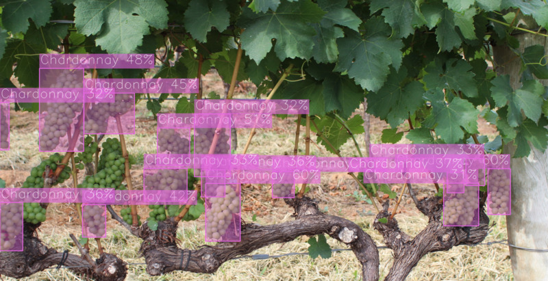

How to run the demo with exportable code
========================================

In this tutorial we will show how run :doc:`trained <how_to_train/index>` and :doc:`deployed <deploy>` model in demostrarion mode. It allows us to apply our model on the custom data or the online footage from a web camera and see how it will work in the real-life scenario.

1. Unzip the ``openvino.zip`` archive.

.. code-block::

    unzip  outputs/deploy/openvino.zip -d outputs/deploy/

2. To run the demo in exportable code, we can use a brand-new virtual environment, where we need to install a minimalistic set of packages required for inference only.

.. code-block::

    python3 -m venv demo_venv --prompt="demo"
    source demo_venv/bin/activate
    python -m pip install -r requirements.txt

3. The following line will run the demo on your input source, using the model in the ``model`` folder. You can pass as ``input`` a single image, a folder of images, a video file, or a web camera id.

.. code-block::

    (demo) ...$ python3 outputs/deploy/python/demo.py --input docs/utils/images/wgisd_dataset_sample.jpg \
                                                      --models outputs/deploy/model

You can press ``Q`` to stop inference during the demo running.

The model inference on your custom image will look like this:

.. image:: ../../../utils/images/wgisd_pr_sample.jpg
  :width: 600
  :alt: this image shows the inference results on the WGISD dataset

.. note::

    If you provide a single image as input, the demo processes and renders it quickly, then exits. To continuously
    visualize inference results on the screen, apply the ``loop`` option, which enforces processing a single image in a loop.
    In this case, you can stop the demo by killing the process in the terminal (``Ctrl+C`` for Linux).

To learn how to run the demo on Windows and MacOS, please refer to the ``README.md`` file in exportable code.

4. To run a demo on a web camera, we need to know its ID. We can check a list of camera devices by running this command line on Linux system:

.. code-block::

    sudo apt-get install v4l-utils
    v4l2-ctl --list-devices

The output will look like this:

.. code-block::

    Integrated Camera (usb-0000:00:1a.0-1.6):
        /dev/video0

After that, we can use this ``/dev/video0`` as a camera ID for ``--input``.

5. We can also change ``config.json`` that specifies the confidence threshold and color for each class visualization, but any changes should be made with caution. 

For example, in our image of the winery we see, that a lot of objects weren't detected.
The original confidence threshold was chosen based on the validation split results to maximize the final F1 metric, balancing precision and recall values. So, visual results can be not suitable enough for a user.
To overcome this problem, we can decrease ``confidence_threshold`` in ``config.json file`` from **0.4** to **0.3**.

.. code-block::

    "model_parameters": {
        "result_based_confidence_threshold": true,
        "confidence_threshold": 0.3000000059604645,

For visual purposes, we can also update the color of ``Chardonnay`` class from yellow to lilac to make it more distinguishable.

.. code-block::

    "all_labels": {
        "0": {
            "_id": "0",
            "name": "Chardonnay",
            "color": {
                "red": 230,
                 "green": 106,
                 "blue": 226,

The result will be the following:

Congratulations! Now you have learned how to use base OTX functionality. For the advanced features, please refer to the next section called :doc:`../advanced/index`.

***************
Troubleshooting
***************

1. If you have access to the Internet through the proxy server only, please use pip with a proxy call as demonstrated by the command below:

.. code-block::

    python -m pip install --proxy http://<usr_name>:<password>@<proxyserver_name>:<port#> <pkg_name>

2. If you use Anaconda environment, you should consider that OpenVINO has limited `Conda support <https://docs.openvino.ai/2021.4/openvino_docs_install_guides_installing_openvino_conda.html>`_ for Python 3.6 and 3.7 versions only. But the demo package requires python 3.8.

So please use other tools to create the environment (like ``venv`` or ``virtualenv``) and use ``pip`` as a package manager.

3. If you have problems when you try to use ``pip install`` command, please update the pip version by the following command:

.. code-block::
   
    python -m pip install --upgrade pip
