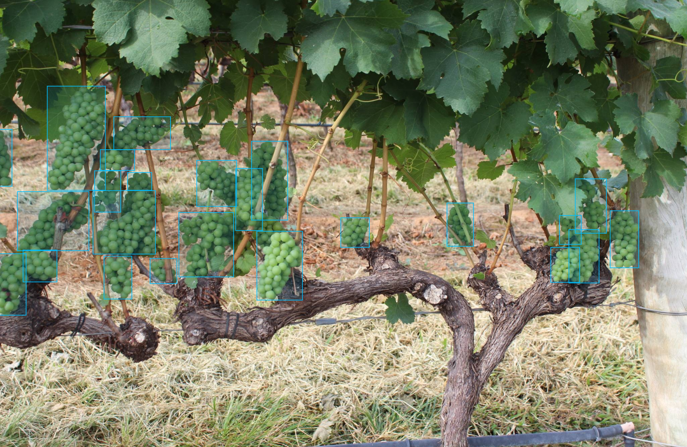

Object Detection model
======================

This tutorial reveals end-to-end solution from installation to model export and optimization for object detection task on a specific example.
On this page we show how to train, validate, export and optimize ATSS model on WGISD public dataset.

.. note::

  To learn how to deploy the trained model, refer to :doc:`../deploy`.

  To learn how to run the demo and visualize results, refer to :doc:`../demo`.

The process has been tested on the following configuration.

- Ubuntu 20.04
- NVIDIA GeForce RTX 3090
- CUDA Toolkit 11.4 

*************************
Setup virtual environment
*************************

You can follow the installation process from a :doc:`quick_start guide <../../../get_started/quick_start>` to create a universal virtual environment for all tasks. On the other hand, you can create a task-specific environment following the process below.

1. Check your python version:

.. code-block::

  python3 --version; pip3 --version; 

  Python 3.8.10

2. Create and activate a virtual environment for the obect detection task.

The following example creates a virtual environment in the ``det_venv`` folder for detection task.

.. code-block::

  sudo apt-get install python3-venv
  # create virtual env
  bash ./otx/algorithms/detection/init_venv.sh det_venv
  # activate virtual env
  source det_venv/bin/activate

.. #TODO: Update installation part: virtual env, install prerequisite, pip install -e . or pip install otx

***************************
Dataset preparation
***************************

1. Clone a repository with `WGISD dataset <https://github.com/thsant/wgisd>`_. 

.. code-block::

  cd data
  git clone https://github.com/thsant/wgisd.git
  cd wgisd
  git checkout 6910edc5ae3aae8c20062941b1641821f0c30127

This dataset contains images of grapevines with the annotation for different varieties of grapes. 

- ``CDY``	- Chardonnay
- ``CFR``	- Cabernet Franc
- ``CSV``	- Cabernet Sauvignon
- ``SVB``	- Sauvignon Blanc
- ``SYH``	- Syrah

It's a great example to start with. The model achieves high accuracy right from the beginning of the training due to relatively large and focused objects. Also, these objects are distinguished by a person, so we can check inference results just by looking at images.

2. Check the file structure of downloaded repository, we will need the following files:

.. code-block::

  wgisd
  ├── README.md
  ├── coco_annotations/
      ├── train_bbox_instances.json
      └── test_bbox_instances.json
  ├──data/
      └── <images>
  ...

3. ``(Optional)`` To simplify the command line functions calling, we may create a ``data.yaml`` file with annotations info and pass it as a ``--data`` parameter. The content of the ``training_extesions/data.yaml`` for WGISD dataset should have absolute paths and will be similar to that:

.. code-block::

  {'data': 
    {'train': 
      {'ann-files': '/home/<username>/training_extensions/data/wgisd/coco_annotations/train_bbox_instances.json',
       'data-roots': '/home/<username>/training_extensions/data/wgisd/data'},
    'val':
      {'ann-files': '/home/<username>/training_extensions/data/wgisd/coco_annotations/test_bbox_instances.json',
       'data-roots': '/home/<username>/training_extensions/data/wgisd/data'},
    'test':
      {'ann-files': '/home/<username>/training_extensions/data/wgisd/coco_annotations/train_bbox_instances.json',
       'data-roots': '/home/<username>/training_extensions/data/wgisd/data'}
    }
  }

``Ann-files`` contains a path to the annotation, while ``data-roots`` is a path to the folder, where images are stored.

*********
Training
*********

1. First of all, we need to choose which object detection model will we train. The list of supported templates for object detection is available with the command line below. 

.. note::

  The characteristics and detailed comparison of the models could be found in :doc:`Explanation section <../../../explanation/algorithms/object_detection/object_detection>`.

  To modify the architecture of supported models with various backbones, please refer to the :doc:`advanced tutorial for model customization <../../advanced/backbones>`.

.. code-block::

  (detection) ...$ otx find --template --task DETECTION
  +-----------+-----------------------------------+-------+---------------------------------------------------------------------------+
  |    TASK   |                 ID                |  NAME |                                    PATH                                   |
  +-----------+-----------------------------------+-------+---------------------------------------------------------------------------+
  | DETECTION |   Custom_Object_Detection_YOLOX   | YOLOX | otx/algorithms/detection/configs/detection/cspdarknet_yolox/template.yaml |
  | DETECTION |  Custom_Object_Detection_Gen3_SSD |  SSD  |  otx/algorithms/detection/configs/detection/mobilenetv2_ssd/template.yaml |
  | DETECTION | Custom_Object_Detection_Gen3_ATSS |  ATSS | otx/algorithms/detection/configs/detection/mobilenetv2_atss/template.yaml |
  +-----------+-----------------------------------+-------+---------------------------------------------------------------------------+

2. ``otx train`` trains a model (a particular model template) on a dataset and results in two files:

- ``weights.pth`` - a model snapshot
- ``label_schema.json`` - a label schema used in training, created from a dataset

These are needed as inputs for the further commands: ``export``, ``eval``,  ``optimize``,  ``deploy`` and ``demo``.

3. To have a specific example in this tutorial, all commands will be run on the ATSS model. It's a medium model, that achieves relatively high accuracy, while keeping the inference fast.

The following command line starts training of the medium object detection model on the first GPU on WGISD dataset:

.. code-block::

  (detection) ...$ otx train otx/algorithms/detection/configs/detection/mobilenetv2_atss/template.yaml \
                            --train-ann-files data/wgisd/coco_annotations/train_bbox_instances.json \
                            --train-data-roots  data/wgisd/data \
                            --val-ann-files data/wgisd/coco_annotations/test_bbox_instances.json \
                            --val-data-roots data/wgisd/data \
                            --save-model-to outputs \
                            --work-dir outputs/logs \
                            --gpus 1

To start multi-gpu training, list the indexes of GPUs you want to train on or omit `gpus` parameter, so training will run on all available GPUs.

If you created ``data.yaml`` file in previous step, you can simplify the training by passing it in ``--data`` parameter.

.. code-block::

  (detection) ...$ otx train otx/algorithms/detection/configs/detection/mobilenetv2_atss/template.yaml \
                            --data data.yaml \
                            --save-model-to outputs \
                            --work-dir outputs/logs \
                            --gpus 1

Looks much simpler, isn't it? You can also pass the ``data.yaml`` for the rest of the OTX CLI commands (eval, export, optimize) that require annotation paths.

4. ``(Optional)`` Additionally, we can tune training parameters such as batch size, learning rate, patience epochs or warm-up iterations. More about template-specific parameters is in quick start [#TODO link].

It can be done by manually updating parameters in the ``template.yaml`` file or via command line. 

For example, to decrease the batch size to 4, fix the number of epochs to 100 and disable early stopping, extend the command line above with the following line.

.. code-block::

                            params --learning_parameters.batch_size 4 --learning_parameters.num_iters 100 --learning_parameters.enable_early_stopping false 

5. The training results are ``weights.pth`` and ``label_schema.json`` files that located in ``outputs`` folder, while training logs and tf_logs for `Tensorboard` visualization can be found in the ``outputs/logs`` dir.

.. code-block::

  ...
  2023-01-10 05:40:21,520 | INFO : Update Lr patience: 3
  2023-01-10 05:40:21,520 | INFO : Update Validation Interval: 2
  2023-01-10 05:40:21,520 | INFO : Update Early-Stop patience: 5
  2023-01-10 05:40:23,140 | INFO : Epoch [1][1/31]        lr: 1.333e-03, eta: 11 days, 14:44:47, time: 1.619, data_time: 0.961, memory: 4673, current_iters: 0, loss_cls: 1.1261, loss_bbox: 0.6514, loss_centerness: 0.6337, loss: 2.4112, grad_norm: 18.5789

  ...
  2023-01-10 05:52:33,985 | INFO : run task done.
  2023-01-10 05:52:35,682 | INFO : Inference completed
  2023-01-10 05:52:35,683 | INFO : called evaluate()
  2023-01-10 05:52:35,907 | INFO : F-measure after evaluation: 0.5487693710118504
  2023-01-10 05:52:35,907 | INFO : Evaluation completed
  Performance(score: 0.5487693710118504, dashboard: (1 metric groups))

The training time highly relies on the hardware characteristics, for example on 1 GeForce 3090 the training took about 15 minutes.

After that we have the PyTorch object detection model trained with OTX, that we can use for evaliation, export, optimization and deployment. 

***********
Validation
***********

1. ``otx eval`` runs evaluation of a trained model on a particular dataset.

Eval function receives test annotation information and model snapshot, trained in previous step.
Please note, ``label_schema.json`` file contains meta-information about the dataset and it should be located in the same folder as the model snapshot.

The default metric is F1 measure.

2. That's how we can evaluate the snapshot in ``outputs`` folder on WGISD dataset and save results to ``outputs/performance``:

.. code-block::

  (detection) ...$ otx eval otx/algorithms/detection/configs/detection/mobilenetv2_atss/template.yaml \
                            --test-ann-files data/wgisd/coco_annotations/test_bbox_instances.json \
                            --test-data-roots data/wgisd/data \
                            --load-weights outputs/weights.pth \
                            --save-performance outputs/performance.json
  

If you created ``data.yaml`` file in previous step, you can simplify the training by passing it in ``--data`` parameter. 
Note,  with ``data.yaml``, it runs evaluation on test JSON annotation file (not on validation JSON annotation file). 

.. code-block::

  (detection) ...$ otx eval otx/algorithms/detection/configs/detection/mobilenetv2_atss/template.yaml \
                            --data data.yaml \
                            --load-weights outputs/weights.pth \
                            --save-performance outputs/performance.json

We will get this validation output:

.. code-block::

  2023-01-10 06:17:32,182 | INFO : run task done.
  2023-01-10 06:17:33,884 | INFO : Inference completed
  2023-01-10 06:17:33,885 | INFO : called evaluate()
  2023-01-10 06:17:34,142 | INFO : F-measure after evaluation: 0.5487693710118504
  2023-01-10 06:17:34,142 | INFO : Evaluation completed
  Performance(score: 0.5487693710118504, dashboard: (1 metric groups))

3. The output of ``./outputs/performance.json`` consists of dict with target metric name and its value.

.. code-block::

  {"f-measure": 0.5487693710118504}

4. ``Optional`` Additionally, we can tune evaluation parameters such as confidence threshold via the command line. Read more about template-specific parameters for validation in quick start [#TODO link].

For example, if there are too many False-Positive predictions (there we have a prediction, but don't have annotated object for it), we can suppress its number by increasing the confidence threshold as it is shown below.

Please note, by default, the optimal confidence threshold is detected based on validation results to maximize the final F1 metric. To set a custom confidence threshold, please disable ``result_based_confidence_threshold`` option.

.. code-block::

  (detection) ...$ otx eval otx/algorithms/detection/configs/detection/mobilenetv2_atss/template.yaml \
                            --data data.yaml \
                            --load-weights outputs/weights.pth \
                            params \
                            --postprocessing.confidence_threshold 0.5 \
                            --postprocessing.result_based_confidence_threshold false

  ...

  2023-01-10 06:21:04,254 | INFO : F-measure after evaluation: 0.514346439957492

*********
Export
*********

1. ``otx export`` exports a trained Pytorch `.pth` model to the OpenVINO™ Intermediate Representation (IR) format. 
It allows to efficiently run it on Intel hardware, especially on CPU, using OpenVINO™ runtime.
Also, the resulting IR model is required to run POT optimization in the section below. IR model contains 2 files: ``openvino.xml`` for weights and ``openvino.bin`` for architecture.

2. That's how we can export the trained model ``outputs/weights.pth`` from the previous section and save the exported model to the ``outputs/openvino/`` folder.

.. code-block::

  (detection) ...$ otx export otx/algorithms/detection/configs/detection/mobilenetv2_atss/template.yaml \
                              --load-weights outputs/weights.pth \
                              --save-model-to outputs/openvino/

  ...

  2023-01-10 06:23:41,621 | INFO : run task done.
  2023-01-10 06:23:41,630 | INFO : Exporting completed

3. We can check the accuracy of the IR model and the consistency between the exported model and the PyTorch model, using ``otx eval`` and passing the IR model path to the ``--load-weights`` parameter.

.. code-block::

  (detection) ...$ otx eval otx/algorithms/detection/configs/detection/mobilenetv2_atss/template.yaml \
                            --test-ann-files data/wgisd/coco_annotations/test_bbox_instances.json \
                            --test-data-roots data/wgisd/data \
                            --load-weights outputs/openvino/openvino.xml \
                            --save-performance outputs/openvino/performance.json \
  
  ...
  2023-01-10 06:24:50,382 | INFO : Start OpenVINO inference
  2023-01-10 06:24:54,943 | INFO : OpenVINO inference completed
  2023-01-10 06:24:54,944 | INFO : Start OpenVINO metric evaluation
  2023-01-10 06:24:55,117 | INFO : OpenVINO metric evaluation completed
  Performance(score: 0.5487693710118504, dashboard: (1 metric groups))

*************
Optimization
*************

1. We can further optimize the model with ``otx optimize``. It uses NNCF or POT depending on the model format.

``NNCF`` optimization is used for trained snapshots in a framework-specific format such as checkpoint (.pth) file from Pytorch. It starts accuracy-aware quantization based on the obtained weights from the training stage. Generally, we will see the same output as during training.

``POT`` optimization is used for models exported in the OpenVINO™ IR format. It decreases the floating-point precision to integer precision of the exported model by performing the post-training optimization.

The function results with the following files, which could be used to run :doc:`otx demo <../demo>`:

- ``confidence_threshold``
- ``config.json``
- ``label_schema.json``
- ``openvino.bin``
- ``openvino.xml``

To learn more about optimization, refer to `NNCF repository <https://github.com/openvinotoolkit/nncf>`_.

2. Command example for optimizing a PyTorch model (`.pth`) with OpenVINO NNCF.

.. code-block::

  (detection) ...$ otx optimize otx/algorithms/detection/configs/detection/mobilenetv2_atss/template.yaml \
                                --train-ann-files data/wgisd/coco_annotations/train_bbox_instances.json \
                                --train-data-roots  data/wgisd/data \
                                --val-ann-files data/wgisd/coco_annotations/test_bbox_instances.json \
                                --val-data-roots data/wgisd/data \
                                --load-weights outputs/weights.pth \
                                --save-model-to outputs/nncf \
                                --save-performance outputs/nncf/performance.json

  ...

  2023-01-17 06:46:08,208 | INFO : run task done.
  2023-01-17 06:46:08,618 | INFO : Inference completed
  2023-01-17 06:46:08,618 | INFO : called evaluate()
  2023-01-17 06:46:08,829 | INFO : F-measure after evaluation: 0.5446735395189003
  2023-01-17 06:46:08,829 | INFO : Evaluation completed
  Performance(score: 0.5446735395189003, dashboard: (1 metric groups))

3.  Command example for optimizing OpenVINO™ model (.xml) with OpenVINO™ POT.

.. code-block::

  (detection) ...$ otx optimize otx/algorithms/detection/configs/detection/mobilenetv2_atss/template.yaml \
                                --train-ann-files data/wgisd/coco_annotations/train_bbox_instances.json \
                                --train-data-roots  data/wgisd/data \
                                --val-ann-files data/wgisd/coco_annotations/test_bbox_instances.json \
                                --val-data-roots data/wgisd/data \
                                --load-weights outputs/openvino/openvino.xml \
                                --save-model-to outputs/pot

  ...

  2023-01-10 06:29:46,751 | INFO : Loading OpenVINO OTXDetectionTask
  2023-01-10 06:29:47,685 | INFO : OpenVINO task initialization completed
  2023-01-10 06:29:47,685 | INFO : Start POT optimization
  2023-01-10 06:34:29,304 | INFO : POT optimization completed
  2023-01-10 06:34:29,419 | INFO : Start OpenVINO inference
  2023-01-10 06:34:33,275 | INFO : OpenVINO inference completed
  2023-01-10 06:34:33,275 | INFO : Start OpenVINO metric evaluation
  2023-01-10 06:34:33,451 | INFO : OpenVINO metric evaluation completed
  Performance(score: 0.5389435989256938, dashboard: (1 metric groups))

The optimization time highly relies on the hardware characteristics, for example on 1 GeForce 3090 it took about 10 minutes.
Please note, that POT will take some time without logging to optimize the model.

4. Finally, we can also evaluate the optimized model by passing it to the ``otx eval`` function.

Now we have fully trained, optimized and exported an efficient model representation ready-to-use object detection model.

Following tutorials provides further steps how to :doc:`deploy <../deploy>` and use your model in the :doc:`demonstration mode <../demo>` and visualize results.

***************
Troubleshooting
***************

1. If you have access to the Internet through the proxy server only, please use pip with proxy call as demonstrated by command below:

.. code-block::

    python -m pip install --proxy http://<usr_name>:<password>@<proxyserver_name>:<port#> <pkg_name>

2. If you use Anaconda environment, you should consider that OpenVINO has limited `Conda support <https://docs.openvino.ai/2021.4/openvino_docs_install_guides_installing_openvino_conda.html>`_ for Python 3.6 and 3.7 versions only. But the demo package requires python 3.8. 

So please use other tools to create the environment (like ``venv`` or ``virtualenv``) and use ``pip`` as a package manager.

3. If you have problems when you try to use ``pip install`` command, please update pip version by following command:

.. code-block::
    
    python -m pip install --upgrade pip
