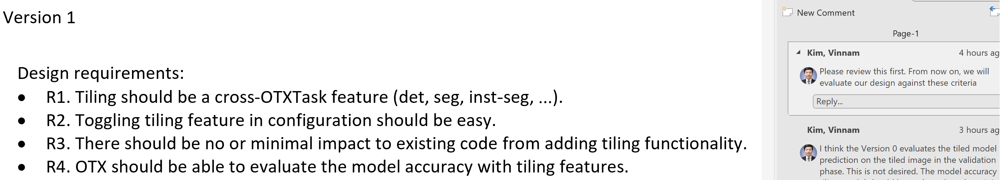
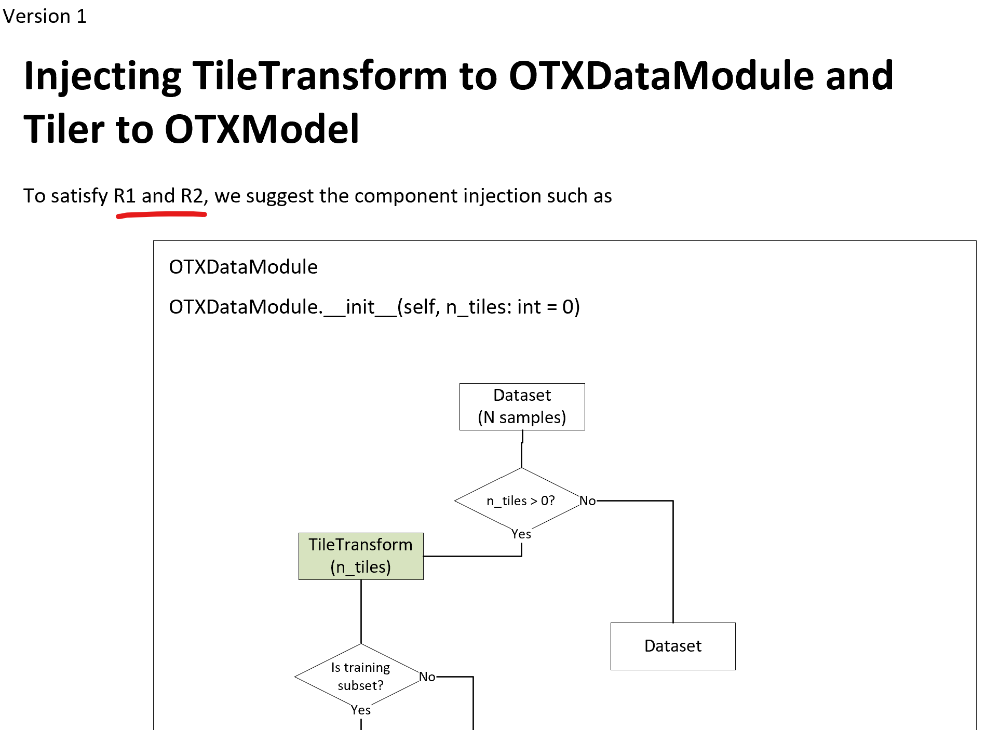
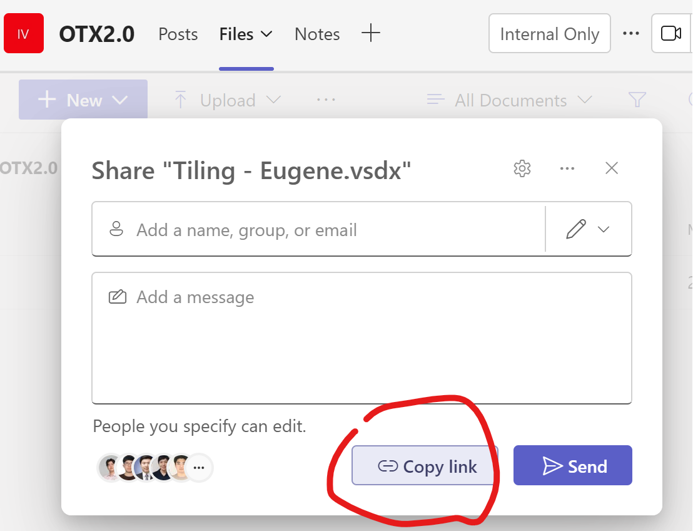
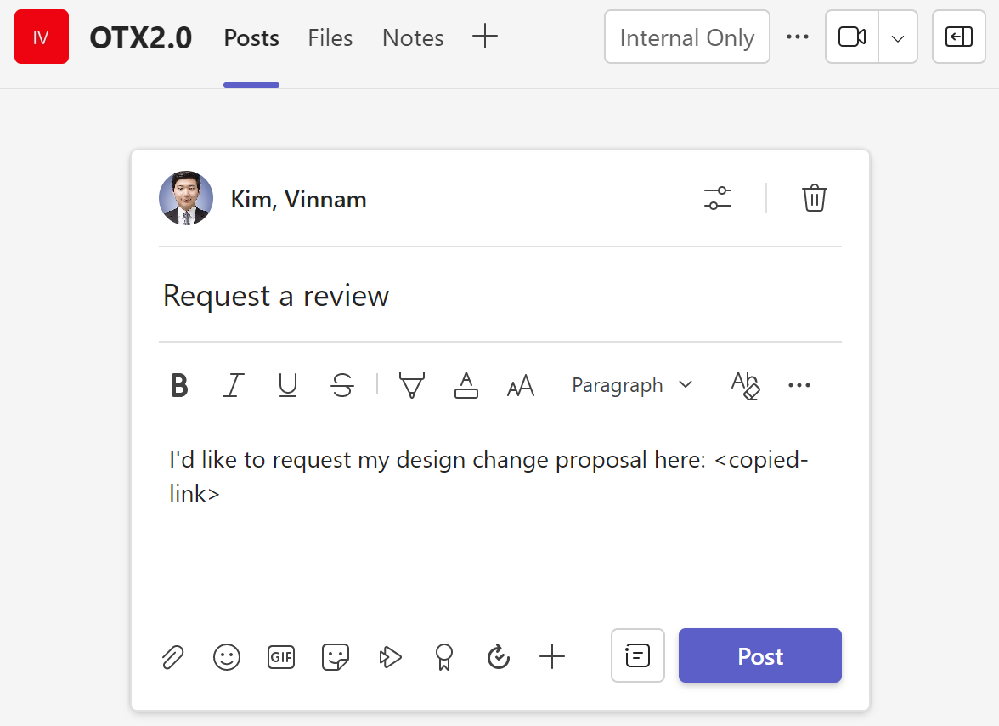

# Contribution Guide

## Design Change Proposal Process

### Who Needs It?

If you believe your work on OTX 2.0 could have a global impact on the product or involve significant changes to its structure, follow the design change proposal process.
We don't want this process to be a gatekeeper hindering our development.
Instead, we hope that it will be a systematic and fair framework for everyone to get agreement on major changes.
Given OTX 2.0's early development phase, the decision to follow this process is at the individual's discretion.
Besides, we encourage a flexible document format according to the taste of each developer, but there is with only one requirement outlined in the next section.
Developers should carefully consider this purpose before contributing to OTX 2.0.

### How to Proceed

For Intel internal developers, we have the "OTX2.0" channel in Teams.
This channel includes a file repository for viewing and uploading files. If you lack access, please contact the owner (mark.byun@intel.com).
This channel serves as the public space for suggesting and reviewing design change proposals.

### Proposing Your Design Change

1. **Prepare your proposal and upload it to the channel**

   While we don't enforce a strict document format, there is one essential requirement: establish design requirements.
   These serve as a standard for reviewers evaluating the proposal in the next step.
   For instance, here are the design requirements for the tiling feature:
   
   **Ensure your proposal aligns with our product missions**.

   After that, you can write your proposal. In your document, address how your proposal meets the design requirements you've established, as shown in the following example:
   
   We expect that this "set design requirement -> resolve design requirement" process can make our design change decision clear.

2. **Request a review on the channel**

   Copy the document link from the Teams UI:
   

   Post a review request on the channel to ask feedback from others:
   

### Reviewing Other Members' Proposals

Follow these two steps in the reviewing process:

1. **Review the design requirements**: Ensure alignment with our product missions.
2. **Review the proposal content against the design requirements**: Thoroughly check that the proposed changes address the design requirements.

## Docstrings

We follow Google style docstrings. For the detail guide of this, please see [this link](https://sphinxcontrib-napoleon.readthedocs.io/en/latest/example_google.html).
