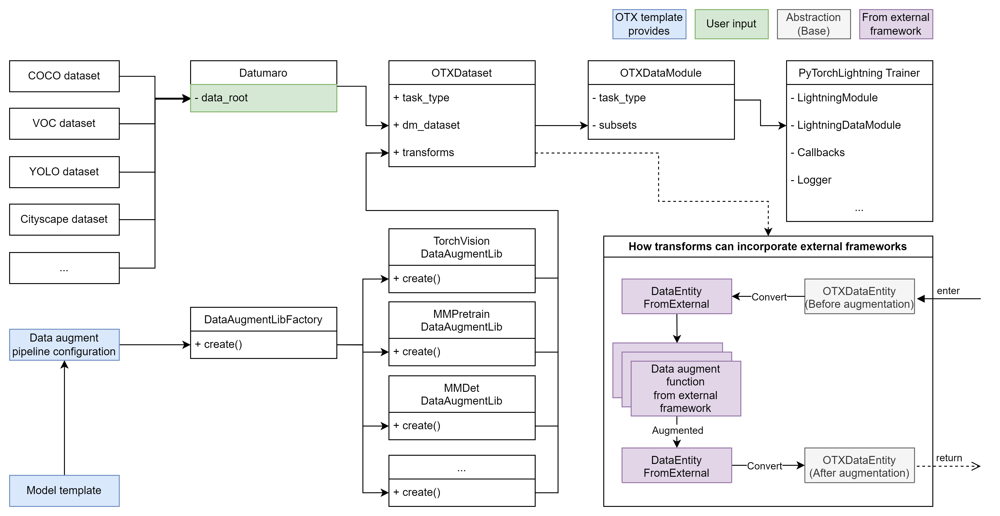

# Product Design

## Our Product Mission

1. **Provide a deep learning model training framework that encompasses various tasks solvable by deep learning models.** Our product aims to be convenient for developers, allowing them to easily expand support for tasks and models.

2. **Empower users to seamlessly and intuitively navigate the OpenVINO™-based workflow, from model training to inference.** To ensure a user-friendly experience throughout, our product should have user-friendly CLI and Python API entrypoints.

3. **Support Intel devices for accelerating deep learning model training:** We offer best practices for training from scratch or fine-tuning popular model architectures using Intel devices.

## Product Design Principles

To realize our product missions, we establish the following design principles and details, providing a comprehensive overview of our product's structure.

### Core

1. **Static Typing System for Task-Data-Model to Accelerate Task and Model Development Cycles**

   _"Advocates of static typing argue that ... a better design time developer experience..."_[^1]

   Our framework should support various deep learning tasks simultaneously.
   To achieve this mission, it is essential to make it developer-friendly for expanding our product across three dimensions: task, data, and model.
   The key insight here is that, while these dimensions may seem independent, they can be interconnected into a single dimension, specifically the task, where both the data and model depend on.
   We believe that nice abstractions with static typing can help developers in this regard.
   Therefore, we here introduce the **Task-Data-Model** abstraction with static typing.

   |  |
   | :-------------------------------------------------------------: |
   |    Figure 1. Task-Data-Model abstractions with static typing    |

   As shown in Figure 1, there are abstractions (grey-colored boxes) that form the base for each task:

   1. `OTXTaskType`: A Python enum defining the deep learning task supported in this framework.
   2. `OTXDataEntity`: A Python dataclass object representing a single data sample for each `OTXTaskType`.
   3. `OTXBatchDataEntity`: A Python dataclass object representing a batch of `OTXDataEntity`.
   4. `OTXModel`: PyTorch module (`nn.Module`) defined for each `OTXTaskType`.
      Its `forward()` function has strict typing: 1) `OTXBatchDataEntity` as inputs and 2) `OTXBatchLossEntity` or `OTXBatchPredEntity` as outputs.

   On the other hand, we can see embodiments from the abstractions (blue-colored boxes) for the detection task (`OTXTaskType.DETECTION`):

   1. `DetDataEntity` and `DetBatchDataEntity`: Python dataclass objects including `bboxes` and `labels` fields for the detection task.
      `DetBatchDataEntity` is used for the input of `OTXDetectionModel`'s `forward()` function.
   2. `DetBatchPredEntity`: Python dataclass object including the `scores` field beyond `DetBatchDataEntity`.
      It is used for the output of `OTXDetectionModel`'s `forward()` function at inference mode.

   As observed, a developer aiming to add a new model to OTX for the detection task only needs to consider the strictly typed input and output (`DetBatchDataEntity` and `DetBatchPredEntity`).

   Conversely, in the event of a new task requirement, we can incorporate it by implementing embodiments from the base, such as `OTXTaskType`, `OTXDataEntity`, `OTXBatchDataEntity`, and `OTXModel`.

2. **Single Engine but Capable of Incorporating Other Public Model Training Frameworks**

   _"Don't Reinvent the Wheel"_[^2]

   We choose PyTorch Lightning[^3] as the primary engine for our training framework.
   However, as you are aware, there are numerous open-source model training frameworks worldwide.
   Often, these frameworks are tightly coupled with their own engines, hindering the reuse of valuable data pipelines or model implementations.
   This goes against the well-known software engineering principle, _"Don't Reinvent the Wheel."_

   Nevertheless, our `OTXModel` class features special abstract member functions that enable us to reuse model implementations from any framework.
   These special functions, namely `create_model()`, `customize_inputs()` and `customize_outputs()`, facilitate the conversion of our own data entity class to the format required by a model imported from an external framework.

   Let's consider an example of importing a model from MMDetection[^4]:

   |  |
   | :-----------------------------------------------------: |
   | Figure 2. Import RTMDetTiny[^5] model from MMDetection  |

   In Figure 2, `MMDetCompatibleModel` implements `create_model()` to generate the `RTMDetTiny` model and registers it as a child module.
   At this point, the `RTMDetTiny` model requires `DataSample` input from MMDetection and produces a Python dictionary for its output.
   These data entity types do not comply with our framework.
   To resolve this issue, `MMDetCompatibleModel` implements `customize_inputs()` and `customize_outputs()` functions to convert them into our format.
   With this design, we can explicitly support major frameworks. We plan to continually expand the supported frameworks using this approach.

3. **Support Various Data Formats without Worrying about Customizing the Input Data Pipeline**

   _Much of the time for an AI project is likely to be spent on data-related tasks ..._[^6]

   When developing a new deep learning model, one of the most tedious tasks is often creating a data pipeline for the given dataset.
   Developers must study the data schema of the provided dataset and parse it into a data entity consumable by both the data augmentation pipeline and the model.

   To simplify and enhance this process in the model development lifecycle, we introduce Datumaro[^7], a member of the OpenVINO™ open-source ecosystem.
   Datumaro allows the import of various data formats from around the world.
   Please refer to the following Figure.

   |  |
   | :-------------------------------------------------------------------------------------: |
   | Figure 3. Only the root directory path is provided by the user to make a data pipeline  |

   In Figure 3, a popular data format such as COCO, VOC, YOLO, or Cityscape can be imported with Datumaro.
   While Figure 3 illustrates the entire data pipeline, the only input required from the user is `data_root`.
   This simplicity allows users to enjoy a convenient model training workflow without worrying about the input data pipeline.

   Another advantage highlighted in Figure 3 is the support for multiple data augmentation pipelines.
   As shown, we demonstrate how to incorporate a data augmentation pipeline from an external framework.
   We provide the necessary online conversions before and after the data augmentation pipeline from the external framework.
   As a result, by adjusting or using the configuration from the template we provide, users can utilize not only the default pipeline from TorchVision[^8], but also other pipelines such as MMPretrain, MMDetection, etc.
   This flexibility enables developers to freely compose the model and the data augmentation pipeline from various frameworks, accelerating the creation of custom model training templates for specific problem domains.

Authors: @wonjuleee @vinnamkim

### Entrypoint

TBD @samet-akcay @harimkang

### Intel Device Support

TBD

[^1]: Meijer, Erik, and Peter Drayton. "Static typing where possible, dynamic typing when needed: The end of the cold war between programming languages." OOPSLA, 2004.
[^2]: https://en.wikipedia.org/wiki/Reinventing_the_wheel#In_software_development
[^3]: https://lightning.ai/pytorch-lightning
[^4]: https://github.com/open-mmlab/mmdetection
[^5]: https://github.com/open-mmlab/mmdetection/tree/main/configs/rtmdet
[^6]: https://www.netapp.com/media/16928-wp-7299.pdf
[^7]: https://github.com/openvinotoolkit/datumaro
[^8]: https://pytorch.org/vision/0.16/transforms.html
