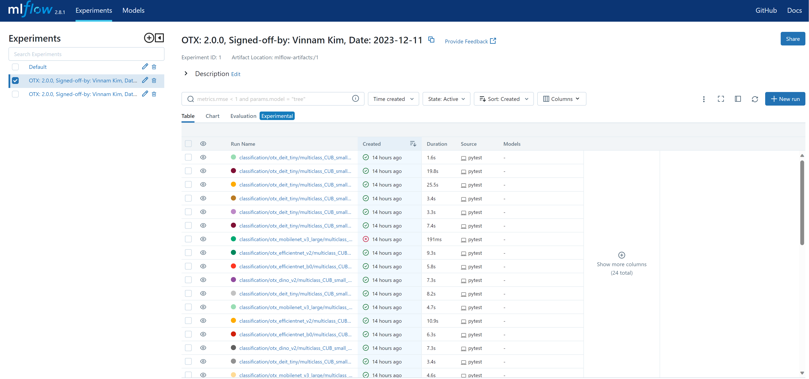

# How to do integration test

## How to deploy MLFlow Tracking Server with POSTGRES Database

1. Build MLFlow Tracking Server docker image

   ```console
   for_developers/regression_test$ ./build.sh
   ```

2. Create DB data storage directory

   ```console
   for_developers/regression_test$ mkdir postgres_data
   ```

3. Deploy MLFlow Tracking Server

   You should set a proper value for the password environment variable, `POSTGRES_PASSWORD=<SET_MY_PASSWORD>`.

   ```console
   for_developers/regression_test$ USER=$(id -u) POSTGRES_PASSWORD=<SET_MY_PASSWORD> docker compose up -d
   ```

## How to execute regression test

1. Prerequisite

   You must [deploy the MLFlow Tracking server](#how-to-deploy-mlflow-tracking-server-with-postgres-database) beforehand executing the regression test.
   After the deployment, you can access to your MLFlow Tracking server instance with `http://<server-ip>:5000` (e.g., if you launched the server instance in your local machine, `http://localhost:5000`).
   You might see the following screen in your web browser:

   |  |
   | :---------------------------------------: |
   |             MLFlow Dashboard              |

   By using MLFlow Tracking server, we can save, load, and visualize the regression test results easily.
   Additionaly, our MLFlow Tracking server stores the data in PostgreSQL database backend.
   This means that we can have our own web front-end for the regression tests in the future.

   |                 |
   | :-------------------------------------------------------------------: |
   | Test results and environment will be recorded in the metrics and tags |

   |                                                                                                                                         |
   | :-----------------------------------------------------------------------------------------------------------------------------------------------------------------------------------------: |
   | One of MLFlow Tracking server UI provides filtering functionality. In this example, we filter the regression results. Test results and environment will be recorded in the metrics and tags |

2. Launch the regression tests

   To launch the regression tests, you should use the PyTest framework.
   We developed the regression tests workflow in `tests/regression`.

   ```console
   pytest tests/regression --mlflow-tracking-uri http://<server-ip>:5000 --dataset-root-dir <dataset-root-dir> --user-name '<user-name>'
   ```

   There are three CLI arguments you should put in the testing commands:

   - `--mlflow-tracking-uri http://<server-ip>:5000`: This is the MLFlow Tracking server URI where the integration test results will be stored in.

   - `--dataset-root-dir <dataset-root-dir>`: This is the local directory path where the integration test should look as the input dataset.

     ```console
     <dataset-root-dir>
     ├── classification
     │   └── multiclass_CUB_small
     │       ├── 1
     │       │   ├── train
     │       │   ├── val
     │       │   └── test
     |       ...
     ├── detection
     ...
     ```

   - `--user-name <user-name>`: This is the user name who launched the integration test.
