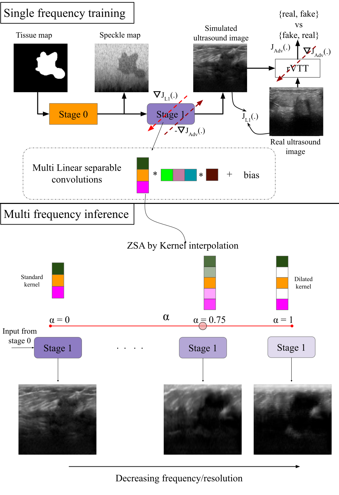
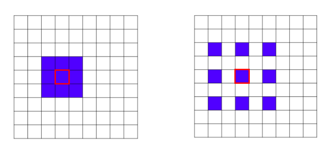
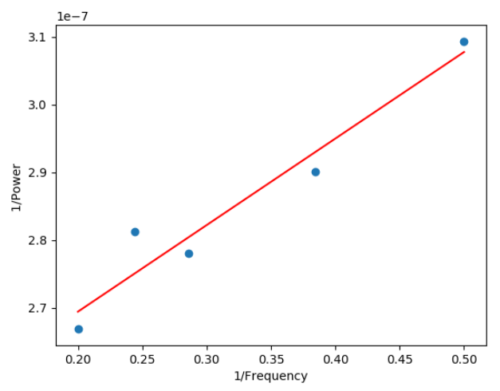
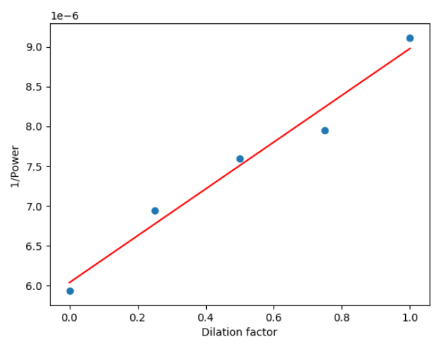
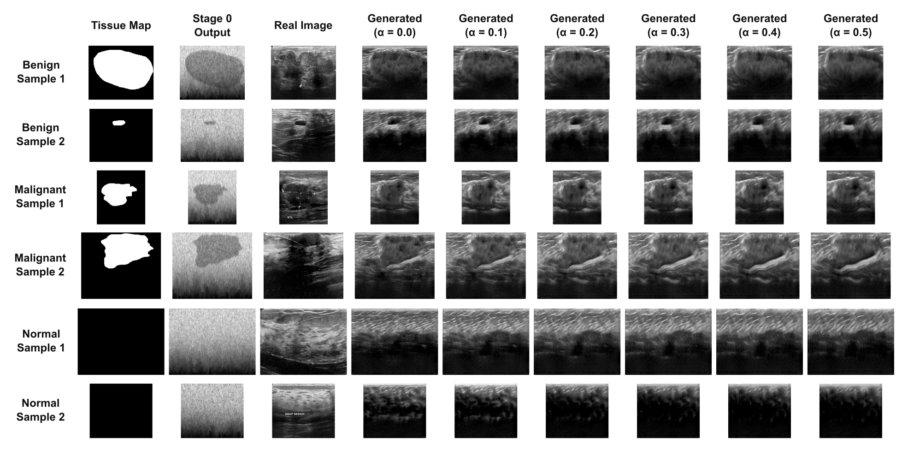

# Fast Simulation of Ultrasound Images using Multilinear Separable Deep Convolution Neural Network with Kernel Dilation

<div id="abs">

Ultrasound image formation depends on factors like frequency and size of the transducer, tissue characteristics, nonlinear attenuation, diffraction, and scattering due to the medium, which all need to be taken into account in order to generate realistic ultrasound image simulations. Traditionally, the various factors are incorporated by modeling their physics and solving wave equations which leads to computationally expensive solutions. To address these issues, we explore a Convolutional Neural Network (CNN) based fast simulation approach to model the non-linearity of signal interaction with ultrasound image formation. The network is trained in an adversarial manner using a Turing test discriminator. The simulation process consists of two stages. Stage 0 is a pseudo B-mode simulator that provides an initial estimate of the speckle map. Stage 1 is a multi-linear separable CNN which further refines the speckle map to provide the final output.

We further derive the relationship between frequency of the transducer and resolution of the ultrasound image in order to be able to simulate and form images at frequencies other than at which the model is trained. This is achieved by interpolation between dilated kernels in a multi-linear separable CNN that is used to control the resolution of the generated image allowing for zero-shot adaptation (ZSA).

Using a regression analysis, we have concluded that there exists a linear relationship between the proposed  kernel interpolation factor and the inverse of transducer frequency, thereby laying the foundation of a multi-frequency full 2D ultrasound simulator. The models made available in this repo are trained using [Breast Ultrasound Images Dataset (Dataset BUSI)](https://scholar.cu.edu.eg/Dataset_BUSI.zip).



## Kernel Dilation:

The blue boxes represent $3\times3$ convolution kernels with different dilation rates operating on the underlying image. A low dilation factor (left) is used for modeling high resolution image and a high dilation factor (right) is used for modeling low resolution image.



Plot between the inverse of power of bandpass spectrum of real ultrasound images and inverse of frequency is shown as follows. It can be observed there exists a linear relationship between them.



Plot between the inverse of power of band pass spectrum of simulated images and dilation factor is shown as follows. It can be observed there exists a linear relationship between them.



## **Results**



## **Model**

Download `.pt` checkpoint for Stage1 Generator model with the following [link](http://kliv.iitkgp.ac.in/projects/miriad/model_weights/bmi6/model.pt).

Inference models will be made available in the [open_model_zoo](https://github.com/openvinotoolkit/open_model_zoo/tree/master/models/public).


## **Setup**

### Prerequisites

* Ubuntu\* 18.04.6
* Python\* 3.9.0
* NVidia\* GPU for training
* 16GB RAM for inference

## **Train**

1. Download the [Breast Ultrasound Images Dataset (Dataset BUSI)](https://scholar.cu.edu.eg/Dataset_BUSI.zip).
2. Create the directory tree
3. Prepare the training dataset
4. Run the training script

## **Code and Directory Organisation**

```
breast_ultrasound_simulation/
	breast_ultrasound_simulation/
      stage1/
        src/
          utils/
          dataloader.py
          demo_kernel_dilation.py
          exporter.py
          infer.py
          metric.py
          model.py
          solve.py
          train.py
        final_dataset_images_and_masks.py
        original_images_and_masks.py
        PolarPseudoBMode2D.py
        stage_0_masks.py
	configs/
      download_config.json
      net_config.json
	media/
      kd_example.png
      kd_p_vs_dil.png
      kd_p_vs_freq.png
      kd_pipeline.png
      kd_results.png
	tests/
      test_1_train.py
      test_2_export.py
      test_3_inference.py
	init_venv.sh
	ReadMe.md
	requirements.txt
	setup.py
```

## **Code Structure**

1. `train.py` in `breast_ultrasound_simulation/stage1/src` directory contains the code for training the model.
2. `demo_kernel_dilation.py` in `breast_ultrasound_simulation/stage1/src` directory contains the code for evaluating the model with test set.
3. `export.py` in `breast_ultrasound_simulation/train_utils` directory generating the ONNX and Openvino IR of the trained model.
4. All dependencies are provided in **utils** folder.
5. **tests** directory contains  unittests.
6. **config** directory contains model configs.

## **Run Tests**

Necessary unit tests have been provided in the tests directory. The sample/toy dataset to be used in the tests can also be downloaded from [here](http://kliv.iitkgp.ac.in/projects/miriad/model_weights/bmi6/downloads.zip).

## How to run
Follow the below steps to reproduce

1. Create virtual environment: sh init_venv.sh
2. Activate venv: source venv/bin/activate
3. Copy original dataset: extract the downloaded dataset zip file and paste it under the "breast_ultrasound_simulation/stage1/" folder.
4. Prepare dataset (Step 1): python -m breast_ultrasound_simulation.stage1.original_images_and_masks
5. Prepare dataset (Step 2): python -m breast_ultrasound_simulation.stage1.stage_0_masks
6. Prepare dataset (Step 3): python -m breast_ultrasound_simulation.stage1.final_dataset_images_and_masks
7. Train stage1 model: python -m breast_ultrasound_simulation.stage1.src.train
8. Inference on stage 1 model: python -m breast_ultrasound_simulation.stage1.src.demo_kernel_dilation


## **Acknowledgement**

This work is undertaken as part of Intel India Grand Challenge 2016 Project MIRIAD: Many Incarnations of Screening of Radiology for High Throughput Disease Screening via Multiple Instance Reinforcement Learning with Adversarial Deep Neural Networks, sponsored by Intel Technology India Pvt. Ltd., Bangalore, India.


**Principal Investigators**

<a href="https://www.linkedin.com/in/debdoot/">Dr Debdoot Sheet</a>,<a href="http://www.iitkgp.ac.in/department/EE/faculty/ee-nirmalya"> Dr Nirmalya Ghosh (Co-PI) </a></br>
Department of Electrical Engineering,</br>
Indian Institute of Technology Kharagpur</br>
email: debdoot@ee.iitkgp.ac.in, nirmalya@ee.iitkgp.ac.in

<a href="https://www.linkedin.com/in/ramanathan-sethuraman-27a12aba/">Dr Ramanathan Sethuraman</a>,</br>
Intel Technology India Pvt. Ltd.</br>
email: ramanathan.sethuraman@intel.com

**Contributor**

The codes/model was contributed to the OpenVINO project by:

<a href="https://www.linkedin.com/in/raj-krishan-ghosh-77571a1b9/">Raj Krishan Ghosh</a>, </br>
Centre of Excellence in Artificial Intelligence, </br>
Indian Institute of Technology Kharagpur</br>
email: rajkrishanghosh@gmail.com</br>

<a href="https://github.com/vidit98">Vidit Goel</a>, </br>
Department of Electrical Engineering, </br>
Indian Institute of Technology Kharagpur</br>
email: viditgoel9816@gmail.com</br>

<a href="https://github.com/Rakshith2597"> Rakshith Sathish</a>,</br>
Advanced Technology Development Center,</br>
Indian Institute of Technology Kharagpur</br>
email: rakshith.sathish@kgpian.iitkgp.ac.in</br>
Github username: Rakshith2597

## **References**

Mooga, A., Sethuraman, R. and Sheet, D., 2020, April. Zero-shot adaptation to simulate 3D ultrasound volume by learning a multilinear separable 2D convolutional neural network. In <i>2020 IEEE 17th International Symposium on Biomedical Imaging (ISBI)</i> (pp. 1780-1783). IEEE.
