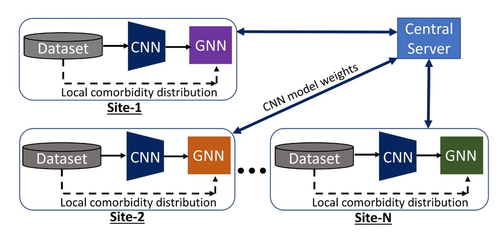
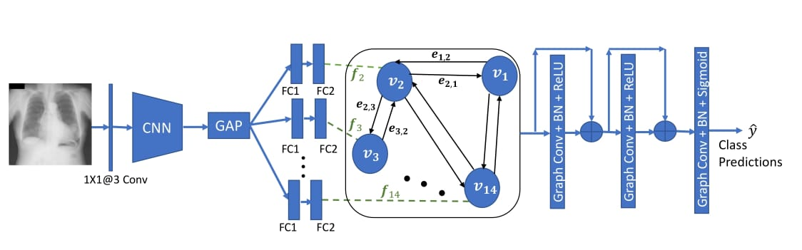
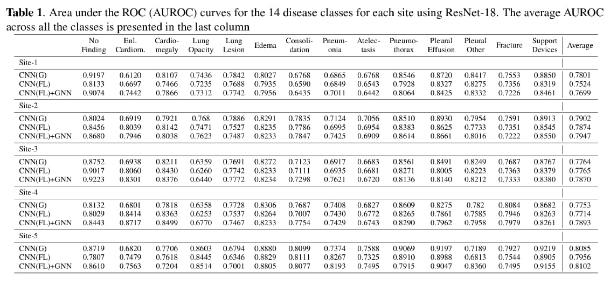

# Federated Learning for Site Aware Chest Radiograph Screening

The shortage of Radiologists is inspiring the development of
Deep Learning (DL) based solutions for detecting cardio, thoracic and pulmonary pathologies in Chest radiographs through
multi-institutional collaborations. However, sharing the training data across multiple sites is often impossible due to privacy, ownership and technical challenges. Although Federated
Learning (FL) has emerged as a solution to this, the large
variations in disease prevalence and co-morbidity distributions
across the sites may hinder proper training. We propose a DL
architecture with a Convolutional Neural Network (CNN) followed by a Graph Neural Network (GNN) to address this issue.
The CNN-GNN model is trained by modifying the Federated
Averaging algorithm. The CNN weights are shared across all
sites to extract robust features while separate GNN models are
trained at each site to leverage the local co-morbidity dependencies for multi-label disease classification. The CheXpert
dataset is partitioned across five sites to simulate the FL set
up. Federated training did not show any significant drop in
performance over centralized training. The site-specific GNN
models also demonstrated their efficacy in modelling local disease co-occurrence statistics leading to an average area under
the ROC curve of 0.79 with a 1.74% improvement.

Figure below shows the overall schematic diagram of federated learning proposed in <a href="#comp_journal">[1]</a>


## The proposed CNN-GNN architecture 



Separate Fully Connected (FC) layers are employed to obtain different 512-D
features for each class. These are used as node features to construct a graph whose edges capture the co-occurrence dependencies
between the classes at each site. The graph is provided as input to a Graph Neural Network to obtain the prediction labels for
each node. The entire CNN-GNN architecture is trainable in an end-to-end manner.

## Results

The overall performance of the proposed CNN-GNN is 


## Model

Download `.pth` checkpoint for CNN-GNN model trained on CheXpert dataset with the following [link](http://kliv.iitkgp.ac.in/projects/miriad/model_weights/bmi34/high_low/weights.zip).

Inference models will be made available in the [open_model_zoo](https://github.com/openvinotoolkit/open_model_zoo/tree/master/models/public) as well.

Note: The ONNX and IR representation models accepts inputs of fixed size mentioned in configuration file. This needs to be updated based on the input size.

## Setup

* Ubuntu 20.04
* Python 3.8
* NVidia GPU for training
* 16 GB RAM for inference

## Code and Directory Organisation


```
radiology_compression/
	src/
       utils/
        dataprep.py
        downloader.py
        downloader.py
        evaluators.py
        exporter.py
        generate.py
        get_config.py
        inference_utils.py
        model.py
        train_utils.py
       export.py
       inference.py
       train.py
	configs/
       phase1_config.json
       phase2_config.json
       download_configs.json
	media/
	tests/
       test_export.py
       test_inference.py
       test_train.py
	init_venv.sh
	README.md
	requirements.txt
	setup.py
```

## Code Structure

1. `train.py` in src directory contains the code for training the model.
2. `inference.py` in src directory contains the code for evaluating the model with test set.
3. `export.py` in src directory generating the ONNX and Openvino IR of the trained model.
4. All dependencies are provided in **utils** folder.

5. **tests** directory contains  unit tests.
6. **config** directory contains model configurations for the network.


### Run Tests

Necessary unit tests have been provided in the tests directory. The sample/toy dataset to be used in the tests can also be downloaded from [here](http://kliv.iitkgp.ac.in/projects/miriad/sample_data/bmi34/phase1/phase1.zip) and [here](http://kliv.iitkgp.ac.in/projects/miriad/sample_data/bmi34/phase2/phase2.zip).

## Acknowledgement

The model and architecture was first published in 2021 IEEE 18th International Symposium on Biomedical Imaging (ISBI).

This work is supported through a research grant from Intel
India Grand Challenge 2016 for Project MIRIAD.

**Principal Investigators**

<a href="https://www.linkedin.com/in/debdoot/">Dr Debdoot Sheet</a></br>
Department of Electrical Engineering,</br>
Indian Institute of Technology Kharagpur</br>
email: debdoot@ee.iitkgp.ac.in

<a href="https://www.linkedin.com/in/ramanathan-sethuraman-27a12aba/">Dr Ramanathan Sethuraman</a>,</br>
Intel Technology India Pvt. Ltd.</br>
email: ramanathan.sethuraman@intel.com

**Contributor**

The codes/model was contributed to the OpenVINO project by

<a href="https://github.com/Kasliwal17"> Aditya Kasliwal</a>,</br>
Department of Data Science and Computer Applications,</br>
Manipal Institute of Technology, Manipal</br>
email: kasliwaladitya17@gmail.com</br>
Github username: Kasliwal17

<a href="https://github.com/Rakshith2597"> Rakshith Sathish</a>,</br>
Advanced Technology Development Center,</br>
Indian Institute of Technology Kharagpur</br>
email: rakshith.sathish@kgpian.iitkgp.ac.in</br>
Github username: Rakshith2597


## References


<div id="comp_journal">
<a href="#results">[1]</a>  Chakravarty, Arunava and Kar, Avik and Sethuraman, Ramanathan and Sheet, Debdoot; Federated Learning for Site Aware Chest Radiograph Screening; In 2021 IEEE 18th International Symposium on Biomedical Imaging (ISBI). <a href="https://ieeexplore.ieee.org/document/9433876"> (link) </a>
</div>
