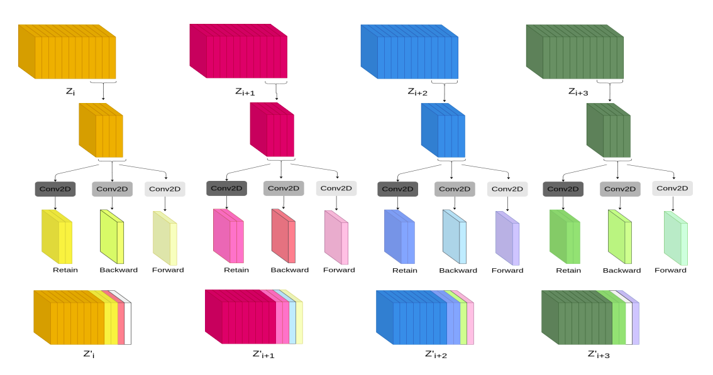
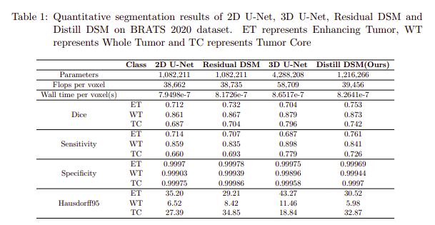
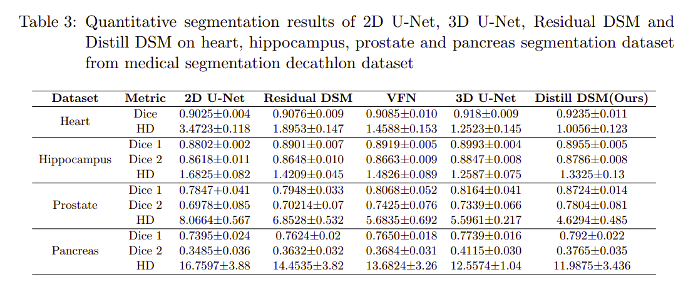
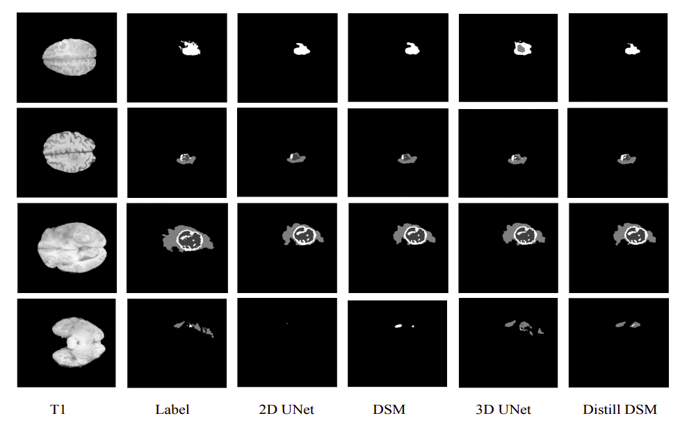

## Abstract

Accurate segmentation of volumetric scans like MRI and CT scans is highly demanded for surgery planning in clinical practice, quantitative analysis, and identification of disease. However, accurate segmentation is challenging because of the irregular shape of given organ and large variation in appearances across the slices. In such problems, 3D features are desired in nature which can be extracted using 3D convolutional neural network (CNN). However, 3D CNN is compute and memory intensive to implement due to large number of parameters and can easily over fit, especially in medical imaging where training data is limited. In order to address these problems, we propose a distillation-based depth shift module (Distill DSM). It is designed to enable 2D convolutions to make use of information from neighbouring frames more efficiently. Specifically, in each layer of the network, Distill DSM learns to extract information from a part of the channels and shares it with neighbouring slices, thus facilitating information exchange among neighbouring slices. This approach can be incorporated with any 2D CNN model to enable it to use information across the slices with introducing very few extra learn-able parameters.

## Proposed Approach



## Results

Brats 2020 results are obtained on validation dataset by uploading on their portal.
 </br>
We have evaluated our model on 4 dataset (Heart, Hippocampus, Prostate, and Pancreas) of medical decathlon challenge. For the purpose of evaluation we have used 5 fold cross validation strategy. </br>

Visualisation of segmentation results on Brats 2020 dataset. 


## Dependencies
* Pytorch
* nilearn
* pandas

```
sh init_venv.sh
```

## Model Implementation 
Repository have implemented following models
* Distill DSM
* DSM
* 2D Unet 
* 3D Unet

## Dataset

* [BraTS2020](https://www.med.upenn.edu/cbica/brats2020/data.html) 
* [Heart](http://medicaldecathlon.com/)
* [Hippocampus](http://medicaldecathlon.com/)
* [Pancreas](http://medicaldecathlon.com/)
* [Prostate](http://medicaldecathlon.com/)

## Unit Tests
Toy dataset for brats 2020 and heart dataset could be found [here](data/) and [here](data_heart/) respectively. For the purpose of checking the loss is reducing using following command.

```
cd PATH_TO_FOLDER
export PYTHONPATH=${PWD}:${PYTHONPATH}
cd examples/brats2020
python ../../src/scripts/train_test.py --config_filename heart_config_toy.json --model_filename ./distill_DSM.h5 --training_log_filename ./distill_dsm_training_log.csv --subjects_filename examples/heart/heart_subjects.json  --model_name Distill --nthreads <nthreads> --ngpus <ngpus>

```
For the above experiment, you will observe the loss is decreasing every epoch and also to cross check this happens an assertion is kept in place.
For checking the inferencing use the below command
```
cd PATH_TO_FOLDER
export PYTHONPATH=${PWD}:${PYTHONPATH}
cd examples/hearts
python ../../src/scripts/train_test.py --config_filename heart_config_toy.json --model_filename ../../Model/heart_distill.h5 --training_log_filename ./distill_dsm_training_log.csv --subjects_filename examples/heart/heart_subjects.json  --model_name Distill --infer --nthreads <nthreads> --ngpus <ngpus>

```
I recieved a dice score of 0.914 for the above experiment (with the given pretrained model). An assertion of dice score to be greater than 0.9 is also kept in place.

## Training and Testing

Open examples/barts2020 folder and checkout [README](examples/brats2020/README.md) for training and testing purpose. </br>
Checkout sample scripts at [examples/hearts/run.sh](examples/hearts/run.sh) for training and [examples/hearts/visualise.sh](examples/hearts/visualise.sh) for prediction </br>

Above examples could be used for other dataset as well, by changing necessary arguments.

## Experiments 

We have evaluated using testing data on brats2020 dataset and 5 fold cross validation on heart, hippocampus, prostate and pancreas dataset. For 5-fold cross validation, we split total training volumes in 5 set of data. </br>

All the hyperparameter related to model are initialised in cofig file, which you can change accordingly.

## Pretrained Model

[Distill DSM Model](Model/heart_distill.h5) and [onnx model](Model/heart_distill_onnx.onnx) trained on Heart dataset </br>
[Distill DSM Model](Model/heart_distill.h5) and [onnx model](Model/prostate_distill_onnx.onnx) trained on Prostate dataset </br>

## Demo script

In order to infer model on any dataset. 

```
cd PATH_TO_FOLDER
export PYTHONPATH=${PWD}:${PYTHONPATH}
cd examples/hearts
python ../../src/scripts/predict.py --segment --output_directory ./predictions/validation/baseline --config_filename ./heart_config.json --model_filename Models/heart_distill.h5 --group validation --output_template "hearts_Validation_{subject}.nii.gz" --subjects_filename examples/heart_subjects.json --model_name <model_name> --nthreads <nthreads> --ngpus <ngpus>
```

## Acknowledgement 

This work is undertaken as part of Intel India Grand Challenge 2016 Project MIRIAD, sponsored by Intel Technology India Pvt. Ltd., Bangalore, India.

### Contribution
[Harsh Maheshwari](https://www.linkedin.com/in/harsh-99/) </br>
Department of Electrical Engineering </br>
Indian Institute of Technology, Kharagpur </br>
Email: harshmaheshwari135@gmail.com </br>

### Principle Investigators

[Dr Debdoot Sheet](https://www.linkedin.com/in/debdoot/) </br>
Department of Electrical Engineering </br>
Indian Institute of Technology Kharagpur </br>
email: debdoot@ee.iitkgp.ac.in </br>

[Dr Ramanathan Sethuraman](https://www.linkedin.com/in/ramanathan-sethuraman-27a12aba/) </br>
Intel Technology India Pvt. Ltd. </br>
email: ramanathan.sethuraman@intel.com </br>

## Publication

* Harsh Maheshwari, Vidit Goel, Ramanathan Sethuraman, Debdoot Sheet, "Distill DSM: Computationally efficient method for segmentation of medical imaging volumes", 2021, 4th International Conference on Medical Imaging with Deep Learning (Accepted)