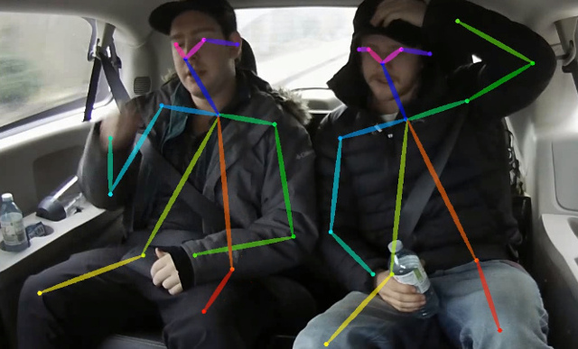

# Real-time 2D Multi-Person Pose Estimation on CPU: Lightweight OpenPose

This repository contains training code for the paper [Real-time 2D Multi-Person Pose Estimation on CPU: Lightweight OpenPose](https://arxiv.org/pdf/1811.12004.pdf). This work heavily optimizes the [OpenPose](https://github.com/CMU-Perceptual-Computing-Lab/openpose) approach to reach real-time inference on CPU with a negligible accuracy drop. It detects a skeleton (which consists of keypoints and connections between them) to identify human poses for every person inside the image. The pose may contain up to 18 keypoints: ears, eyes, nose, neck, shoulders, elbows, wrists, hips, knees, and ankles. This code achieves a 40% AP for the single-scale inference on the COCO 2017 Keypoint Detection validation set without a flip or post-processing. You can reproduce the result using this repository.

The implementation of our paper for single-person pose estimation problem [Global Context for Convolutional Pose Machines](https://arxiv.org/pdf/1906.04104.pdf) is added. See [README_single.md](README_single.md) for details.



## Table of Contents

* [Requirements](#requirements)
* [Prerequisites](#prerequisites)
* [Training](#training)
* [Validation](#validation)
* [Pretrained Model](#pretrained-model)
* [Output Format](#output-format)
* [C++ Demo](#cpp-demo)
* [Python Demo](#python-demo)
* [Fine-Tuning](#fine-tuning)
* [Citation](#citation)

## Requirements

* Ubuntu\* 16.04
* Python\* 3.6
* PyTorch\* 0.4.1 (PyTorch\* 1.0 not validated)

## Prerequisites

1. Download the COCO 2017 dataset: [http://cocodataset.org/#download](http://cocodataset.org/#download) (train, val, annotations) and unpack it to the `<COCO_HOME>` folder.
2. Create virtual environment:

    ```bash
      bash init_venv.sh
    ```

## Training

Training consists of three steps (given AP values for full validation dataset):

1. Training from MobileNet weights. Expected AP after this step is ~38%.
2. Training from weights obtained from the previous step. Expected AP after this step is ~39%.
3. Training from weights obtained from the previous step and increased number of refinement stages to 3 in the network. Expected AP after this step is ~40% (for a network with one refinement stage, two next ones are discarded).

### Training Flow

1. Download the pretrained MobileNet v1 weights `mobilenet_sgd_68.848.pth.tar` from the [pytorch-mobilenet repository](https://github.com/marvis/pytorch-mobilenet) (choose the sgd option).

2. Convert the train annotations to the internal format by running the following:

    ```bash
    python scripts/prepare_train_labels.py --labels <COCO_HOME>/annotations/person_keypoints_train2017.json
    ```

    This produces the `prepared_train_annotation.pkl` file with annotations converted in the internal format.

3. *Optional*. For fast validation, make a *subset* of the validation dataset by running the following:

    ```bash
    python scripts/make_val_subset.py --labels <COCO_HOME>/annotations/person_keypoints_val2017.json
    ```

    This produces the `val_subset.json` file with annotations just for 250 random images (out of 5000).

4. To train from the MobileNet weights, run the following:

    ```bash
    python train.py \
        --train-images-folder <COCO_HOME>/train2017/ \
        --prepared-train-labels prepared_train_annotation.pkl \
        --val-labels val_subset.json \
        --val-images-folder <COCO_HOME>/val2017/ \
        --checkpoint-path <path_to>/mobilenet_sgd_68.848.pth.tar \
        --from-mobilenet
    ```

5. To train from the checkpoint from the previous step, run the command below:

    ```bash
    python train.py \
        --train-images-folder <COCO_HOME>/train2017/ \
        --prepared-train-labels prepared_train_annotation.pkl \
        --val-labels val_subset.json \
        --val-images-folder <COCO_HOME>/val2017/ \
        --checkpoint-path <path_to>/checkpoint_iter_420000.pth \
        --weights-only
    ```

6. To train from the checkpoint from the previous step and three refinement stages in the network, run the following:

    ```bash
    python train.py \
        --train-images-folder <COCO_HOME>/train2017/ \
        --prepared-train-labels prepared_train_annotation.pkl \
        --val-labels val_subset.json \
        --val-images-folder <COCO_HOME>/val2017/ \
        --checkpoint-path <path_to>/checkpoint_iter_280000.pth \
        --weights-only \
        --num-refinement-stages 3
    ```

    We took the checkpoint after 370000 iterations as the final one.

We did not perform the best checkpoint selection at any step, so similar result may be achieved after less number of iterations.

#### Known Issue

We observe this error with maximum number of open files (`ulimit -n`) equals to 1024:

```
  File "train.py", line 164, in <module>
    args.log_after, args.val_labels, args.val_images_folder, args.val_output_name, args.checkpoint_after, args.val_after)
  File "train.py", line 77, in train
    for _, batch_data in enumerate(train_loader):
  File "/<path>/python3.6/site-packages/torch/utils/data/dataloader.py", line 330, in __next__
    idx, batch = self._get_batch()
  File "/<path>/python3.6/site-packages/torch/utils/data/dataloader.py", line 309, in _get_batch
    return self.data_queue.get()
  File "/<path>/python3.6/multiprocessing/queues.py", line 337, in get
    return _ForkingPickler.loads(res)
  File "/<path>/python3.6/site-packages/torch/multiprocessing/reductions.py", line 151, in rebuild_storage_fd
    fd = df.detach()
  File "/<path>/python3.6/multiprocessing/resource_sharer.py", line 58, in detach
    return reduction.recv_handle(conn)
  File "/<path>/python3.6/multiprocessing/reduction.py", line 182, in recv_handle
    return recvfds(s, 1)[0]
  File "/<path>/python3.6/multiprocessing/reduction.py", line 161, in recvfds
    len(ancdata))
RuntimeError: received 0 items of ancdata
```

To get rid of it, increase the limit to a bigger number. For example, to increase the limit to 65536, run the following in the terminal: `ulimit -n 65536`.

## Validation

Run the following:

```bash
python val.py \
  --labels <COCO_HOME>/annotations/person_keypoints_val2017.json \
  --images-folder <COCO_HOME>/val2017 \
  --checkpoint-path <CHECKPOINT>
```

## Pretrained Model

The model expects a normalized image (mean=[128, 128, 128], scale=[1/256, 1/256, 1/256]) in the planar BGR format.
A model pretrained on COCO is available at the [Intel® Open Source Technology Center](https://download.01.org/opencv/openvino_training_extensions/models/human_pose_estimation/checkpoint_iter_370000.pth), it has 40% of AP on the COCO validation set (38.6% of AP on the val *subset*).

## Conversion to the OpenVINO™ Format

1. Convert a PyTorch\* model to the ONNX\* format by running the script in the terminal:

    ```bash
    python scripts/convert_to_onnx.py --checkpoint-path <CHECKPOINT>
    ```
    The script produces `human-pose-estimation.onnx`.

2. Convert the ONNX model to the OpenVINO™ format with Model Optimizer by running the script below in the terminal:

    ```bash
    python <OpenVINO_INSTALL_DIR>/deployment_tools/model_optimizer/mo.py \
        --input_model human-pose-estimation.onnx \
        --input data \
        --mean_values data[128.0,128.0,128.0] \
        --scale_values data[256] \
        --output stage_1_output_0_pafs,stage_1_output_1_heatmaps
    ```
    This produces the `human-pose-estimation.xml` model and weights `human-pose-estimation.bin` in single-precision floating-point format (FP32).

## Output Format

The network has two outputs:
* Keypoints heatmaps
* Part affinity fields (used in grouping by persons instances)

These outputs are post-processed, and [`group_keypoints`](https://github.com/opencv/openvino_training_extensions/blob/develop/pytorch_toolkit/human_pose_estimation/modules/keypoints.py#L51) function returns recognized poses, represented as two lists:
* `all_keypoints` - list of keypoints for all poses found in an image. Each element is a keypoint with its confidence and global ID, represented as a tuple with 4 elements: 0, 1 - keypoints coordinates, 2 - keypoint confidence (value from heatmap) and the last one is the global keypoint id in this list.
* `pose_entries` - list of poses. Each pose is a list of 20 elements: [0,17] - global keypoints IDs, 18 is the pose confidence (sum of keypoints confidences and confidences of connections between keypoints), the last one is the number of recognized keypoints for the pose.

Keypoints order and names are defined in the [Pose](https://github.com/opencv/openvino_training_extensions/blob/develop/pytorch_toolkit/human_pose_estimation/modules/pose.py#L7) class. Example of parsing is shown in the [demo](https://github.com/opencv/openvino_training_extensions/blob/develop/pytorch_toolkit/human_pose_estimation/demo.py#L112).

## <a name="cpp-demo"/>C++ Demo</a>

To run the demo, download the Intel® OpenVINO™ Toolkit [https://software.intel.com/en-us/openvino-toolkit/choose-download](https://software.intel.com/en-us/openvino-toolkit/choose-download), install it and [build the samples](https://software.intel.com/en-us/articles/OpenVINO-InferEngine) (*Inferring Your Model with the Inference Engine Samples* part). Then run `<SAMPLES_BIN_FOLDER>/human_pose_estimation_demo -m <path_to>/human-pose-estimation.xml -i <path_to_video_file>` for the inference on CPU.

## <a name="python-demo"/>Python* Demo</a>

We provide the Python demo just for the quick results preview. Consider the C++ demo for the best performance. To run the Python demo from a webcam, run the following:

`python demo.py --checkpoint-path <path_to>/checkpoint_iter_370000.pth --video 0`

## <a name="fine-tuning"/>Fine-Tuning</a>

* The annotations have to be in the [COCO format](http://cocodataset.org/#format-data).
* If the number of keypoints differs from this model (18), then the network structure and result parsing code (e.g. `modules/keypoints.py`) adjustments are required.
* The output order of keypoints is consistent to the [OpenPose format](https://github.com/CMU-Perceptual-Computing-Lab/openpose/blob/master/doc/02_output.md#pose-output-format-body_25) (from 1 to 18).
* Fine-tuning steps are the same as steps 2-3 for training, just pass the path to the pretrained checkpoint and your data.

#### Example

We will perform fine-tuning on the first half of validation dataset and report the performance on the second part (see image indices in `data/val2017_2nd_half_indices.txt` for the reference) after 200 iterations (~6 epoches).

* Validate before fine-tuning:

  ```bash
  python val.py \
    --labels val2017_2nd_part.json \
    --output-name detections.json \
    --images-folder <COCO_HOME>/val2017 \
    --checkpoint-path <path_to>/checkpoint_iter_370000.pth
  ```

  AP before fine-tuning is 39%.

* Perform fine-tuning for 200 iterations:

    ```bash
    python train.py \
        --train-images-folder <COCO_HOME>/val2017/ \
        --prepared-train-labels prepared_val2017_1st_part_annotation.pkl \
        --val-labels val2017_2nd_part.json \
        --val-images-folder <COCO_HOME>/val2017/ \
        --checkpoint-path <path_to>/checkpoint_iter_370000.pth \
        --weights-only \
        --checkpoint-after 200 \
        --val-after 100 \
        --log-after 12 \
        --base-lr 0.00000444444
    ```

    Expected AP after 200 iterations of fine-tuning is 39.1%-39.2%.

## Citation

If this helps your research, please cite the paper:

```
@inproceedings{osokin2018lightweight_openpose,
    author={Osokin, Daniil},
    title={Real-time 2D Multi-Person Pose Estimation on CPU: Lightweight OpenPose},
    booktitle = {arXiv preprint arXiv:1811.12004},
    year = {2018}
}
```
