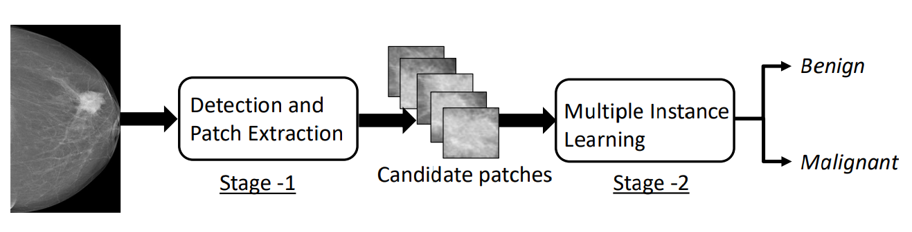
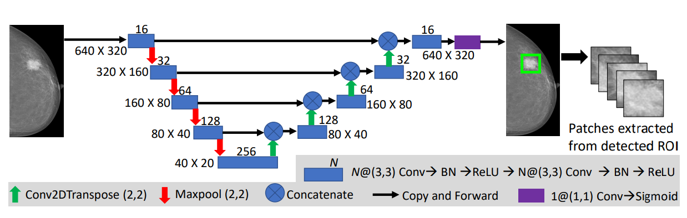
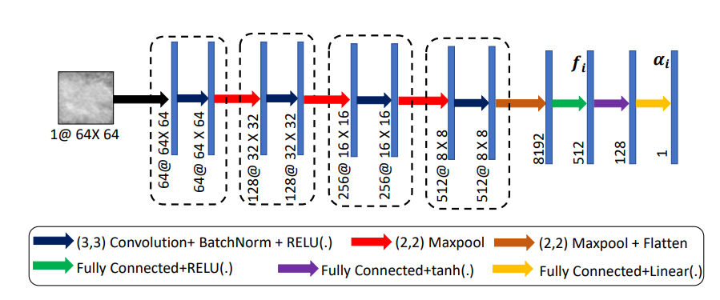

# Deep Neural Network for Chest X-Ray Screening

<div id="abs">

Mammograms are commonly employed in the large scale screening of breast cancer which is primarily characterized by the presence of malignant masses. However, automated image-level detection of malignancy is a challenging task given the small size of the mass regions and difficulty in discriminating between malignant, benign mass and healthy dense fibro-glandular tissue. To address these issues, we explore
a two-stage Multiple Instance Learning (MIL) framework. A Convolutional Neural Network (CNN) is trained in the first stage to extract local candidate patches in the mammograms that may contain either a benign or malignant mass. The second stage employs a MIL strategy for an image level benign vs. malignant classification. A global image-level feature is computed as a weighted average of patch-level features
learned using a CNN. Restricting the MIL only to the candidate
patches extracted in Stage 1 led to a significant improvement in classification performance in comparison to a dense extraction of patches from the entire mammogram. Our method performed well on the task of localization of masses with an average Precision/Recall of 0.76/0.80 and acheived an average AUC of 0.91 on the imagelevel classification task using a five-fold cross-validation on the INbreast dataset. The models made available in this repo are models trained using Re-annotated CBIS-DDSM dataset. (##insert ieee link##)



## Network Architecture:

The block diagram and CNN architecture used in Stage 1 to detect the bounding boxes of the mass regions in the mammogram.


The architecture of the patch level CNN is shown below
</br>


## Results

**Sensitivity:** 0.63
**Specificity:** 0.45
**Accuracy:** 0.90

Note: The newtork was trained for 25 epochs. 

Performance of the network, when trained and evaluated using the Inbreast dataset is given below.

## Results

**Sensitivity:** 0.96
**Specificity:** 0.77
**Accuracy:** 0.86


## **Model**

Download `.pth`checkpoint for stage1 mass localisation model with the following [link]().

Download `.pth` checkpoint for stage2 patch level model with the following [link]()

Inference models will be made available in the [open_model_zoo](https://github.com/openvinotoolkit/open_model_zoo/tree/master/models/public).

## **Demo**
!! TO-DO
An example for using the ONNX models for inference can be found [here]().

An example for using the ONNX model of optimised network for inference can be found [here]().

## **Setup**

### Prerequisites

* Ubuntu\* 16.04
* Python\* 3.6
* NVidia\* GPU for training
* 16GB RAM for inference

## **Train**

1. Download the [Re-annotated CBIS-DDSM Dataset]()
2. Create the directory tree
3. Prepare the training dataset
4. Run the training script
<!-- 
## **Code and Directory Organisation**

```
chest_xray_screening/
	chest_xray_screening/
      utils/
        data_prep.py
        downloader.py
        download_weights.py
        exporter.py
        generate.py
        get_config.py
        model.py
        score.py
      export.py
      inference.py
      train.py
	configs/
      densenet121_config.json
      densenet121eff_config.json
      gdrive_config.json
	media/
	tests/
      test_export.py
      test_inference.py
      test_train.py
	init_venv.sh
	README.md
	requirements.txt
	setup.py
``` -->

## **Code Structure**

1. `train.py` in `src/stage1` and `src/stage2` directory contains the code for training the model.
2. `inference.py` in `src/stage1` and `src/stage2` directory contains the code for evaluating the model with test set.
3. `export.py` in `src/stage1` and `src/stage2` directory generating the ONNX and Openvino IR of the trained model.
4. All dependencies are provided in **utils** folder.

5. **tests** directory contains  unittests.
6. **config** directory contains model configs.


<!-- ### Run Training

Run the `train.py` script:
```
python train.py \
  --checkpoint \
  --bs \
  --lr test_run \
  --imgpath \
  --epochs 
``` -->
<!-- 
## How to Perform Prediction

Ensure that the test directory contains a series of X-ray samples in the JPEG format with the `.jpg` extension.

### Run Inference
```
python inference.py \
  --alpha \
  --beta \
  --phi \
  --checkpoint \
  --bs \
  --imgpath \

``` -->

### Run Tests

Necessary unit tests have been provided in the tests directory. The sample/toy dataset to be used in the tests can also be downloaded from [here]().

## **Acknowledgement**

This work is undertaken as part of Intel India Grand Challenge 2016 Project MIRIAD: Many Incarnations of Screening of Radiology for High Throughput Disease Screening via Multiple Instance Reinforcement Learning with Adversarial Deep Neural Networks, sponsored by Intel Technology India Pvt. Ltd., Bangalore, India.


**Principal Investigators**

<a href="https://www.linkedin.com/in/debdoot/">Dr Debdoot Sheet</a>,<a href="http://www.iitkgp.ac.in/department/EE/faculty/ee-nirmalya"> Dr Nirmalya Ghosh (Co-PI) </a></br>
Department of Electrical Engineering,</br>
Indian Institute of Technology Kharagpur</br>
email: debdoot@ee.iitkgp.ac.in, nirmalya@ee.iitkgp.ac.in

<a href="https://www.linkedin.com/in/ramanathan-sethuraman-27a12aba/">Dr Ramanathan Sethuraman</a>,</br>
Intel Technology India Pvt. Ltd.</br>
email: ramanathan.sethuraman@intel.com

**Contributor**

The codes/model was contributed to the OpenVINO project by

<a href="https://www.linkedin.com/in/arunava-chakravarty-b1736b158/">Arunava Chakravarty</a>, </br>
Department of Electrical Engineering, </br>
Indian Institute of Technology Kharagpur</br>
email: arunavachakravarty1206@gmail.com </br>

<a href="https://github.com/Rakshith2597"> Rakshith Sathish</a>,</br>
Advanced Technology Development Center,</br>
Indian Institute of Technology Kharagpur</br>
email: rakshith.sathish@kgpian.iitkgp.ac.in</br>
Github username: Rakshith2597

# References