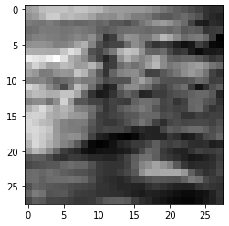
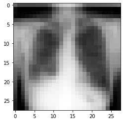
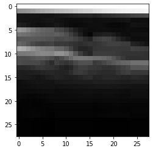
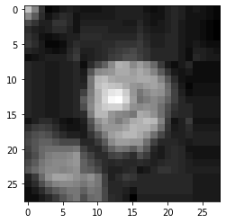
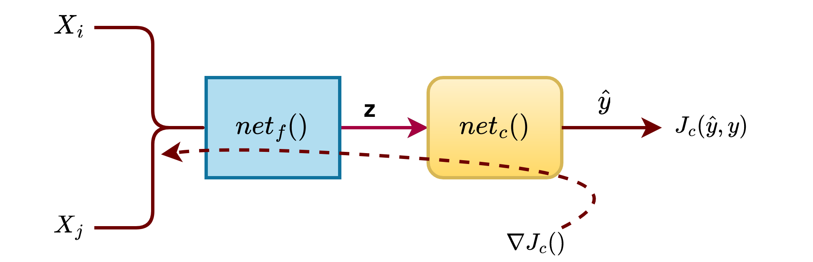
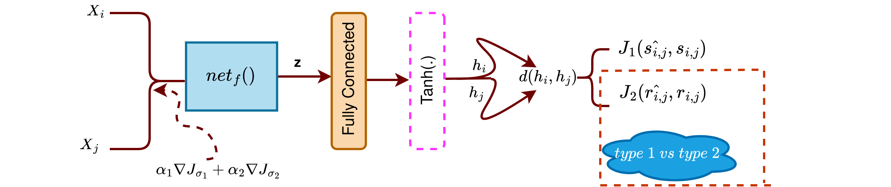
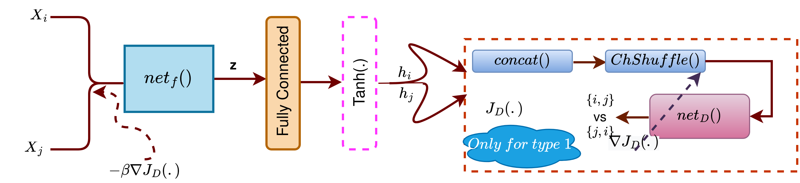

# Deep Neural Hashing for Medical Image Retrieval

<div id="abs">

The rapid digitalisation of the healthcare sector has resulted in a large corpus of various forms of data on different parts of the human body, mainly acquired using X-rays, Magnetic Resonance (MR), Computed Tomography (CT), and Ultrasound. This large repository of data has the potential to transform the way treatment is administered by clinicians based on evidence. Evidence-based medicine (EBM) [[1](#EBM)] needs to integrate better clinical expertise, patient values, and the best research evidence with the help of modern technologies. Content-based medical image retrieval (CBMIR) is the subset of content-based image retrieval (CBIR) [[2](#CBIR)], which specially focuses on medical image retrieval. The simple approach of  CBIR is to use a query image to find the previously stored images in databases that are the closest neighbours. CBIR technology appears very limited in regular clinical practice or biomedical research. Clinicians can prescribe the same treatment to all the patients, and reports are retrieved from the medical database using a CBIR system similar to the query image. DNHN is an efficient and automatic technique for CBIR by automatically and visually retrieving semantically similar images to the query being studied from an existing image database which can help doctors and clinicians make a final diagnosis.

This code/method is designed to retrieve medical images with semantic similarity of organs and their associated pathology. In this code, experiments are performed on LeNet-121[[3](#LeNet)] CNN architecture for this task. The method contains three steps to generate authentic hash codes from images during the training procedure. First, minimise the classifying error of input images. Second, maximise the ability of the discriminator to identify two similar images, and third, minimise and maximise the Hamming distance with cosine similarity for two similar and two dissimilar images, respectively, using Cauchy cross-entropy loss [[3](#cauchy)]. This model is trained using a subset of the publicly available benchmark MedMNIST v2. [[5]](#medmnist) [(link)](https://zenodo.org/record/6496656) [(license)](https://medmnist.com/). The performance of the model was evaluated using two metrics mean Average Precision (mAP) and normalised Discounted Cumulative Gain (nDCG). The evaluation process can be found [(here)](https://github.com/asimmanna17/Deep-Neural-Hashing/blob/main/Evaluation_metrics.pdf).


> **Note:**  The model was first proposed for a dataset created by collecting images from the brain tumor dataset [(link)](https://figshare.com/articles/dataset/brain_tumor_dataset/1512427/5), dataset of breast ultrasound images [(link)](https://www.kaggle.com/datasets/aryashah2k/breast-ultrasound-images-dataset) and Labeled Optical Coherence Tomography (OCT) and Chest X-Ray Images [(link)](https://data.mendeley.com/datasets/rscbjbr9sj/2). However, the dataset license clause does not abide by the criteria/requirements of the training_extension repository. Hence, a model trained using the MedMNISTv2 dataset comprising images of size 28x28 is provided here.


> **Note:** The model trained on MedNISTv2 dataset is NOT intended for clinical use.


> **Note:** The method used is yet to be published in a peer-reviewed journal. Appropriate changes will be made to the repository once it is published.

</div>


Few example images from the dataset
<table >
<tr>
<td align='center'> Image 1</td>
<td align='center'> Image 2 </td>
<td align='center'> Image 3 </td>
<td align='center'> Image 4 </td>
</tr>
<tr>
<td align='center'></td>
<td align='center'> </td>
<td align='center'>  </td>
<td align='center'>  </td>
</tr>
</table>
Image 1: Organ- Breast,  Pathology- normal or benign.      

Image 2: Organ- Chest, Pathology- atelectasis.

Image 3: Organ- Retina, Pathology- drusen.

Image 4: Organ-Tissue,  Pathology- Thick Ascending Limb​.


Minimizing classification loss:



Cauchy entropy loss:


Discriminator loss:


## Network Architecture:

We have used a LeNet-5 as the base architecture.


## Hyperparameters

| Variable | Value |
| -- | -- |
| Epoch | 100|
| lr | 0.001|
| α1 | 0.5 |
| α2 | 0.5 |
| β  | 0.6 |
| γ  |  1   | 

## Results

Score of mean avergae precision for hash code length 48 bit.
| mAP@p |  Score  |
|--|--|
| mAP@10 | 0.7586 |
| mAP@100 | 0.7075 |
| mAP@1000 | 0.6307 |


Score of normalized discounted cumulative gain for hash code length 48 bit.
| mAP@p |  Score  |
|--|--|
| nDCG@10 | 0.5148 |
| nDCG@100 | 0.5793 |
| nDCG@1000 | 0.6151 | 


Note: The newtork was trained for 100 epochs. 


## **Model**

Download `.pkl` checkpoint for densenet with the following [link](http://kliv.iitkgp.ac.in/projects/miriad/model_weights/bmi10/encoder-100.zip).


## **Setup**

* Ubuntu 20.04.4 LTS (GNU/Linux 5.4.0-124-generic x86_64)
* Python\* 3.9.6
* Nvidia\* 1080Ti GPU (Driver Version: 515.65.01; CUDA Version: 11.7) for training
* CPU: Intel(R) Xeon(R) Silver 4110 CPU @ 2.10GHz


## **Train**

1. Download the [MedMNIST v2 Dataset](https://zenodo.org/record/6496656)
2. Create the directory tree
3. Prepare the training dataset and store
4. Run the training script

## **Code and Directory Organisation**

```

openvino_Hashing/
  src
    utils
      dataset
        train
        val
        gallery
        query
      model_weghts
        encoder-100.pkl
        encoder.bin
        encoder.onnx
        encoder.xml
      dataloader.py
      exporter.py
      get_config.py
      network.py
      downloader.py
      vectorHandle.py
    export.py
    inference.py
    train.py
  test
    test_export.py
    test_inference.py
    test_train.py
  init_venv.sh
  README.md
  requirements.txt
  setup.py
```

## **Code Structure**


1. `train.py` in src directory contains the code for training the model.
2. `inference.py` in src directory contains the code for evaluating the model with test set.
3. `export.py` in src directory generating the ONNX and Openvino IR of the trained model.
4. All dependencies are provided in **utils** folder.

5. **tests** directory contains  unittests.
6. **config** directory contains model configs.
7. `encoder-100.pkl` in model_weights directoery genearting hash code of an input images.


## **Creating the Dataset Directory Tree**

We have downloaded four dataset ChestMNIST, BreastMNIST, RetinaMNIST, TissueMNIST from MedMNIST benchmark. We have proocessed each sample into `Organ_disease_count.npy` format, where Organ comes from dataset and disease comes from lable of the corresponding datasets.  We divide the dataset into four subfolder train, val, gallery, and query with ratio 6:1:2:1. Dataset tree is given below.

```
+-- dataset
|   +-- train
          +--Breast
          +--Chest
          +--Retina
          +--Tissue
        test
          +--Breast
          +--Chest
          +--Retina
          +--Tissue
        gallery
|       query

```
Download the dataset from [link](https://zenodo.org/record/6496656). 


### Run Training

Run the `train.py` script:
```
python train.py \
  --alpha 1\
  --alpha 2\
  --beta \
  --gamma \
  --checkpoint \
  --bs \
  --lr test_run \
  --dpath \
  --spath \
  --epochs \
  --zSize \
  --clscount \
```

## How to Perform Prediction

Ensure that the test directory contains a series of  samples in the numpy format with the `.npy` extension.

### Run Inference
```
python inference.py \
  --checkpoint \
  --dpath \
  --modelpath \
  --zSize \

```

### Run Tests

Necessary unit tests are `test_train.py`, `test_inference.py`, `test_export.py` and have been provided in the test directory. The sample/toy dataset to be used in the tests are stroed in dataset folder.

## **Acknowledgement**

> This work is undertaken as part of Intel India Grand Challenge 2016 Project MIRIAD: Many Incarnations of Screening of Radiology for High Throughput Disease Screening via Multiple Instance Reinforcement Learning with Adversarial Deep Neural Networks, sponsored by Intel Technology India Pvt. Ltd., Bangalore, India.


**Principal Investigators**

<a href="https://www.linkedin.com/in/debdoot/">Dr Debdoot Sheet</a>,<a href="http://www.iitkgp.ac.in/department/EE/faculty/ee-nirmalya"> Dr Nirmalya Ghosh (Co-PI) </a></br>
Department of Electrical Engineering,</br>
Indian Institute of Technology Kharagpur</br>
email: debdoot@ee.iitkgp.ac.in, 

<a href="https://www.linkedin.com/in/ramanathan-sethuraman-27a12aba/">Dr Ramanathan Sethuraman</a>,</br>
Intel Technology India Pvt. Ltd.</br>
email: ramanathan.sethuraman@intel.com

**Contributor**

The codes/model was contributed to the OpenVINO project by

<a href="https://www.linkedin.com/in/asimmanna17/">Asim Manna</a>, </br>
Centre of Excellence in Artificial Intelligence, </br>
Indian Institute of Technology Kharagpur </br>
email: asimmanna17@kgpian.iitkgp.ac.in </br> 


<a href="https://github.com/Rakshith2597"> Rakshith Sathish</a>,</br>
Advanced Technology Development Center,</br>
Indian Institute of Technology Kharagpur</br>
email: rakshith.sathish@kgpian.iitkgp.ac.in</br>
Github username: Rakshith2597


## **References**

<div id="EBM">
<a href="#abs">[1]</a> R. B. Haynes, D. L. Sackett, W. S. Richardson, W. Rosenberg, G. R.
Langley, Evidence-based medicine: How to practice & teach ebm,
Canadian Medical Association. Journal 157 (6) (1997) 788. </a> 
</div>

<div id="CBIR">
<a href="#abs">[2]</a> F. Long, H. Zhang, D. D. Feng, Fundamentals of content-based image
retrieval, in: Multimedia information retrieval and management,
Springer, 2003, pp. 1–26 </a>

</div>
<div id="LeNet">
<a href="#abs">[3]</a>  A. El-Sawy, E.-B. Hazem, M. Loey, Cnn for handwritten arabic digits recognition based on lenet-5, in: International conference on advanced
intelligent systems and informatics, Springer, 2016, pp. 566–575. </a>

</div>
<div id="cauchy">
<a href="#results">[4]</a>  Y. Cao, M. Long, B. Liu, J. Wang, Deep cauchy hashing for hamming space retrieval, in: Proceedings of the IEEE Conference on Computer
Vision and Pattern Recognition, 2018, pp. 1229–1237 </a>
</div>

</div>
<div id="medmnist">
<a href="#results">[5]</a> 
Yang, Jiancheng, et al. "Medmnist v2: A large-scale lightweight benchmark for 2d and 3d biomedical image classification." arXiv preprint arXiv:2110.14795 (2021).</a>
</div>