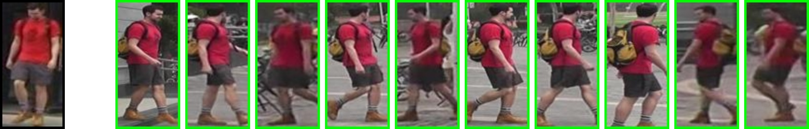

# Person Re-Identification



This repository contains training and inference code for person re-identification
neural networks. The networks are based on the [OSNet](https://arxiv.org/abs/1905.00953)
architecture provided by the [deep-object-reid](https://github.com/opencv/deep-object-reid.git)
project. The code supports conversion to the ONNX\* format and inference of OpenVINO™ models.


| Model Name | Market-1501 rank@1 accuracy | Market-1501 mAP | GFlops | MParams | Links |
| --- | --- | --- | --- | --- | --- |
| person-reidentification-retail-0248 | 84.3 | 55.6 | 0.174 | 0.183 | [shapshot](https://download.01.org/opencv/openvino_training_extensions/models/person_reidentification/person-reidentification-retail-0248.pt), [configuration file](configs/person-reidentification-retail-0248.yaml) |
| person-reidentification-retail-0265 | 95.9 | 87.7 | 1.993 | 2.103 | [shapshot](https://download.01.org/opencv/openvino_training_extensions/models/person_reidentification/person-reidentification-retail-0265.pt), [configuration file](configs/person-reidentification-retail-0265.yaml) |
| person-reidentification-retail-0267 | 92.7 | 76.6 | 0.564 | 0.595 | [shapshot](https://download.01.org/opencv/openvino_training_extensions/models/person_reidentification/person-reidentification-retail-0267.pt), [configuration file](configs/person-reidentification-retail-0267.yaml) |
| person-reidentification-retail-0270 | 94.7 | 83.8 | 1.170 | 1.234 | [shapshot](https://download.01.org/opencv/openvino_training_extensions/models/person_reidentification/person-reidentification-retail-0270.pt), [configuration file](configs/person-reidentification-retail-0270.yaml) |


## Setup

### Prerequisites

* Ubuntu\* 16.04
* Python\* 3.5.2
* PyTorch\* 1.4 or higher
* OpenVINO™ 2020 R3 (or newer) with Python API

### Installation

To create and activate virtual Python environment follow [installation instructions](../README.md)

### Datasets

This toolkit contains configs for training on the following datasets:

* Market-1501
* MSMT17v2

For training, set up a root directory to the datasets.
Structure of the root directory is as follows:

```
root
├── market1501
│   └── Market-1501-v15.09.15
│       ├── bounding_box_test
│       ├── bounding_box_train
│       └── query
│
└── msmt17
    └── MSMT17_V2
        ├── mask_test_v2
        ├── mask_train_v2
        ├── list_gallery.txt
        ├── list_query.txt
        ├── list_train.txt
        └── list_val.txt
```

### Configuration Files

The script for training and inference uses a configuration file
[default_config.py](https://github.com/openvinotoolkit/deep-object-reid/tree/ote/scripts/default_config.py), which consists of default parameters.
This file also has description of parameters.
Parameters that you wish to change must be in your own configuration file.
Example: [person-reidentification-retail-0265.yaml](configs/person-reidentification-retail-0265.yaml)

## Training

To start training, create or choose a configuration file and use the [main.py](https://github.com/openvinotoolkit/deep-object-reid/tree/ote/tools/main.py) script.

Example:

```bash
python ../../../external/deep-object-reid/tools/main.py \
    --root /path/to/datasets/directory/root \
    --config configs/person-reidentification-retail-0265.yaml
```

## Test
To test your network, set in a configuration file the `test.evaluate` parameter to `True`
and run a command like the one used for training.
For visualization results, set the `test.visrank` parameter to `True` (it works only when
`test.evaluate` is `True`).
For visualization activation maps, set the `test.visactmap` parameter to `True`.


### Test OpenVINO™ Re-Identification Models

OpenVINO™ models are represented by \*.xml and \*.bin files (Intermediate Representation (IR) format).
To use such a model, set the next parameters in the config file:

```yaml
model:
  openvino:
    name: /path/to/model/in/IR/format.xml
    cpu_extension: /path/to/cpu/extension/lib.so
```

> **NOTE**: \*.xml and \*.bin files should be saved in the same directory.


## Convert a PyTorch Model to the OpenVINO™ Format

Follow the steps below:

1. Convert a PyTorch model to the ONNX format by running the following:

    ```bash
    python ../../../external/deep-object-reid/tools/convert_to_onnx.py \
        --config /path/to/config/file.yaml \
        --output-name /path/to/output/model \
        --verbose
    ```

    Name of the output model ends with `.onnx` automatically.
    By default, the output model path is `model.onnx`. Be careful about the `load_weights` parameter
     in the configurations file. The `verbose` argument is non-required and
    switches on detailed output in conversion function.

2. Convert the obtained ONNX model to the IR format by running the following command:

```bash
python <OpenVINO_INSTALL_DIR>/deployment_tools/model_optimizer/mo.py --input_model model.onnx  \
    --mean_values '[123.675, 116.28, 103.53]' \
    --scale_values '[58.395, 57.12, 57.375]' \
    --reverse_input_channels
```

This produces the `model.xml` model and weights `model.bin` in single-precision floating-point format (FP32).

## OpenVINO™ Demo

OpenVINO™ provides the multi-camera-multi-person tracking demo, which is able to use these models as person re-identification networks. See details in the [demo](https://github.com/openvinotoolkit/open_model_zoo/tree/develop/demos/multi_camera_multi_target_tracking_demo/python).

## Citation
If this training code helped your research, please cite the paper:

```
@misc{sovrasov2020building,
    title={Building Computationally Efficient and Well-Generalizing Person Re-Identification Models with Metric Learning},
    author={Vladislav Sovrasov and Dmitry Sidnev},
    year={2020},
    eprint={2003.07618},
    archivePrefix={arXiv},
    primaryClass={cs.CV}
}
```
