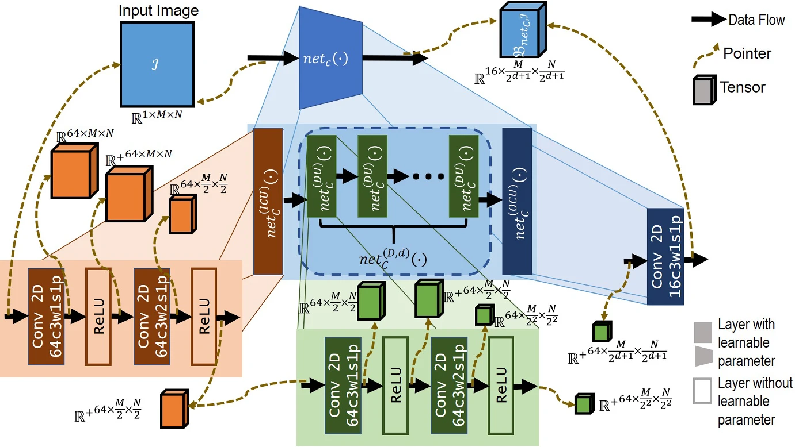
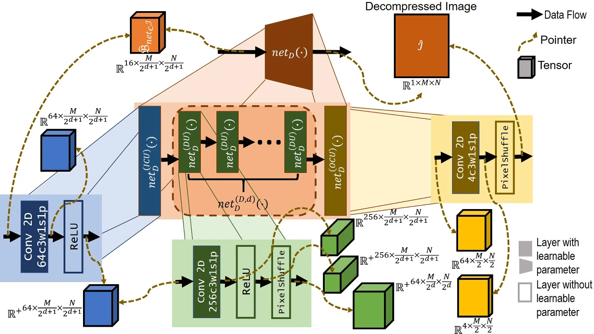
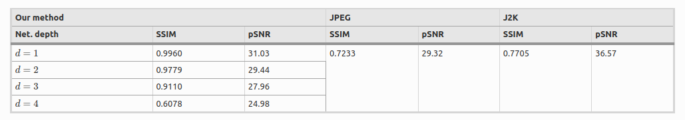
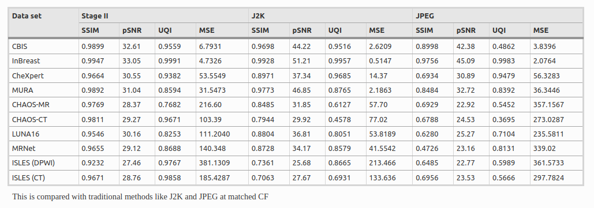

# Designing Deep Neural High-Density Compression Engines for Radiology Images

As a speciality, radiology produces the highest volume of medical images in clinicalestablishments compared to other commonly employed imaging modalities like dig-ital pathology, ophthalmic imaging, etc. 
Archiving this massive quantity of imageswith large file sizes is a major problem since the costs associated with storing medicalimages continue to rise with an increase in cost of electronic storage devices. 
One ofthe possible solutions is to compress them for effective storage. The prime challengeis that each modality is distinctively characterized by dynamic range and resolutionof the signal and its spatial and statistical distribution. Such variations in medicalimages are different from camera-acquired natural scene images. Thus, conventionalnatural image compression algorithms such as J2K and JPEG often fail to preservethe clinically relevant details present in medical images. We address this challenge bydeveloping a modality-specific compressor and a modality-agnostic generic decom-pressor implemented using a deep neural network (DNN) and capable of preserving clinically relevant image information. Architecture of the DNN is obtained through design space exploration (DSE) with the objective to feature the least computational complexity at the highest compression and a target high-quality factor, thereby leading to a low power requirement for computation. The neural compressed bitstream is further compressed using the lossless Huffman encoding to obtain a variable bit length and high-density compression (20 × −400×). Experimental validation is performed on X-ray, CT and MRI. Through quantitative measurement and clinical validation with a radiologist in the loop, we experimentally demonstrate our approach’s performance superiority over traditional methods like JPEG and J2K operating at matching compression factors.

Figure below shows the overall schematic diagram of the compression engine proposed in <a href="#comp_journal">[1]</a>


> **Paper**: </Br>
Raj, Aditya and Sathish, Rakshith and Sarkar, Tandra and Sethuraman, Ramanathan and Sheet, Debdoot; Designing Deep Neural High-Density Compression Engines for Radiology Images; In Circuits, Systems, and Signal Processing, Springer., 2022. </Br>_Access the paper via_ [**Springer**](https://link.springer.com/article/10.1007/s00034-022-02222-0)

BibTeX reference to cite, if you use it:
```bibtex
@article{raj2023designing,
  title={Designing Deep Neural High-Density Compression Engines for Radiology Images},
  author={Raj, Aditya and Sathish, Rakshith and Sarkar, Tandra and Sethuraman, Ramanathan and Sheet, Debdoot},
  journal={Circuits, Systems, and Signal Processing},
  volume={42},
  number={2},
  pages={643--682},
  year={2023},
  publisher={Springer}
}

```

## Network Architecture


### Architecture of the Lossy Compressor



The compressor (netC(·)) as illustrated in Figure above is implemented using a DNN which features the following components:

1. Input conditioning units (net(ICU)C(·)) implemented using a double convolutionlayer unit. A 2D convolution layer made up of 64 kernels (c) each of spatial size(w) of 3 × 3 operating with a stride (s) of 1 and zero padding (p) of 1 along bothaxes, represented as 64c3w1s1p, is followed by a rectified linear unit (ReLU(·))transfer function, another 2D convolution layer made up of 64 kernels each of size3×3 operating with a stride of 2 and zero padding of 1 along both axes representedas 64c3w2s1p followed by a ReLU(·). This unit is symbolically represented as $net(ICU)C(·)→ 64c3w1s1p → relu → 64c3w2s1p → relu$, such that $y = net(ICU)C(x)$ produces the output $y ∈ R64×M2×N2$ when $x = I ∈ R1×M×N$.

2. This is followed by the digest $(net(D,d)C(·))$ made up of a cascade of d number ofdigest units $(net(DU)C(·))$, such that $net(D,d)C(·) = (net(DU)C(net(DU)C(···net(DU)C(·))))d$, and $net(DU)C(·)→ 64c3w1s1p → relu → 64c3w2s1p → relu$. The output obtained is $y = net(D,d)C(net(ICU)C(x))$, where $y ∈ R64×M2d+1×N2d+1$, when $x = I$.Typically we have $d ={1, 2, 3, 4}$, and for the seed architecture we take $d = 3$.

3. Finally this is followed by the output conditioning unit defined as $net(OCU)C(·)→ 16c3w1s1p$.

### Architecture of the Lossy Decompressor



The compressed bitstream (BnetC,I) is subsequently fed to the decompressor(netD(·)) as illustrated in Fig.3, featuring the following components:

1. Input conditioning unit is implemented as $net(ICU)D(·)→ 64s3w1s1p → relu$ such that we obtain $y = net(ICU)D(x)$, where $y ∈ R64×M2d+1×N2d+1$ when $x = BnetC,I$.

2. This is followed by the digest $(net(D,d)D(·))$ made up of a cascade of d number of digest units $(net(DU)D(·))$, such that $net(D,d)D(·) = (net(DU)D(net(DU)D(···net(DU)D(·))))d$, and net $(DU)D(·)→ 256c3w1s1p → relu → PixelShuffle$.The operation PixelShuffle(·) represents sub-pixel shuffling such that for $y = PixelShuffle(x)$ we obtain $y ∈ Rc×2b×2a$ when $x ∈ R4c×b×a$. Effectively the $net(DU)D(·)$ implements a learnable deconvolution unit. The output obtained is $y = net(D,d)D(net(ICU)D(x))$, where $y ∈ R64×M2×N2$, when $x = BnetC,I$ .Here $d$ has the same value as is for $net(D,d)C(·)$ in $netC(·)$.

3. Finally the output conditioning is implemented as $net(OCU)D(·)→ 4s3w1s1p → PixelShuffle$.

## Results

The overall performance of the proposed compressor decompressor model is 


The modality specific performance of the proposed compressor decompressor model is



## Trained Models

Download `.pth` checkpoint for low and high density compression model trained on CBIS-DDSM dataset with the following [link](http://kliv.iitkgp.ac.in/projects/miriad/model_weights/bmi34/high_low/weights.zip).

>**Note:** The ONNX and IR representation models accepts inputs of fixed size mentioned in configuration file. This needs to be updated based on the input size.

## System Specifications

* Ubuntu 20.04
* Python 3.8
* NVidia GPU for training
* 16 GB RAM for inference

## Code and Directory Organisation

```
radiology_compression/
	src/
       utils/
        dataprep.py
        downloader.py
        downloader.py
        evaluators.py
        exporter.py
        generate.py
        get_config.py
        inference_utils.py
        model.py
        train_utils.py
       export.py
       inference.py
       train.py
	configs/
       phase1_config.json
       phase2_config.json
       download_configs.json
	media/
	tests/
       test_export.py
       test_inference.py
       test_train.py
	init_venv.sh
	README.md
	requirements.txt
	setup.py
```

## Code Structure

1. `train.py` in src directory contains the code for training the model.
2. `inference.py` in src directory contains the code for evaluating the model with test set.
3. `export.py` in src directory generating the ONNX and Openvino IR of the trained model.
4. All dependencies are provided in **utils** folder.

5. **tests** directory contains  unit tests.
6. **config** directory contains model configurations for the network.

## How to Run

### Prepare the Training Dataset

```
python src/utils/data_prep.py -p absolute/path/to/dataset/directory -d dimension_of_patch --out_train path/to/save/train_samples --out_test path/to/save/test_samples  --report
```

### Run Training

Run the `train.py` script:
```
python train.py \
  --traindata path/to/train/data
  --testdata path/to/test/data
  -b batch_size
  -e epoch
  --gpu 
  -i interval_to_print_results
  -s size of the randomly selected subset
  --model_file_name Name of model and log files
  --randomize_subset Randomize selected subset in every epoch
  -d no of conv blocks in the architecture
  -w no of Filters per conv
  -p flexibilty factor for computation power
  --efficient_net active efficientNet based scaling
  --iterate Grid search iterations for alpha-beta
  -p Select phase 1 or phase 2
```

## How to Perform Prediction

### Run Inference
```
python inference.py \
  -m path_to_model_file
  --inferdata path/to/folder/containing/fullsize/images
  -t Required bit depth for Float2Int quantization
  --gpu
  --with_aac Use Adaptive Arithmatic Coding (Huffman coding)
  -l Write latent code tensor (integer) as output (possibly along huffman codebook)
  -d Write decompressed images as output
  --out_latent Folder to produce the latent codes into ?
  --out_decom Folder to produce decompressed images into ?
  -p Path for the output json file
  --depth no of conv blocks in the architecture
  --width No of filters
  -x limit the number of samples to use for inference
  -ph Select phase

```

## Run Tests

Necessary unit tests have been provided in the tests directory. The sample/toy dataset to be used in the tests can also be downloaded from [here](http://kliv.iitkgp.ac.in/projects/miriad/sample_data/bmi34/phase1/phase1.zip) and [here](http://kliv.iitkgp.ac.in/projects/miriad/sample_data/bmi34/phase2/phase2.zip).

## Acknowledgement

The model and architecture was first published in Circuits, Systems, and Signal Processing, Springer., 2022 by Springer Nature.

This work is undertaken as part of Intel India Grand Challenge 2016 Project MIRIAD: Many Incarnations of Screening of Radiology for High Throughput Disease Screening via Multiple Instance Reinforcement Learning with Adversarial Deep Neural Networks, sponsored by Intel Technology India Pvt. Ltd., Bangalore, India.

**Principal Investigators**

<a href="https://www.linkedin.com/in/debdoot/">Dr Debdoot Sheet</a>,<a href="http://www.iitkgp.ac.in/department/EE/faculty/ee-nirmalya"> Dr Nirmalya Ghosh (Co-PI) </a></br>
Department of Electrical Engineering,</br>
Indian Institute of Technology Kharagpur</br>
email: debdoot@ee.iitkgp.ac.in, nirmalya@ee.iitkgp.ac.in

<a href="https://www.linkedin.com/in/ramanathan-sethuraman-27a12aba/">Dr Ramanathan Sethuraman</a>,</br>
Intel Technology India Pvt. Ltd.</br>
email: ramanathan.sethuraman@intel.com

**Contributor**

The codes/model was contributed to the OpenVINO project by

<a href="https://github.com/Rakshith2597"> Rakshith Sathish</a>,</br>
Advanced Technology Development Center,</br>
Indian Institute of Technology Kharagpur</br>
email: rakshith.sathish@kgpian.iitkgp.ac.in</br>
Github username: Rakshith2597

<a href=""> Aditya Raj</a>,</br>
Department of Electrical Engineering,</br>
Indian Institute of Technology Kharagpur</br>

<a href=""> Subhadip Roy</a>,</br>
Department of Computer Science and Engineering,</br>
Institute of Engineering and Management, Kolkata</br>
Github username: Subhadip11290157


## References


<div id="comp_journal">
<a href="#results">[1]</a>  Raj, Aditya and Sathish, Rakshith and Sarkar, Tandra and Sethuraman, Ramanathan and Sheet, Debdoot; Designing Deep Neural High-Density Compression Engines for Radiology Images; In Circuits, Systems, and Signal Processing, Springer., 2022. <a href="https://link.springer.com/article/10.1007/s00034-022-02222-0"> (link) </a>
</div>
