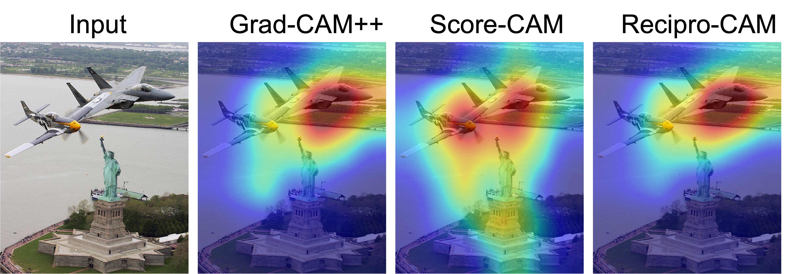
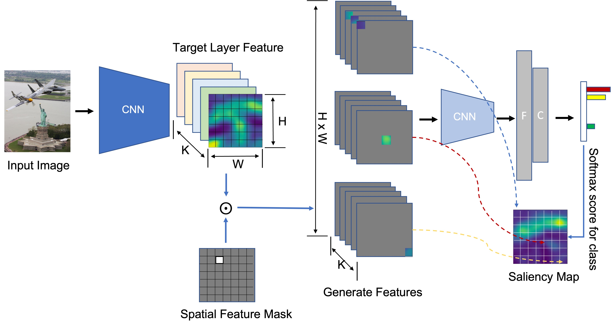

# Recipro-CAM: Fast gradient-free visual explanations for convolutional neural networks

This repository contains two recipro-cam algorithm implementations and one pytorch based sample code about how to use the algorithm.

Referrence paper: [https://arxiv.org/abs/2209.14074](https://arxiv.org/abs/2209.14074)



## Algorithm Overview



## Prerequisites

* Ubuntu\* 18.04 / 20.04
* Python\* 3.8
* PyTorch\* 1.9.0
* torchvision
* torchcam

## Run

```bash
python recipro_cam_test.py
```

## Result


