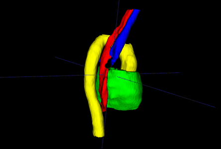

# Segmentation of Thoracic Organs Using Pixel Shuffle

This code was written for participation in the [SegTHOR: Segmentation of THoracic Organs at Risk in CT images](https://competitions.codalab.org/competitions/21145).
The code is based on [the corresponding paper](http://ceur-ws.org/Vol-2349/SegTHOR2019_paper_10.pdf), where we employ deep learning approach and explore two concepts: attention mechanism and pixel shuffle as an upsampling operator. The method in this repository differs from the one described in the paper by a few aspects: we have changed the backbone from ResNet to ResNeXt and added a postprocessing step.

An example of the final segmentation:



The visualization is done with ITK-SNAP.

## Network Architecture

It is a 3D UNet with ResNext blocks. The architecture consists of decoding and encoding paths with skip-connections
between them. We employed strided convolutions for downsampling in encoder and pixel-shuffle for upsampling in decoder.


## Results

The Dice index and Hausdorff distance are reported for each organ (esophagus, heart, trachea, aorta). For local
validation, the scores are reported without post-processing and test time augmentation. The number in the brackets is the
leaderboard placement by the time of this commit.

|              | Esophagus (D) | Heart (D)   | Trachea (D) | Aorta (D)   |
| :----------- | :-----------: | :---------: | :---------: | :---------: |
| CV 5         | 0.8249        | 0.9475      | 0.9007      | 0.9310      |
| SegTHOR Test | 0.8646 (3)    | 0.9423 (18) | 0.9172 (10) | 0.9369 (13) |

The Hausdorff distance is reported in voxels. For test, scores include post-processing and test time augmentation, the
Hausdorff distance is reported in mm.

|              | Esophagus (H) | Heart (H)   | Trachea (H) | Aorta (H)   |
| :----------- | :-----------: | :---------: | :---------: | :---------: |
| CV 5         | 13.14vx       | 47.28vx     | 37.79vx     | 22.26vx     |
| SegTHOR Test | 0.2847 (4)    | 0.1883 (13) | 0.2178 (13) | 0.1658 (10) |

### Model
Download checkpoint with the following
[01.org](https://download.01.org/opencv/openvino_training_extensions/models/segthor/segthor_0620_best_model.pth).

## Setup

### Prerequisites

* Ubuntu\* 16.04
* Python\* 3.6
* NVidia\* GPU for training
* 32GB RAM for inference

### Installation

1. Create virtual environment
    ```bash
    virtualenv venv -p python3 --prompt="(segthor)"
    ```

2. Activate virtual environment and setup OpenVINO variables:
    ```bash
    . venv/bin/activate
    . /opt/intel/openvino/bin/setupvars.sh
    ```

    >**TIP**: Good practice is adding `. /opt/intel/openvino/bin/setupvars.sh` to the end of the `venv/bin/activate`.

    ```
    echo ". /opt/intel/openvino/bin/setupvars.sh" >> venv/bin/activate
    ```

3. Install the module
    ```bash
    pip3 install -e .
    ```

## Train

1. Download the [SegTHOR dataset](https://competitions.codalab.org/competitions/21012#participate)
2. Create the directory tree
3. Prepare the training dataset
4. Run the training

### Creating the Directory Tree

The data directory should contain two subdirectories: preprocessed data for training and original
[data](https://competitions.codalab.org/competitions/21012#participate).

```
+-- data
|   +-- original
|   +-- preprocessed
```

The models directory should contain all the experiments you run. Your new experiments will be added here.

```
+-- models
|   +-- ..
```

### Prepare the Training Dataset

```
python tools/prepare_training_dataset.py \
  --input_path data/train \
  --output_path data/experimental \
  --new_scale 1 1 2.5
```

You should get a set of folders in the `output_path` with preprocessed data. The data can be visualized with ITK-SNAP.

### Run Training

Run the `main.py` script:

```
python3 tools/main.py \
  --batchSize 2 \
  --nEpochs 10 \
  --splits 5 \
  --threads 12 \
  --train_path data/train_resampled1_1_25_cropped \
  --name test_run \
  --models_path models \
  --gpus 2
```

The tensorboard log will be accessible in the `models\test_run\logs` folder.

## How to Perform Prediction

Ensure that the test directory contains a series of CT samples in the NIfTI format with the `.nii.gz` extension.

### Run Test

```
python3 tools/test.py --name pai_0620 \
  --models_path=models \
  --data_path=data/test \
  --output_path=data/output_062 \
  --new_scale 1 1 2.5
```

### Run test with OpenVINO™

1. Download and setup [OpenVINO™ ](https://software.intel.com/en-us/openvino-toolkit)

2. Run `thoracic_segmentation.py`

```
python3.6 tools/thoracic_segmentation.py \
  -i test \
  -o models/pai_0620/test \
  -m models/pai_0620/pai_0620_export.xml \
  -l /opt/intel/openvino/inference_engine/lib/intel64/libcpu_extension_avx2.so \
  -nthreads 12
```

## Citations

```
@inproceedings{lachinov2019segmentation,
  title={Segmentation of Thoracic Organs Using Pixel Shuffle.},
  author={Lachinov, Dmitry}
}
```

SegTHOR citation

```
Roger Trullo, C. Petitjean, Su Ruan, Bernard Dubray, Dong Nie, and Dinggang Shen.
Segmentation of organs at risk in thoracic CT images using a sharpmask architecture and
conditional random fields. In 14th IEEE International Symposium on Biomedical Imaging
(ISBI), pp. 1003-1006, 2017.
```
