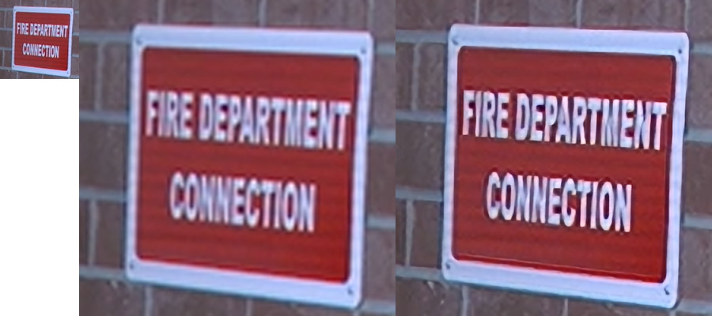

# Super Resolution

This code is intended for training Super Resolution (SR) algorithms in Pytorch.



## Models

Typologies are available for training at this point:

1. Single image super resolution network based on SRResNet architecture
(["Photo-Realistic Single Image Super-Resolution Using a Generative Adversarial
Network"](https://arxiv.org/pdf/1609.04802.pdf)) but with reduced number of channels and depthwise convolution in the decoder
2. [Attention-Based single image super resolution network](https://arxiv.org/pdf/1807.06779.pdf) with reduced number of channels and changes in the network architecture
3. [Tiny model to upsampling scanned text images](./README_text.md)

## Results

The PSNR values were calculated with Y channel from YCrCb image.

| Model      | Set5, PSNRx3, dB | Set5, PSNRx4, dB |
| :--------- | :--------------: | :--------------: |
| SmallModel | 33.15            | 31.16            |


## Setup

### Prerequisites

* Ubuntu\* 16.04 or higher
* OpenVINO™ 2019 R1 or higher
* Python\* 3


### Installation

1. Create virtual environment:
    ```bash
    virtualenv venv -p python3 --prompt="(sr)"
    ```

2. Activate virtual environment and setup OpenVINO™ variables:
    ```bash
    . venv/bin/activate
    . /opt/intel/openvino/bin/setupvars.sh
    ```
    >**TIP**: Good practice is adding `. /opt/intel/openvino/bin/setupvars.sh` to the end of the `venv/bin/activate`.
    ```
    echo ". /opt/intel/openvino/bin/setupvars.sh" >> venv/bin/activate
    ```

3. Install the module
    ```bash
    pip3 install -e .
    ```

## Train and Evaluate

### Prepare Dataset

Create two directories for train and test images. Train images may have any resolution higher than `path_size`.
Validation images should have the resolution like the `path_size`.

```
./data
├── train
│   ├── 000000.png
│   ...
└── val
    ├── 000000.png
    ...
```

### Training

Use the `tools/train.py` script to start the training process:
```
python3 tools/train.py --config configs/smallmodel_scale4.yaml
```

To start from a pretrained [checkpoint](https://download.01.org/opencv/openvino_training_extensions/models/super_resolution/image_super_resolution.tar.gz), set `init_checkpoint` in config.


### Testing

Use the `tools/test.py` script to evaluate the trained model.

```
python3 tools/test.py --test_data_path PATH_TO_TEST_DATA \
    --models_path PATH_TO_MODELS_PATH \
    --exp_name EXPERIMENT_NAME
```

## Export to OpenVINO™

```
python3 tools/export.py --models_path PATH_TO_MODELS_PATH \
    --exp_name EXPERIMENT_NAME \
    --input_size 200 200 \
    --data_type FP32
```

## Demo

### For the Latest Checkpoint

```
python3 tools/infer.py --model PATH_TO_CHECKPOINT \
    --scale 4 \
    image_path
```

### For Intermediate Representation (IR)

```
python3 tools/infer_ie.py --model <PATH_TO_IR_XML> \
    image_path
```

[C++ demo](https://github.com/opencv/open_model_zoo/tree/master/demos/super_resolution_demo)


## Know Issues

A network cannot be reshaped after conversation to the IR. Set the `input_size` when running `tools/export.py`.
