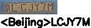

# License Plate Recognition

[LPRNet](https://arxiv.org/abs/1806.10447) is an end-to-end method for Automatic License Plate Recognition without preliminary character segmentation.



## Setup

### Prerequisites

* Ubuntu\* 16.04
* Python\* 3.6
* TensorFlow\* 1.13.1
* OpenVINO™ 2019 R1 with Python API

### Installation

1. Clone and checkout state of `tensorflow/models`:
    ```bash
    git clone https://github.com/tensorflow/models.git $(git rev-parse --show-toplevel)/external/models
    cd $(git rev-parse --show-toplevel)/external/models
    git checkout f0899f18e178afb4b57c50ec32a7e8952e6f6a99
    cd -
    ```

2. Create and activate virtual environment:

    ```bash
    cd $(git rev-parse --show-toplevel)/misc/tensorflow_toolkit/lpr
    virtualenv venv -p python3.6 --prompt="(lpr)"
    echo ". /opt/intel/openvino/bin/setupvars.sh" >> venv/bin/activate
    . venv/bin/activate
    ```

3. Install the modules:

    ```bash
    pip3 install -e .
    pip3 install -e ../utils
    ```

    In the case without GPU, use the `CPU_ONLY=true` environment variable:

    ```bash
    CPU_ONLY=true pip3 install -e .
    pip3 install -e ../utils
    ```

## Train an LPRNet Model

Predefined configuration for Chinese license plates recognition:

* Configuration file: [misc/tensorflow_toolkit/lpr/chinese_lp/config.py](chinese_lp/config.py).
* Trained model: [LPRNet 94x24](https://download.01.org/opencv/openvino_training_extensions/models/license_plate_recognition/license-plate-recognition-barrier-0007.tar.gz).

Training dataset: [Synthetic Chinese License Plates](https://download.01.org/opencv/openvino_training_extensions/datasets/license_plate_recognition/Synthetic_Chinese_License_Plates.tar.gz)

To train a model, go through the steps described in the following sections.

### Prepare a Dataset

1. Download training data and extract it in the `data/synthetic_chinese_license_plates` folder. The dataset must consist from a folder with training images named `crops` and a text file with annotations named `annotation`. Use the commands below:

    ```bash
    cd $(git rev-parse --show-toplevel)/data/synthetic_chinese_license_plates
    wget https://download.01.org/opencv/openvino_training_extensions/datasets/license_plate_recognition/Synthetic_Chinese_License_Plates.tar.gz
    tar xf Synthetic_Chinese_License_Plates.tar.gz
    ```

2. After extracting the training data archive, run the Python script from
    `data/synthetic_chinese_license_plates/make_train_val_split.py` to split the annotations into `train` and `val` by passing the path to `data/synthetic_chinese_license_plates/annotation`
    file from archive as an input. The script outputs the `data/synthetic_chinese_license_plates/train` and
    `data/synthetic_chinese_license_plates/val` annotation files with full paths to images and labels in the folder
    with extracted data.
    Use the command below:

    ```bash
    python3 make_train_val_split.py Synthetic_Chinese_License_Plates/annotation
    ```

    The resulting structure of the folder:

    ```
    ./data/synthetic_chinese_license_plates/
    ├── make_train_val_split.py
    └── Synthetic_Chinese_License_Plates/
        ├── annotation
        ├── crops/
        │   ├── 000000.png
        |   ...
        ├── LICENSE
        ├── README
        ├── train
        └── val
    ```

### Train and Evaluate

1. To start the training process, use the command below:

    ```bash
    cd $(git rev-parse --show-toplevel)/misc/tensorflow_toolkit/lpr
    python3 tools/train.py chinese_lp/config.py
    ```

2. To start from a pretrained checkpoint,use the command below:

    ```bash
    wget https://download.01.org/opencv/openvino_training_extensions/models/license_plate_recognition/license-plate-recognition-barrier-0007.tar.gz
    tar xf license-plate-recognition-barrier-0007.tar.gz
    python3 tools/train.py chinese_lp/config.py \
      --init_checkpoint license-plate-recognition-barrier-0007/model.ckpt
    ```

3. To start evaluation process, use the command below:

    ```bash
    python3 tools/eval.py chinese_lp/config.py
    ```

    > **NOTE** Before taking the step 4, make sure that the `eval.file_list_path` parameter in
    `lpr/chinese_lp/config.py` points out to the file with
    annotations to test on. Take the step 4 in another terminal, so training and
    evaluation are performed simultaneously.

4. Training and evaluation artifacts are stored by default in `lpr/chinese_lp/model`.
   To visualize training and evaluation, run the `tensorboard` with the command below:

    ```bash
    tensorboard --logdir=./model
    ```

    Then view results in a browser: [http://localhost:6006](http://localhost:6006).

### Export to OpenVINO™

To run the model via OpenVINO™, freeze the TensorFlow graph and
then convert it to the OpenVINO™ Intermediate Representation (IR) using the Model Optimizer:

```Bash
python3 tools/export.py --data_type FP32 --output_dir model/export chinese_lp/config.py
```

**Default export path**:
`lpr/model/export_<step>/frozen_graph` - path to the frozen graph
`lpr/model/export_<step>/IR/<data_type>` - path to the model converted to the IR format

## Demo

### For the Latest Checkpoint

> **NOTE**: Input data for inference should be set via the `infer.file_list_path` parameter in
`misc/tensorflow_toolkit/lpr/chinese_lp/config.py` and must look like a text file
with a list of paths to license plates images in the following format:

```
path_to_lp_image1
path_to_lp_image2
...
```

When the training is complete, the model from the checkpoint can be inferred on the
input data by running `misc/tensorflow_toolkit/lpr/chinese_lp/infer.py`:

```Bash
python3 tools/infer_checkpoint.py chinese_lp/config.py
```

### For a Frozen Graph

```Bash
python3 tools/infer.py --model model/export/frozen_graph/graph.pb.frozen \
    --config chinese_lp/config.py \
    <image_path>
```

### For Intermediate Representation (IR)

```Bash
python3 tools/infer_ie.py --model model/export/IR/FP32/lpr.xml \
  --device=CPU \
  --cpu_extension="${INTEL_OPENVINO_DIR}/deployment_tools/inference_engine/lib/intel64/libcpu_extension_avx2.so" \
  --config chinese_lp/config.py \
  <image_path>
```

## Citation

If you find *LPRNet* useful in your research, please, consider to cite the following paper:

```
@article{icv2018lprnet,
title={LPRNet: License Plate Recognition via Deep Neural Networks},
author={Sergey Zherzdev and Alexey Gruzdev},
journal={arXiv:1806.10447},
year={2018}
}
```
