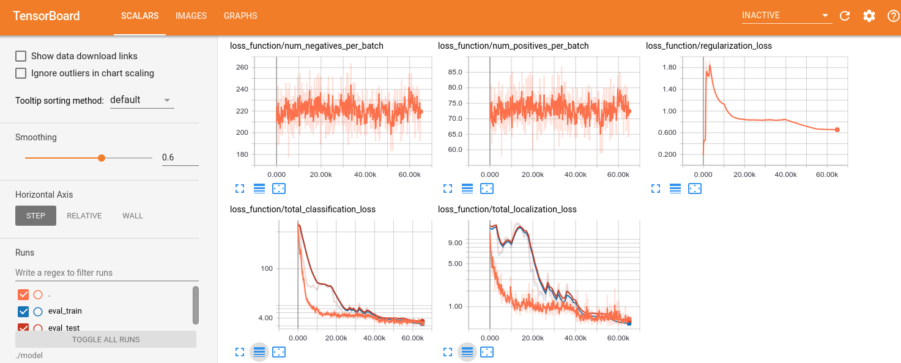

# SSD Object Detection

## Setup SSD Object Detection

Update PYTHONPATH environment variable

```
cd /<path_to_working_dir>/training_toolbox_tensorflow/models/ssd_detector
export PYTHONPATH=`pwd`:$PYTHONPATH
```

## Test Training

In order to check that everything works properly run regression test:

```
cd /<path_to_working_dir>/training_toolbox_tensorflow/models/ssd_detector/regression_test
python train_net.py
```

The test output must end with:

```
Ran 2 tests in 194.815s

OK (skipped=1)
```

## Test model export to **Inference Engine**

Download and install [OpenVINO™ Toolkit](https://software.intel.com/en-us/openvino-toolkit).

Do not forget to install required packages for Model Optimzer:

```
pip install networkx
```

Do not forget to update several environment variables are required to compile and run OpenVINO™ toolkit applications,
for details see: [https://software.intel.com/en-us/articles/OpenVINO-Install-Linux](https://software.intel.com/en-us/articles/OpenVINO-Install-Linux).

```
cd /<path_to_working_dir>/training_toolbox_tensorflow/ssd_detector
export OPEN_VINO_DIR=<PATH_TO_OPENVINO>
python train_net.py
```

If OpenVINO™ was installed in a home directory, then `<PATH_TO_OPENVINO>` is `~/intel/computer_vision_sdk_2018.3.343/`.

The test output must end with:

```
Ran 2 tests in 203.989s

OK
```

## Train SSD detection model

To train a [Single Shot Detector](https://arxiv.org/abs/1512.02325), jump to
models/ssd_detector directory. You'll see the `ssd_detector` folder with sample code
demonstrating how to train a MobileNetV2-based SSD object detector.

We provide 2 predifined configuration:
* Vehicles and license plates detector [models/ssd_detector/vlp/config.py](vlp/config.py).
* COCO object detector detector [models/ssd_detector/coco/config.py](coco/config.py) on COCO dataset [data/coco/README.md](../../data/coco/README.md).

### Quck start with vehicles and license plates detector
The sample model will learn how to detect vehicles and license plates on
[BitVehicle](http://iitlab.bit.edu.cn/mcislab/vehicledb/) dataset. The resulting
model can further be used to build a sample application, similar to ["security
barrier"](https://software.intel.com/en-us/articles/OpenVINO-IE-Samples#security-barrier-camera)
from OpenVINO™.

To train a model, go through the following steps:

1. Download training data and put it in the `data/bitvehicle` directory
    according to [data/bitvehicle/README.md](../../data/bitvehicle/README.md)
    file. Annotation files in **COCO** format (refer to
    [cocodataset](http://cocodataset.org/#format-data) for details) are already
    located in `data/bitvehicle`.

2. If necessary, you can modify training settings by editing
    [models/ssd_detector/vlp/config.py](vlp/config.py) or leave them by
    default. For more details please read comments in
    [config.py](vlp/config.py). Notable parameters in `train`
    class are:
     * `batch_size` - number of images in training batch, by default it's set to
       `32`, but could be increased or decreased depending on the amount of
       available memory.
     * `annotation_path` - path to json file with annotation in **COCO** format,
       by default it's set to relative path to bitvehicle annotation, but you
       could use your own annotation.
     * `steps` - number of training iterations
     * `execution.CUDA_VISIBLE_DEVICES` - Environment variable to control cuda
       device used for training. By default, it's set to `0`. In case you have
       multiple GPUs, you can change it to the respective number, or leave this
       string empty, if you want to train on CPU.
     * `cache_type` - type of input data to save in cache to speed-up data
       loading and preprocessing. By default it's set to `ENCODED`.
       Remember that caching might cause system slowdown, so if you don't have
       enough RAM memory better to disable it, pass `NONE` to this parameter.

3. To start training go to `models/ssd_detector` directory and type in command line:

    ```
    python3 train.py vlp/config.py
    ```

4. To start evaluation process go to `models/ssd_detector` directory and type
    in command line:

    ```
    python3 eval.py vlp/config.py
    ```

    Do step 4 in another terminal, so training and evaluation are performed simultaneously.

5. Training and evaluation artifacts will be stored by default in
    `models/ssd_detector/vlp/model`.  To visualize training and evaluation, go to
    `models/ssd_detector/vlp` and run tensorboard with:

    ```
    tensorboard --logdir=./model
    ```

    And view results in a browser: [http://localhost:6006](http://localhost:6006).

    

6. When training is complete, model from the checkpoint could be infered on
    input data by running `models/ssd_detector/infer.py`:

    ```
    python3 infer.py vlp/config.py --video --input=<path_to_input_video> --show
    ```

7. Finally, trained model could be converted to Inference Engine format for
    optimized inference. To export, go to `models/ssd_detector` and run
    `export.py`:

    ```
    python3 export.py vlp/config.py <path_to_mo.py>
    ```

    If OpenVINO™ was installed in a home directory, then `<path_to_mo.py>` is `~/intel/computer_vision_sdk_2018.3.343/deployment_tools/model_optimizer/mo.py`.

    As a result, you'll find three new artifacts in
    `models/ssd_detector/vlp/model/ie_model`:
     - `graph.pb` - TensorFlow frozen graph,
     - `graph.xml` and `grapn.bin` - Inference Engine representation of the
    model.

8. Model in IR format could be infered using python sample from OpenVINO™ which
   could be found here: `<path_to_computer_vision_sdk_2018.3.338>/inference_engine/samples/python_samples/object_detection_demo_ssd_async.py`

    ```
    python3 object_detection_demo_ssd_async.py -m <path_to_converted_model>/graph.xml -l <path_to_computer_vision_sdk_2018.3.338>/deployment_tools/inference_engine/lib/ubuntu_16.04/intel64/libcpu_extension_avx2.so -i <path_to_input_video>
    ```
