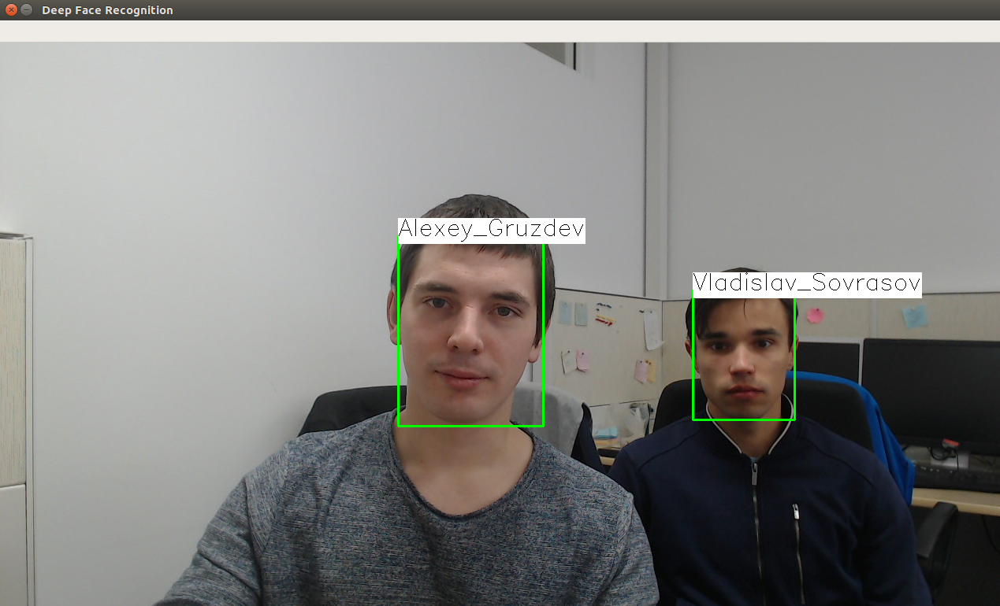

# Face Recognition demo with [OpenVINO™ Toolkit](https://software.intel.com/en-us/openvino-toolkit)



## Demo Preparation

1. Install the [OpenVINO™ toolkit](https://software.intel.com/en-us/articles/OpenVINO-Install-Linux)

2. Create virtual python environment:
    ```bash
      mkvirtualenv fr --python=python3
    ```
3. Install dependencies:
    ```bash
      pip install -r requirements.txt
    ```
4. Initialize OpenVINO™ environment:
    ```bash
    source /opt/intel/computer_vision_sdk/bin/setupvars.sh
    ```

## Deep Face Recognition

1. Set up the `PATH_TO_GALLERY` variable to point to the folder with gallery images (faces to be recognized):
    ```bash
    export PATH_TO_GALLERY=/path/to/gallery/with/images/
    ```
2. To use OpenVINO™ pretrained models, specify `IR_MODELS_ROOT`, otherwise modify the running command:
    ```bash
    export IR_MODELS_ROOT=$INTEL_OPENVINO_DIR/deployment_tools/intel_models/
    ```
3. If you are running from pure console, specify the `PYTHONPATH` variable:
    ```bash
    export PYTHONPATH=`pwd`:$PYTHONPATH
    ```
4. Run the Face Recognition demo:
    ```bash
    python demo/run_demo.py --path_to_gallery $PATH_TO_GALLERY --cam_id 0 \
      --fd_model $IR_MODELS_ROOT/face-detection-retail-0004/FP32/face-detection-retail-0004.xml \
      --fr_model $IR_MODELS_ROOT/face-reidentification-retail-0095/FP32/face-reidentification-retail-0095.xml  \
      --ld_model $IR_MODELS_ROOT/landmarks-regression-retail-0009/FP32/landmarks-regression-retail-0009.xml \
      -l libcpu_extension_avx2.so
    ```
> **NOTE**: `libcpu_extension_avx2.so` is located in the `$INTEL_OPENVINO_DIR/inference_engine/lib/<system_name>/intel64/` folder, where the `<system_name>` is a name detected by OpenVINO™, for example, `ubuntu_16.04` if you are running the demo under the Ubuntu 16.04 system. The folder with CPU extensions is already in `LD_LIBRARY_PATH` after initialization of the OpenVINO™ environment and can be omitted in the launch command.
