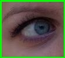

### Eye State classification

This repository contains training scripts for the eye state classifier.



## Setup

### Prerequisites

* Ubuntu\* 16.04 / 18.04
* Python\* 3.6
* PyTorch\* 1.4.0
* OpenVINO™ with Python API

### Installation

1. Create virtual environment:
```bash
bash init_venv.sh
```

2. Activate virtual environment:
```bash
. venv/bin/activate
```

## Training and Evaluation

To train and evaluate net: 

```bash
python3 train.py \
    --data_root ../../data/open_closed_eye/ \
    --epoch 1 \
    --batch 1 \
    --learning_rate 0.1
```

### Convert to OpenVino 
    
```bash
mo.py --input_model model/open_closed_eye_epoch_0.onnx \
    --input_shape [1,3,32,32] \
    --mean_values [128.0,128.0,128.0] \
    --scale_values [255,255,255] \
    --model_name open_closed_eye
```

### Demo

```bash
python3 demo.py \
    --model open_closed_eye.xml \
    --data_root ../../data/open_closed_eye/val/
```