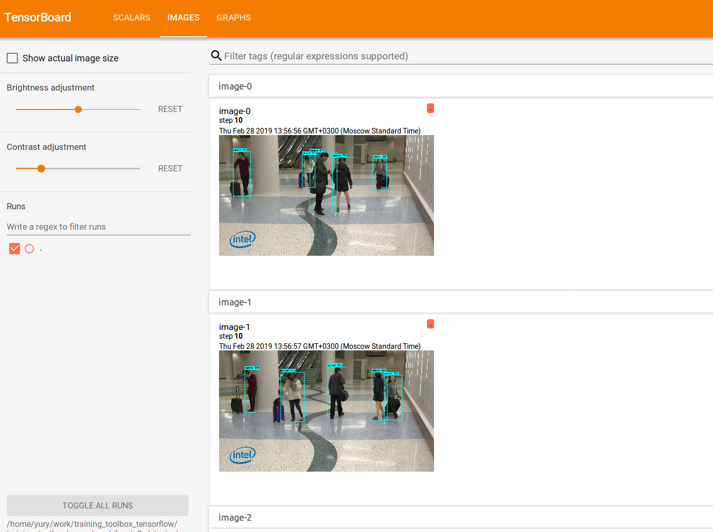

# Person Vehicle Bike Detector


## Information

The crossroad detection network model provides detection of 3 class objects: vehicle, pedestrian, non-vehicle (for example, a bike). The detector was trained on the data from crossroad cameras.

## Setup

### Prerequisites

* Ubuntu\* 16.04
* Python\* 3.6
* TensorFlow\* 1.13.1
* OpenVINO™ 2019 R1 with Python API

### Installation

1. Create virtual environment:
    ```bash
    virtualenv venv -p python3 --prompt="(pvb)"
    ```

2. Modify `venv/bin/activate` to set environment variables:
    ```
    cat <<EOT >> venv/bin/activate
    export PYTHONPATH=\$PYTHONPATH:$(git rev-parse --show-toplevel)/external/models/research
    export PYTHONPATH=\$PYTHONPATH:$(git rev-parse --show-toplevel)/external/models/research/slim
    . /opt/intel/openvino/bin/setupvars.sh
    EOT
    ```

3. Activate virtual environment and setup OpenVINO™ variables:
    ```bash
    . venv/bin/activate
    ```

4. Install modules:
    ```
    pip3 install -r requirements.txt
    ```

5. Download and prepare required submodules:
    ```bash
    bash ../prepare_modules.sh
    ```

## Training and Evaluation Example

> **NOTE** To train model on own dataset you should change `num_steps: 10` in `configs/pipeline.config`.

1. Go to the `openvino_training_extensions/tensorflow_toolkit/person_vehicle_bike_detector/` directory.

2. The example dataset has annotation in the COCO format. You can find it here:
   `openvino_training_extensions/data/airport`
   The annotation was collected using the [COCO object detection format](http://cocodataset.org/#format-data).

3. To convert the dataset to tfrecords, run the following:
   ```bash
   python ./tools/create_crossroad_extra_tf_records.py \
       --train_image_dir=../../data/airport/train/ \
       --val_image_dir=../../data/airport/val/ \
       --train_annotations_file=../../data/airport/annotation_example_train.json \
       --val_annotations_file=../../data/airport/annotation_example_val.json \
       --output_dir=../../data/airport/tfrecords
   ```

4. To start training, run the following:
   ```bash
   python ../../external/models/research/object_detection/model_main.py \
     --model_dir=./model \
     --pipeline_config_path=./configs/pipeline.config
   ```
   Training artifacts are stored by default in `model`.

5. Evaluation artifacts are stored by default in `openvino_training_extensions/tensorflow_toolkit/veh_ped_nonveh_ssd_mobilenetv2_detector/model/eval_0/`.
To show results of network model working, run the following:
   ```bash
   tensorboard --logdir=./model
   ```

   Then view results in a browser: [http://localhost:6006](http://localhost:6006).
   

## Freeze a Graph

```Bash
python ../../external/models/research/object_detection/export_inference_graph.py \
  --input_type=image_tensor \
  --pipeline_config_path=./configs/pipeline.config \
  --trained_checkpoint_prefix=./model/model.ckpt-10 \
  --output_directory ./model/export_10
```

### Demo

```Bash
python tools/infer.py --model=model/export_10/frozen_inference_graph.pb \
  --label_map=../../data/airport/crossroad_label_map.pbtxt \
  ../../data/airport/val/image_000000.jpg
```

## Convert a Model = to Intermediate Representation (IR)

```bash
"${INTEL_OPENVINO_DIR}"/deployment_tools/model_optimizer/mo_tf.py \
  --model_name veh_ped_nonveh_ssd_mobilenetv2_detector \
  --input_model=./model/export_10/frozen_inference_graph.pb \
  --output_dir=./model/export_10/IR \
  --tensorflow_object_detection_api_pipeline_config=./configs/pipeline.config \
  --tensorflow_use_custom_operations_config="${INTEL_OPENVINO_DIR}/deployment_tools/model_optimizer/extensions/front/tf/ssd_v2_support.json"
```

### Demo

```Bash
python tools/infer_ie.py --model model/export_10/IR/veh_ped_nonveh_ssd_mobilenetv2_detector.xml \
  --device=CPU \
  --cpu_extension="${INTEL_OPENVINO_DIR}/deployment_tools/inference_engine/lib/intel64/libcpu_extension_avx2.so" \
  --label_map dataset/crossroad_label_map.pbtxt \
  dataset/ssd_mbv2_data_val/image_000000.jpg
```
