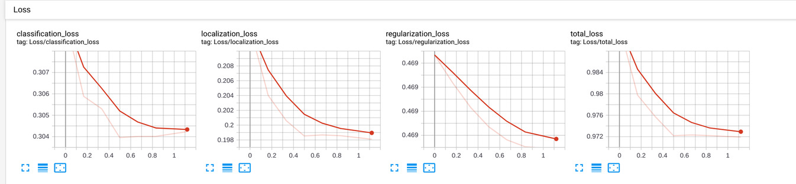
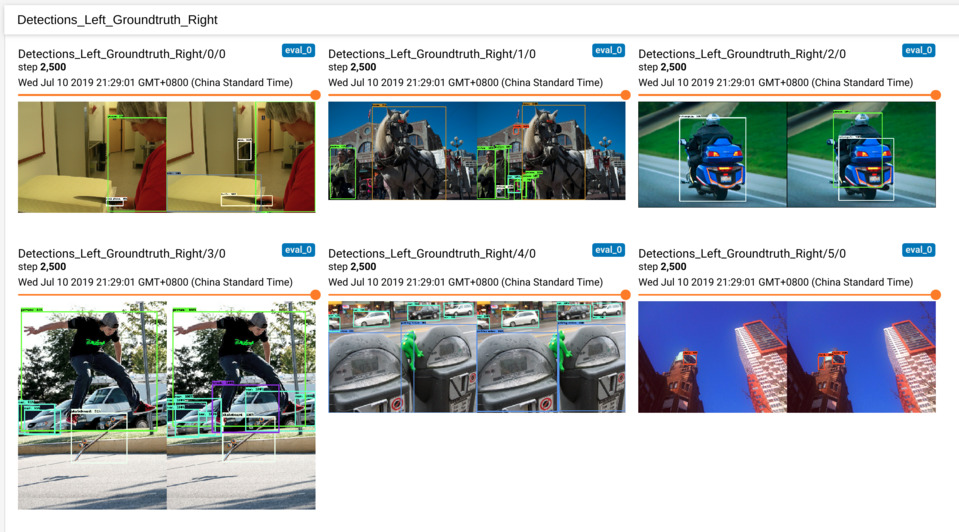
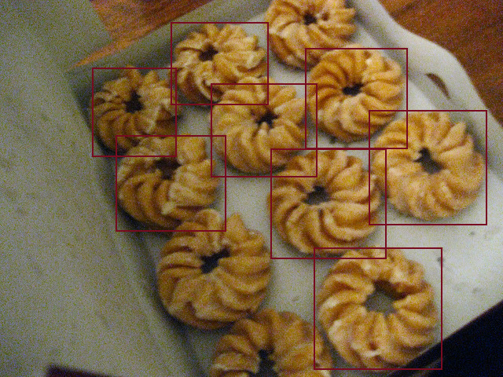

# SSD MobileNet FPN 602

This training extension is designed to run SSD MobileNet with FPN on Intel® devices which cannot place the original
640-size model. By resizing and fine-tuning the network, the model is consistent with OpenVINO™ running on various Intel®
devices as well as achieves decent accuracy close to the original 640-size model. See the accuracy table below.

| Model Name     | Size | AP IOU=0.50:0.95 | AP IOU=0.50 | AR maxDets=100 |
| :------------- | :--: | :--------------: | :---------: | :------------: |
| Pretrained[1] | 640  | 0.291            | 0.445       | 0.370          |
| Resized[2]    | 602  | 0.234            | 0.424       | 0.309          |
| Fine-tuned[3] | 602  | 0.283            | 0.439       | 0.361          |

> **NOTE**:
> - [1] is the [640-size model downloaded from the TensorFlow\* Model Zoo](http://download.tensorflow.org/models/object_detection/ssd_mobilenet_v1_fpn_shared_box_predictor_640x640_coco14_sync_2018_07_03.tar.gz)
> - [2] is the 602-size model resized from [1] straight away
> - [3] is the fine-tuned 602-size model in this extension

## Setup

### Prerequisites

* Ubuntu\* 16.04
* Python\* 3.5
* TensorFlow\* 1.13.1
* OpenVINO™ 2019 R1 with built Inference Engine Samples

### Installation

1. Create virtual environment:
    ```bash
    virtualenv venv -p python3 --prompt="(ssd_mobilenet_fpn_602)"
    ```

2. Modify `venv/bin/activate` to set environment variables:
    ```bash
    cat <<EOT >> venv/bin/activate
    export PYTHONPATH=\$PYTHONPATH:$(git rev-parse --show-toplevel)/external/models/research
    export PYTHONPATH=\$PYTHONPATH:$(git rev-parse --show-toplevel)/external/models/research/slim
    . /opt/intel/openvino/bin/setupvars.sh
    EOT
    ```

3. Activate virtual environment and setup OpenVINO™ variables:
    ```bash
    . venv/bin/activate
    ```

4. Install modules:
    ```bash
    pip3 install -r requirements.txt
    pip3 install -r ${INTEL_OPENVINO_DIR}/deployment_tools/model_optimizer/requirements_tf.txt
    ```

5. Download and prepare required submodules:
    ```bash
    bash ../prepare_modules.sh
    ```

## Data Preparation

1. Download [Common Objects in Context (COCO) images and annotations](https://cocodataset.org/#download). COCO2017 is used in this
repository for training and validation.
    ```bash
    # From openvino_training_extensions/tensorflow_toolkit/ssd_mobilenet_fpn_602/
    mkdir -p dataset/images
    wget -P dataset http://images.cocodataset.org/annotations/annotations_trainval2017.zip
    wget -P dataset http://images.cocodataset.org/zips/train2017.zip
    wget -P dataset http://images.cocodataset.org/zips/val2017.zip
    unzip dataset/annotations_trainval2017.zip -d dataset
    unzip dataset/train2017.zip -d dataset/images
    unzip dataset/val2017.zip -d dataset/images
    ```

2. Here, a data-generation script is provided to generate a training and validation set since [TensorFlow Object Detection
API](https://github.com/tensorflow/models/tree/master/research/object_detection) is using a COCO *minival* set(note that the
split is different from COCO2017 val) for evaluation. See [create_coco_tfrecord.py](tools/create_coco_tfrecord.py) for
more details. Run the script with the command below:
        ```bash
        python tools/create_coco_tfrecord.py \
            --image_folder=dataset/images \
            --annotation_folder=dataset/annotations \
            --coco_minival_ids_file=../../external/models/research/object_detection/data/mscoco_minival_ids.txt \
            --output_folder=dataset/tfrecord
        ```

3. After data preparation, `tfrecords` are located at `dataset/tfrecord`. Files with `coco_train2017_plus.record` and
`coco_minival2017.record` prefixes can be used for training and validation respectively.

## Fine-tuning and Evaluation

1. Download a pretrained model from the TensorFlow Object Detection Model Zoo and extract it:
        ```bash
        # From openvino_training_extensions/tensorflow_toolkit/ssd_mobilenet_fpn_602/
        mkdir -p models
        wget -P models http://download.tensorflow.org/models/object_detection/ssd_mobilenet_v1_fpn_shared_box_predictor_640x640_coco14_sync_2018_07_03.tar.gz
        tar xzvf models/ssd_mobilenet_v1_fpn_shared_box_predictor_640x640_coco14_sync_2018_07_03.tar.gz -C models
        ```

2. Run fine-tuning as follows:
    >**NOTE**: Evaluation metrics are printed out during fine-tuning.
    ```bash
    python ../../external/models/research/object_detection/model_main.py \
        --model_dir=./models/checkpoint \
        --pipeline_config_path=./configs/pipeline.config
    ```

3. Run the following command for visualization, and follow the terminal instruction to view the fine-tuning and evaluation
result in a browser:
        ```bash
        tensorboard --logdir=./models/checkpoint
        ```


4. After fine-tuning, run a single evaluation as follows:
        ```bash
        python ../../external/models/research/object_detection/model_main.py \
            --model_dir=./models/checkpoint \
            --pipeline_config_path=./configs/pipeline.config \
            --sample_1_of_n_eval_examples=1 \
            --checkpoint_dir=./models/checkpoint \
            --run_once=True
        ```


## Model Conversion

1. New TF checkpoints are generated after fine-tuning, which you can convert into a frozen inference graph as follows:
    ```bash
    python ../../external/models/research/object_detection/export_inference_graph.py \
        --input_type=image_tensor \
        --pipeline_config_path=./configs/pipeline.config \
        --trained_checkpoint_prefix=./models/checkpoint/model.ckpt-2500 \
        --output_directory=./models/frozen_graph
    ```

2. The `frozen_inference_graph.pb` file is generated after the conversion in the step 1. Convert it into the OpenVINO® IR by running the following:
        ```bash
        python "${INTEL_OPENVINO_DIR}"/deployment_tools/model_optimizer/mo_tf.py \
            --input_model=./models/frozen_graph/frozen_inference_graph.pb \
            --output_dir=./models/openvino_ir \
            --tensorflow_object_detection_api_pipeline_config=./configs/pipeline.config \
            --tensorflow_use_custom_operations_config="${INTEL_OPENVINO_DIR}"/deployment_tools/model_optimizer/extensions/front/tf/ssd_v2_support.json
        ```

## OpenVINO™ Demo

1. Build OpenVINO™ samples:
    ```bash
    cd ${INTEL_OPENVINO_DIR}/deployment_tools/inference_engine/samples
    bash build_samples.sh
    ```

2. Run OpenVINO™ SSD sample after OpenVINO™ IR is generated:
        ```bash
        $HOME/inference_engine_samples_build/intel64/Release/object_detection_sample_ssd \
            -i ./assets/000000322211.jpg \
            -m ./models/openvino_ir/frozen_inference_graph.xml \
            -d ${DEVICE}
        ```

2. Check the output image using `eog output_0.bmp`.



> **NOTE**: This document assumes you have already built the OpenVINO™ R1 Inference Engine Samples. In case you have not, refer to the [OpenVINO™ build the sample
applications](https://docs.openvinotoolkit.org/latest/_docs_IE_DG_Samples_Overview.html#build_the_sample_applications).

> **NOTE**: Try `export ${DEVICE}=MYRIAD` to run this model on VPU.
