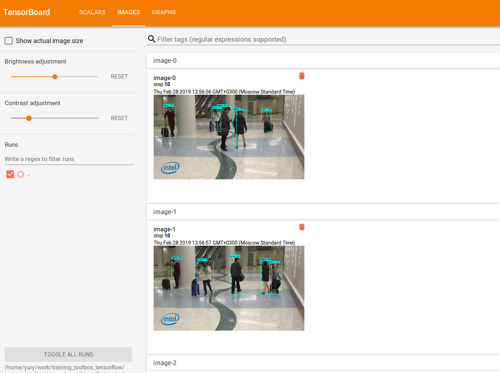

# Crossroad vehicle-pedestrian-non_vehicle object detector


## Information

The crossroad detection network model provides detection of 3 class objects: vehicle, pedestrian, non-vehicle (ex: bikes). This detector was trained on the data from crossroad cameras.


## Prerequisites

1. Tensorflow object-detection framework
   ```
   openvino_training_extensions/external/models/research/object_detection/
   ```
2. cocoapi
   ```
   openvino_training_extensions/external/cocoapi
   ```

3. Compile Protobuf libraries
   ```
   cd openvino_training_extensions/external/models/research/
   protoc object_detection/protos/*.proto --python_out=.
   ```


## Training and evaluation example

0. Go to `openvino_training_extensions/tensorflow_toolkit/veh_ped_nonveh_ssd_mobilenetv2_detector/` directory
1. The example dataset has annotation in coco format. You can find it here: `openvino_training_extensions/tensorflow_toolkit/veh_ped_nonveh_ssd_mobilenetv2_detector/dataset`
2. To convert the dataset to tfrecords you have to run:
   ```
   ./prepare_data.sh
   ```
3. To start training you have to run:
   ```
   ./train.sh
   ```
4. Training artifacts will be stored by default in `openvino_training_extensions/tensorflow_toolkit/veh_ped_nonveh_ssd_mobilenetv2_detector/model`
5. To start evaluation process you have to run:
   ```
   ./evaluate.sh
   ```
6. Evalution artifacts will be stored by default in `openvino_training_extensions/tensorflow_toolkit/veh_ped_nonveh_ssd_mobilenetv2_detector/eval`. To show results of network model working run
  ```
  tensorboard --logdir=./eval
  ```
 And view results in a browser: [http://localhost:6006](http://localhost:6006).

